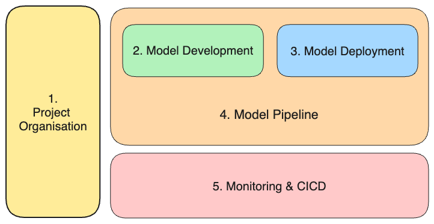

# INFO9023 - Machine Learning Systems Design

The course of Machine Learning System Designs (or MLOps) aims at enabling students to truly build fully functional "user-ready" ML applications. It will look at the whole lifecycle of building a real world ML application, from a technical and functional perspective. At the end of the course, students will be familiar with key tools and frameworks of MLOps.

We are in the early days of the AI revolution, which is expected to bring a large impact to many industries. There is a large demand for skilled engineers who are able to build ML applications.

Bringing a Machine Learning application to production requires many more efforts than solely the ML model development. Famously, there is a large hidden technical debts in designing and implementing all the components coming around your model.

This course and material contained in this repo aims at closing that technical debt by providing essential tools and best practices in MLOps.

The material is not meant to be challenging but rather try to bring a maximum of concepts in an assimilable and enjoyable way for students.

## Logistic
- **Team**: 
  - Thomas Vrancken (Instructor): t.vrancken@uliege.be
  - Matthias Pirlet (Teaching Assistant): Matthias.Pirlet@uliege.be 
- **Lecture time**: The first lecture will be held at 8:30 on the 05/02/2024. Following lectures will be held at **9:00** !
- **Lecture place**: B28 R.75 (0/75) [Liège Sart-Tilman - Polytech]
- **Office hours**: You can ask any question by email, during (or after) classes or in person during open office hours every Monday till 18:00 in office 77B (building B28).
- **Communication**: 
  - Main communication point will be Discord ([link](https://discord.gg/AVbAdNGR))

## Agenda

Note that links to the lecture and labs slides will always be provided shortly before the actual date.

| Date       | Week #     | Sprint #       | Description                          | Material (gradually added) |
|------------|------------|----------------|--------------------------------------|----------------------------|
| 05/02/2024 | W0         | Sprint 0       | Course introduction                  |                            |
| 12/02/2024 | W1         | Sprint 1       | Use case definition                  |                            |
| 19/02/2024 | W2         | Sprint 1       | Project organisation                 |                            |
| 26/02/2024 | W3         | Sprint 2       | Data processing                      |                            |
| 04/03/2024 | W4         | Sprint 2       | Model development                    |                            |
| 11/03/2024 | W5         | Sprint 3       | API implementation                   |                            |
| 18/03/2024 | W6         | Sprint 3       | Model serving & Cloud infrastructure |                            |
| 25/03/2024 | W7         | Sprint 4       | Containerisation                     |                            |
| 01/04/2024 | _No Class_ | _No Class_     | _No Class_                           | _No Class_                 |
| 08/04/2024 | W8         | Sprint 4       | Model Pipeline                       |                            |
| 15/04/2024 | W9         | Sprint 5       | Monitoring & dashboarding            |                            |
| 22/04/2024 | _No Class_ | _No Class_     | _No Class_                           | _No Class_                 |
| 29/04/2024 | _No Class_ | _No Class_     | _No Class_                           | _No Class_                 |
| 06/05/2024 | W10        | Sprint 5       | CICD                                 |                            |
| 13/05/2024 | W11        | Closing sprint | Ethics & Real world use cases        |                            |

## Course pillars

The objective of this course is to provide the following:

- **Theory**: Fundamental concepts of MLOps. Why is it important, framework, type of implementation, best practices, …
- **Technical skills**: Labs are there to show how to use key basic tools of ML Engineering.
Tools are chosen based on popularity, being open-source and ease of utilisation.
- **Project**: We will apply the theoretical and technical learnings on one large group project.
The project will empower you to build applications in a creative way.
- **Engaging**: Always discuss!
Goal to have interactive classes and labs. The classes are built to follow a healthy tempo, to be engaging, frequently give time for open questions, group discussions... and of course the (not so) occasional meme.

## Topics covered

You can find a full view of the topics in the "`Course Introduction`" lecture.

Here is an overview of how the sprints are organised:

## Project info

WIP

## Exam info

WIP

## Questions answered during this course

- I’ve trained my model in notebooks, now what?
- What are different components of an ML system?
- How to automatically train my model with new data?
- How to evaluate your models, both offline and online?
- What’s the difference between online prediction and batch prediction?
- How to build an API? How to deploy an API in the Cloud?
- How to serve a model on the cloud?
- How to continually monitor and deploy changes to ML systems?
- How to use basic tools such 
  - Github
  - Weights & Biases 
  - Docker 
  - Cloud
- …

## Resources

#### Similar classes
- University of Bari.
  - Paper: "Teaching MLOps in Higher Education through Project-Based Learning." arXiv preprint arXiv:2302.01048 (2023) ([link](https://upcommons.upc.edu/bitstream/handle/2117/390805/ICSE_SEET_2023_MLOps.pdf?sequence=3))
  - Lanubile Filippo, Silverio Martínez-Fernández and Luigi Quaranta
- Stanford University
  - CS 329S: Machine Learning Systems Design ([link](https://stanford-cs329s.github.io/))
  - Chip Huyen
- Carnegie-Mellon University
  - Machine Learning in Production / AI Engineering ([link](https://ckaestne.github.io/seai/)) 
  - Christian Kästner

#### General MLOps resources
- Machine Learning Engineering for Production (MLOps) Specialization (Coursera, Andrew Ng) ([link](https://www.coursera.org/specializations/machine-learning-engineering-for-production-mlops?utm_campaign=video-youtube-mlops-video-series&utm_medium=institutions&utm_source=deeplearning-ai))
- Made with ML ([link](https://madewithml.com/))
- Marvelous MLOps ([link](https://marvelousmlops.substack.com/))
- Hidden Technical Debt in Machine Learning System - Google ([link](https://proceedings.neurips.cc/paper_files/paper/2015/file/86df7dcfd896fcaf2674f757a2463eba-Paper.pdf))

#### Books
- Building Machine Learning Powered Applications: Going from Idea to Product (Emmanuel Ameisen)
- Introducing MLOps (Mark Treveil, Nicolas Omont, Clément Stenac et al.)
- Machine Learning Design Patterns (Valliappa Lakshmanan, Sara Robinson, Michael Munn)

# Credits

Many people helped and supported through the preparation of this course. Special thanks to:
- Gilles Louppe
- Filippo Lanubile
- Luigi Quaranta
- Robbe Sneyders
- Sebastian Wehkamp
- Ruwan Lambrichts
- Jason Li
- Thomas Janssens