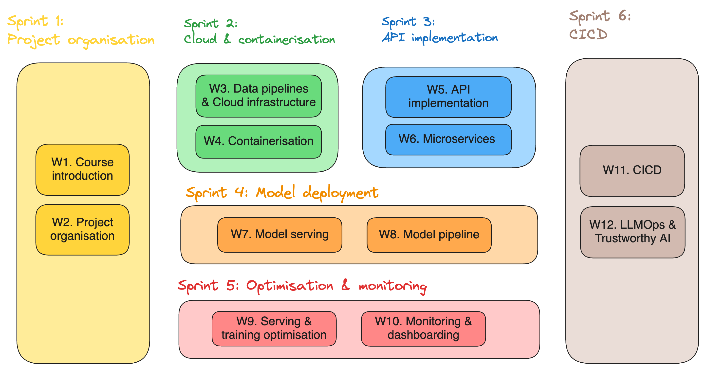

# INFO9023 - Machine Learning Systems Design [spring 2025]

The course of Machine Learning System Designs (or MLOps) aims at enabling students to truly build fully functional "user-ready" ML systems. It will look at the whole lifecycle of building a real world ML application. At the end of the course, students will be familiar with key tools and frameworks of MLOps.

We are in the early days of the AI revolution, which is expected to bring a large impact to many industries. There is a large demand for skilled engineers who are able to build ML systems.

Bringing a Machine Learning application to production requires many more efforts than solely the ML model development. Famously, there is a large hidden technical debts in designing and implementing all the components coming around your model.

This course and material contained in this repo aims at closing that technical debt by providing essential tools and best practices in MLOps.

## Logistic
- **Teaching Staff**: 
  - Thomas Vrancken (Instructor): t.vrancken@uliege.be
  - Matthias Pirlet (Teaching Assistant): Matthias.Pirlet@uliege.be 
- **Class time & place**: Classes are held from **9:00** to **12:30** every Monday, at B37 S.39 (-1/39).
  - First class on the 3rd of Februar 2025 will **still be at 8:30am** to align with the schedule in your calendars. 
- **Communication**: Main communication point will be [Discord](https://discord.gg/kY6B3cchkr). Official communication might also come by email.
- **Support**: You can ask any question on [Discord](https://discord.gg/kY6B3cchkr). Prefer this option instead of **email** so that everyone can benefit from the answer. You can also ask questions during (or after) **classes** or in person during **open office hours** every Monday till 18:00 in office 77B (building B28).

## Agenda

Note that links to the lecture and labs slides will always be provided shortly before the actual date.

| Date       | Week #     | Sprint #       | Description       | Material (gradually added)      | Demo or directed work (gradually added) |
|------------|------------|----------------|-------------------|---------------------------------|------------------------|
| 03/02/2024 | W1  | Sprint 1 | Course introduction | [lecture slides](lectures/01_course_introduction.pdf)  | |
| 10/02/2024 | W2  | Sprint 1 | Project organisation | [lecture slides](lectures/02_project_organisation.pdf)  | [demo git](demos/01_git/README.md) | 
| 17/02/2024 | W3  | Sprint 2 | Data pipelines & Cloud infrastructure | [lecture slides](lectures/03_data_pipelines_&_cloud_infrastructure.pdf) |
| 24/02/2024 | W4  | Sprint 2 | Containerisation | [lecture slides](lectures/04_containerisation.pdf) | [demo gcs & bq](demos/02_gcs_bq/README.md) [directed work Docker](directed_work/01_docker/README.md)|
| 03/02/2024 | W5  | Sprint 3 | API implementation | [lecture slides](lectures/05_API_implementation.pdf) | [directed work Flask](directed_work/02_flask/README.md) |
| 03/02/2024 | W6  | Sprint 3 | Microservices  | [lecture slides](lectures/06_microservices.pdf) | [Demo k8s](demos/03_kubernetes/) |
| 03/02/2024 | W7  | Sprint 4 | Model serving | [lecture slides](lectures/07_model_serving.pdf) | [Demo vLLM](demos/04_vllm/) |
| 03/02/2024 | W8  | Sprint 4 | Model pipeline |   |
| 03/02/2024 | W9  | Sprint 5 | Serving & training optimisation |   |
| 03/02/2024 | W10 | Sprint 5 | Monitoring & dashboarding |   |
| 03/02/2024 | W11 | Sprint 6 | CICD |   |
| 03/02/2024 | W12 | Sprint 6 | LLMOps & Trustworthy AI |   |

## Course culture

#### Pillars
1. **Relevant**: Focused on core concepts of building ML applications. Tailored choice of current best practices.
2. **Practical**: Concrete Labs, resources, real life examples, time to experiment, support line, …
3. **Engagin**: Interactive class session. Healthy tempo (break out exercises, QA, …). 

#### Learning Streams
1. **Lectures**: Present theoretical concepts and practices. Usually the first part of each class.
2. **Labs**: Labs are there to learn how to use key tools widely used to build ML systems. They've been cherry picked based on usability, performance, popularity and accessibility. 
3. **Project**: You will apply the theoretical and technical learnings in one large group project. You will build a ML application in an engaging way - you're in the driving seat.

## Project 

All the project info can be found in the [project/project_description.pdf](project/project_description.pdf) document.

Important to highlight that you are the **decision makers for the design of your project** :open_hands: Design it in a coherent way. Spend time on features that **make sense**. Don't see the workpackages as a long checklist, rather on possible points to implement.

For example, if you implement a computer vision model you might spend more time on the model serving rather than the data exploration. Or conversely, if you need to get tabular data from external APIs you might want to spend more time on the data construction rather than on model serving optimisation. Those are design choices you need to make depending on your project - and as always make sure to ask questions to the teaching staff if you have any (ideally at the end of lectures).  

## Exam 

The exam will take the form of an oral exam in whih you will have to answer a series of 4-5 questions based on a case study. The case study will be give a hypothetical ML application use case and you will have to answer different design questions based on the concept thought during this course.

A practice exam can already be found in [exams/practice_exam_1.pdf](exams/practice_exam_1.pdf). :warning: The actual exam might deviate from this format, the purpose of this practice exam is to give an inspiration of what the exam might be looking like.

## Resources

#### Similar classes
- University of Bari.
  - F. Lanubile, S. Martínez-Fernández and L. Quaranta, "Teaching MLOps in Higher Education through Project-Based Learning," 2023 IEEE/ACM 45th International Conference on Software Engineering: Software Engineering Education and Training (ICSE-SEET), Melbourne, Australia, 2023, pp. 95-100, doi: [10.1109/ICSE-SEET58685.2023.00015](https://ieeexplore.ieee.org/document/10172734).
  - F. Lanubile, S. Martinez-Fernandez and L. Quaranta, "Training future ML engineers: a project-based course on MLOps" in IEEE Software, vol. , no. 01, pp. 1-9, 5555.
doi: [10.1109/MS.2023.3310768](https://www.computer.org/csdl/magazine/so/2024/02/10243109/1QfhWPYvSYU)
  - Lanubile Filippo, Silverio Martínez-Fernández and Luigi Quaranta
- Stanford University
  - CS 329S: Machine Learning Systems Design ([link](https://stanford-cs329s.github.io/))
  - Chip Huyen
- Carnegie-Mellon University
  - Machine Learning in Production / AI Engineering ([link](https://ckaestne.github.io/seai/)) 
  - Christian Kästner

#### General MLOps resources
- Machine Learning Engineering for Production (MLOps) Specialization (Coursera, Andrew Ng) ([link](https://www.coursera.org/specializations/machine-learning-engineering-for-production-mlops?utm_campaign=video-youtube-mlops-video-series&utm_medium=institutions&utm_source=deeplearning-ai))
- Made with ML ([link](https://madewithml.com/))
- Marvelous MLOps ([link](https://marvelousmlops.substack.com/))
- Hidden Technical Debt in Machine Learning System - Google ([link](https://proceedings.neurips.cc/paper_files/paper/2015/file/86df7dcfd896fcaf2674f757a2463eba-Paper.pdf))

#### Books
- Building Machine Learning Powered Applications: Going from Idea to Product (Emmanuel Ameisen)
- Introducing MLOps (Mark Treveil, Nicolas Omont, Clément Stenac et al.)
- Machine Learning Design Patterns (Valliappa Lakshmanan, Sara Robinson, Michael Munn)

# Credits

Many people helped and supported through the preparation of this course. Special thanks to:
- Gilles Louppe
- Filippo Lanubile
- Luigi Quaranta
- Robbe Sneyders
- Philippe Modard
- Sebastian Wehkamp
- Ruwan Lambrichts
- Jason Li
- Thomas Janssens