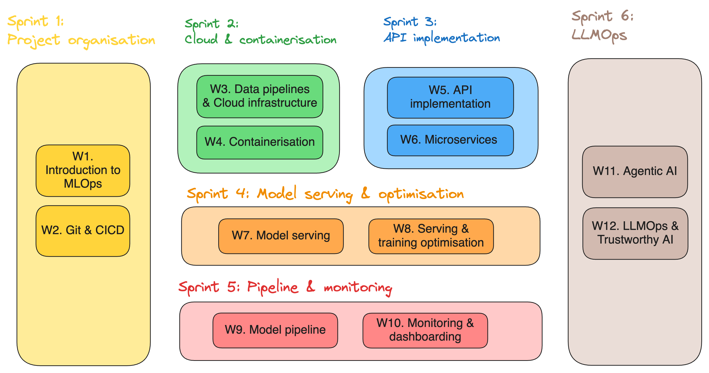

# INFO9023 - Machine Learning Systems Design [spring 2026]

This course equips students with the practical tools and frameworks needed to build production-ready machine learning systems. Covering the complete ML application lifecycle, students will gain hands-on experience with MLOps and LLMOps tools and skills in high demand as industries undergo rapid AI transformation.

Deploying ML to production requires far more than model theoretical knowledge. This course provides the technical skills, practices, and tools to bridge the gap between prototype and production. Students will be equipped to make a direct impact when starting their professional life.

## Topics roadmap

## Lecture schedule

_The links to the lecture slides and directed work will always be provided shortly before the actual date._

| Date       | Week #     | Sprint #       | Topic       | Directed work |
|------------|------------|----------------|-------------------|------------------------|
| 02/02/2026 | W1  | Sprint 1 | | |
| 09/02/2026 | W2  | Sprint 1 | | | 
| 16/02/2026 | W3  | Sprint 2 | | |
| 23/02/2026 | W4  | Sprint 2 | | |
| 02/03/2026 | W5  | Sprint 3 | | |
| 09/03/2026 | W6  | Sprint 3 | | |
| 16/03/2026 | W7  | Sprint 4 | | |
| 23/03/2026 | W8  | Sprint 4 | | |
| 30/03/2026 | W9  | Sprint 5 | | | 
| 06/04/2026 | W10 | Sprint 5 | | | 
| 13/04/2026 | W11 | Sprint 6 | | |
| 20/04/2026 | | | Holiday | |
| 27/04/2026 | | | Holiday | |
| 04/05/2026 | W12 | Sprint 6 | | |
| 11/05/2026 | | | Milestone 3 presentation | |

## Course culture

#### Pillars
1. **Relevant**: Focused on core concepts of building ML/AI applications. Tailored choice of current best practices.
2. **Practical**: Concrete Labs, resources, real life examples, time to experiment, support line, …
3. **Engaging**: Interactive class session. Healthy tempo (break out exercises, QA, …). 

#### Learning Streams
1. **Lectures**: Present theoretical concepts and practices. Usually the first part of each class.
2. **Directed work**: Directed work are there to learn how to use key tools widely used to build ML/AI systems. They've been cherry picked based on usability, performance, popularity and accessibility. 
3. **Project**: You will apply the theoretical and technical learnings in one large group project. You will build a ML application in an engaging way - you're in the driving seat.

## Project 

All the project info can be found in the [project/project_instructions.pdf](project/project_instructions.pdf) document.

## Exam 

The exam will take the form of an oral exam in which you will have to answer a series of 4-5 questions based on a case study. The case study will be given a hypothetical ML/AI application use case and you will have to answer different design questions based on the concepts taught during this course.

## Logistic
- **Teaching Staff**: 
  - Thomas Vrancken (Instructor)
  - Matthias Pirlet (Teaching Assistant)
- **Communication**: Main communication point will be [Discord](link). Official communication might also be sent by email.
- **Support**: After each class, there is dedicated time for students to work on their projects and ask questions to the teaching staff. 

## Resources

#### Similar courses
- University of Bari.
  - F. Lanubile, S. Martínez-Fernández and L. Quaranta, "Teaching MLOps in Higher Education through Project-Based Learning," 2023 IEEE/ACM 45th International Conference on Software Engineering: Software Engineering Education and Training (ICSE-SEET), Melbourne, Australia, 2023, pp. 95-100, doi: [10.1109/ICSE-SEET58685.2023.00015](https://ieeexplore.ieee.org/document/10172734).
  - F. Lanubile, S. Martinez-Fernandez and L. Quaranta, "Training future ML engineers: a project-based course on MLOps" in IEEE Software, vol. , no. 01, pp. 1-9, 5555.
doi: [10.1109/MS.2023.3310768](https://www.computer.org/csdl/magazine/so/2024/02/10243109/1QfhWPYvSYU)
  - Lanubile Filippo, Silverio Martínez-Fernández and Luigi Quaranta
- Stanford University
  - CS 329S: Machine Learning Systems Design ([link](https://stanford-cs329s.github.io/))
  - Chip Huyen
- Carnegie-Mellon University
  - Machine Learning in Production / AI Engineering ([link](https://ckaestne.github.io/seai/)) 
  - Christian Kästner

#### General MLSD resources
- Machine Learning Engineering for Production (MLOps) Specialization (Coursera, Andrew Ng) ([link](https://www.coursera.org/specializations/machine-learning-engineering-for-production-mlops?utm_campaign=video-youtube-mlops-video-series&utm_medium=institutions&utm_source=deeplearning-ai))
- Made with ML ([link](https://madewithml.com/))
- Marvelous MLOps ([link](https://marvelousmlops.substack.com/))
- Hidden Technical Debt in Machine Learning System - Google ([link](https://proceedings.neurips.cc/paper_files/paper/2015/file/86df7dcfd896fcaf2674f757a2463eba-Paper.pdf))

#### Books
- Building Machine Learning Powered Applications: Going from Idea to Product (Emmanuel Ameisen)
- Introducing MLOps (Mark Treveil, Nicolas Omont, Clément Stenac et al.)
- Machine Learning Design Patterns (Valliappa Lakshmanan, Sara Robinson, Michael Munn)
