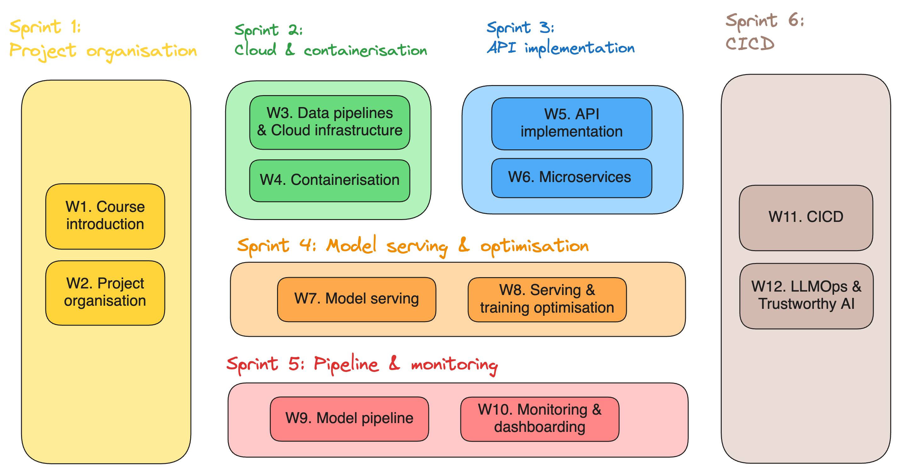

# INFO9023 - Machine Learning Systems Design

The course of Machine Learning System Designs (or MLOps) aims at enabling students to truly build fully functional "user-ready" ML systems. It will look at the whole lifecycle of building a real world ML application. At the end of the course, students will be familiar with key tools and frameworks of MLOps.

We are in the early days of the AI revolution, which is expected to bring a large impact to many industries. There is a large demand for skilled engineers who are able to build ML systems.

Bringing a Machine Learning application to production requires many more efforts than solely the ML model development. Famously, there is a large hidden technical debts in designing and implementing all the components coming around your model.

This course and material contained in this repo aims at closing that technical debt by providing essential tools and best practices in MLOps.

## Logistic
- **Teaching Staff**: 
  - Thomas Vrancken (Instructor): t.vrancken@uliege.be
  - Matthias Pirlet (Teaching Assistant): Matthias.Pirlet@uliege.be 
- **Class time & place**: Classes are held from **9:00** to **12:30** every Monday in B28 R.75 (0/75) [Liège Sart-Tilman - Polytech]
- **Support**: You can ask any question by **email**, during (or after) **classes** or in person during **open office hours** every Monday till 18:00 in office 77B (building B28).
- **Communication**: Main communication point will be Discord ([link](https://discord.gg/AVbAdNGR)). Official communication might also come by email.

## Agenda

Note that links to the lecture and labs slides will always be provided shortly before the actual date.

| Date       | Week #     | Sprint #       | Description                          | Material (gradually added) |
|------------|------------|----------------|--------------------------------------|----------------------------|
| 05/02/2024 | W0         | Sprint 0       | Course introduction                  | [link](lectures/00_course_introduction.pdf)            |
| 12/02/2024 | W1         | Sprint 1       | Use case definition                  |                            |
| 19/02/2024 | W2         | Sprint 1       | Project organisation                 |                            |
| 26/02/2024 | W3         | Sprint 2       | Data processing                      |                            |
| 04/03/2024 | W4         | Sprint 2       | Model development                    |                            |
| 11/03/2024 | W5         | Sprint 3       | API implementation                   |                            |
| 18/03/2024 | W6         | Sprint 3       | Model serving & Cloud infrastructure |                            |
| 25/03/2024 | W7         | Sprint 4       | Containerisation                     |                            |
| 01/04/2024 | _No Class_ | _No Class_     | _No Class_                           | _No Class_                 |
| 08/04/2024 | W8         | Sprint 4       | Model Pipeline                       |                            |
| 15/04/2024 | W9         | Sprint 5       | Monitoring & dashboarding            |                            |
| 22/04/2024 | _No Class_ | _No Class_     | _No Class_                           | _No Class_                 |
| 29/04/2024 | _No Class_ | _No Class_     | _No Class_                           | _No Class_                 |
| 06/05/2024 | W10        | Sprint 5       | CICD                                 |                            |
| 13/05/2024 | W11        | Closing sprint | Ethics & Real world use cases        |                            |

## Course culture

#### Pillars
1. **Relevant**: Focused on core concepts of building ML applications. Tailored choice of current best practices.
2. **Practical**: Concrete Labs, resources, real life examples, time to experiment, support line, …
3. **Engagin**: Interactive class session. Healthy tempo (break out exercises, QA, …). … And lots of memes.

#### Learning Streams
There are 3 points of learnings for students following this course:
1. **Lectures**: Present theoretical concepts and practices. Usually the first part of each class.
2. **Labs**: Labs are there to learn how to use key tools widely used to build ML systems. They've been cherry picked based on usability, performance, popularity and accessibility. 
3. **Project**: You will apply the theoretical and technical learnings in one large group project. You will build a ML application in an engaging way - you're in the driving seat.

## Topics covered

You can find a full view of the topics in the "`Course Introduction`" lecture.

Here is an overview of how the sprints are organised:

## Project 

All the project info can be found in the [project/project_description.pdf](project/project_description.pdf) document.

## Exam 

You can find a practice exam in the [exams/practice_exam_june_2024.pdf](exams/practice_exam_june_2024.pdf) document.

## Resources

#### Similar classes
- University of Bari.
  - Paper: "Teaching MLOps in Higher Education through Project-Based Learning." arXiv preprint arXiv:2302.01048 (2023) ([link](https://upcommons.upc.edu/bitstream/handle/2117/390805/ICSE_SEET_2023_MLOps.pdf?sequence=3))
  - Lanubile Filippo, Silverio Martínez-Fernández and Luigi Quaranta
- Stanford University
  - CS 329S: Machine Learning Systems Design ([link](https://stanford-cs329s.github.io/))
  - Chip Huyen
- Carnegie-Mellon University
  - Machine Learning in Production / AI Engineering ([link](https://ckaestne.github.io/seai/)) 
  - Christian Kästner

#### General MLOps resources
- Machine Learning Engineering for Production (MLOps) Specialization (Coursera, Andrew Ng) ([link](https://www.coursera.org/specializations/machine-learning-engineering-for-production-mlops?utm_campaign=video-youtube-mlops-video-series&utm_medium=institutions&utm_source=deeplearning-ai))
- Made with ML ([link](https://madewithml.com/))
- Marvelous MLOps ([link](https://marvelousmlops.substack.com/))
- Hidden Technical Debt in Machine Learning System - Google ([link](https://proceedings.neurips.cc/paper_files/paper/2015/file/86df7dcfd896fcaf2674f757a2463eba-Paper.pdf))

#### Books
- Building Machine Learning Powered Applications: Going from Idea to Product (Emmanuel Ameisen)
- Introducing MLOps (Mark Treveil, Nicolas Omont, Clément Stenac et al.)
- Machine Learning Design Patterns (Valliappa Lakshmanan, Sara Robinson, Michael Munn)

# Credits

Many people helped and supported through the preparation of this course. Special thanks to:
- Gilles Louppe
- Filippo Lanubile
- Luigi Quaranta
- Robbe Sneyders
- Sebastian Wehkamp
- Ruwan Lambrichts
- Jason Li
- Thomas Janssens