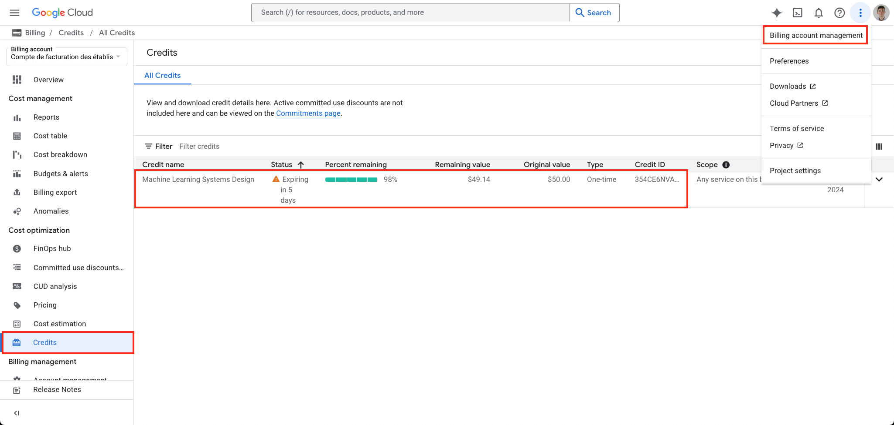
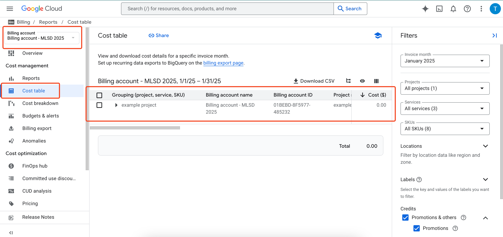

# Demo 2 [Sprint 2, W4]: Google Cloud Storage (GCS) & BigQuery

Purpose of this demo is to give a lightweight introduction to Google Cloud.

To do so, we will focus on two of its most basic and intuitive *data* services: [Google Cloud Storage](https://cloud.google.com/storage/docs/introduction) and [BigQuery](https://cloud.google.com/bigquery/docs/introduction).

## 1. Google Cloud project setup

Make sure to have a GCP project you can use
1. Visit the [Google Cloud Console](https://console.cloud.google.com/) and either select a project or create a new one.
2. Make sure that you have credits through the billing management [page](https://console.cloud.google.com/billing/) (remember that you received an email from us where you can redeem 50$ of credits!)

3. Select which **Google Cloud Project** you will be using, or create a new one (see [doc](https://cloud.google.com/resource-manager/docs/creating-managing-projects)). 
   1. Resources (databases, compute, ...) are attached to a specific project.
   2. Multiple developers can work in a single project.
   3. One project is attached to a specific billing account
   4. In mature applications, managing different projects allows to replicate an infrastructure in different environments (development, test, acceptance, production...).
4. You can give access to other users (project team) to your Google Cloud project through the [IAM page](https://console.cloud.google.com/iam-admin/)

:bulb: Important to emphasis: For your group project you are recommended to create a single Google Cloud **Project**, using one of the team member's billing accounts - where the education credits should have been attributed.
The owner of that project can then grant access to other team members through the [IAM page](https://console.cloud.google.com/iam-admin/).

:eyes: You can verify that your Google Cloud project is correctly linked to your billing account by navigating to the billing tab and navigate to the `Cost table` page - your project should be listed (see screenshot).


## 2. Google Cloud Storage

Google Cloud Storage (GCS) is a highly durable and highly available object storage service offered by Google Cloud.

It is usually used to store and access any type of data from anywhere in the world.

It is included in this course as it is a convenient way to **stage data so it is available by different services in the Cloud**.

:point_right: For example, you built a **dashboard** that should access **data** produced by another service (or model), then you can use GCS for that. This will come in handy later in this course.

### 2.1. Enabling GCS

Enable the Cloud Storage API:
1. Navigate to the [Cloud storage tab](https://console.cloud.google.com/storage)
2. If requested Enable the API

And we will then **create a bucket** in which we will store the files for this lab.

We will do so with the UI. (Alternatively you can do it with the [python sdk](https://cloud.google.com/storage/docs/samples/storage-create-bucket#storage_create_bucket-python)).

### 2.2. Setting up the python SDK

Create a jupyter notebook (e.g. `cloud_storage.ipynb`) and do the following:

First, install the Google Cloud Storage Python library:

```sh
!pip install google-cloud-storage
```

We then need to configure the library to use your credentials to authenticate when running codes. 
We do so using Application Default Credentials (ADC).

```sh
!gcloud auth application-default login
```

You can make sure you are properly logged in by running:

```sh
!gcloud auth list
```
We then need to prepare a local file to be uploaded to GCS.

The example CSV file we're using here can be downloaded on kaggle ([link](https://www.kaggle.com/datasets/yadavhim/housing-csv)).

Make sure to download it and store it on your local machine.

We then run the following python snippet to upload the local CSV file to GCS:

```python
from google.cloud import storage

# Define variables
bucket_name = "bucket-name"  # Replace with your bucket name
source_file_path = "local_file_path.csv"  # Path to your local CSV file
destination_blob_name = "destination_folder/destination_file.csv"  # Path in GCS

def upload_to_gcs(bucket_name, source_file_path, destination_blob_name):
    """Uploads a file to Google Cloud Storage."""
    # Initialize GCS client (it will use default credentials)
    client = storage.Client()

    # Get bucket
    bucket = client.bucket(bucket_name)

    # Create a blob (GCS object) and upload the file
    blob = bucket.blob(destination_blob_name)
    blob.upload_from_filename(source_file_path)

    print(f"File {source_file_path} uploaded to {bucket_name}/{destination_blob_name}")

# Call the function
upload_to_gcs(bucket_name, source_file_path, destination_blob_name)
```

And we can even download that file back locally by running this in another cell:

```python
def download_from_gcs(bucket_name, source_blob_name, destination_file_path):
    """Downloads a file from Google Cloud Storage."""
    client = storage.Client()
    bucket = client.bucket(bucket_name)
    blob = bucket.blob(source_blob_name)

    blob.download_to_filename(destination_file_path)

    print(f"File {source_blob_name} downloaded to {destination_file_path}")

# Define variables
bucket_name = "bucket-name"  # Replace with your bucket name
source_blob_name = "folder_in_gcs/uploaded_file.csv"  # Path in GCS
destination_file_path = "downloaded_file.csv"  # Local path to save the file

# Call the function
download_from_gcs(bucket_name, source_blob_name, destination_file_path)
```

### 2.3. Using a service account for authentication

Note that often you do not want to use personal credentials.
Instead, Google Cloud uses [Service Accounts](https://cloud.google.com/iam/docs/service-account-overview).

If you deploy a service (an API) or are using a VM, it is better to use a sevice account

We will do the same as before but using a service account.

1. Go to the [service accounts](https://console.cloud.google.com/iam-admin/serviceaccounts) tab in the IAM & Admin page
2. Click "create service account"
   1. Give it a name and description (e.g. `gcs-access`)
   2. In "Grant this service account access to project". Go to the `Select a role` drop-down list, in `By product or service` choose `Cloud Storage` and give it the `Storage Object Admin` role.
   3. Once created, click on the service account and go to the `KEYS` tab
   4. Click on `ADD KEY` and select JSON. That will download a service account key locally which has access to GCS :smiley:
   5. Save that JSON file locally and **make sure to not upload it to git!**

Then, we set your Google Cloud credentials as a global variable by pointing to the local service account key (replace with {svc_key_location} with your actual local service account JSON path):

```sh
!export GOOGLE_APPLICATION_CREDENTIALS={svc_key_location}
```

You can now run the previous pieces of python code but replacing the storage client setup to use the service account key:

```python
client = storage.Client.from_service_account_json('path_to_your_service_account_key.json')
```

### 2.4. Conclusion

:muscle: That's it, we managed to upload and download files from GCS !

It is a small thing but it shows you how this can be used to let services access data from the Cloud.

If you want to access structured (or relational) data in a cleaner way check out [BigQuery](https://cloud.google.com/bigquery/docs).

## 3. BigQuery

Google Cloud offers BigQuery, an Online Analytical Processing (OLAP) database.

Google BigQuery is a serverless, fully-managed data warehouse designed for handling large-scale datasets and running fast SQL queries on them. Unlike traditional databases, BigQuery is optimized for big data analytics and can process terabytes of data in seconds.

Features of BigQuery:
- Fast SQL Queries – Optimized for analytics and scalable to petabytes of data.
- Serverless – No infrastructure to manage. You just focus on querying data.
- Supports Standard SQL – Easy to use for SQL users.
- Integrates with Google Cloud Services – Works with GCS, AI/ML tools, and more.
- Pay-as-you-go Pricing – You only pay for the queries and storage you use.

We will do a short demo.

### 3.1. Installation

To use the python sdk, run:

```sh
!pip install google-cloud-bigquery pandas
```

Make sure you are still correctly authenticated:

```sh
!gcloud auth application-default login
```

### 3.2. Loading in data
You have multiple ways of ingesting data to bigquery, from files (CSV, JSON, parquet, ...), streaming, or through Google Cloud services such as GCS or Cloud Functions.

For demo purposes, we will simply load in the data we uploaed to GCS through the BQ [portal UI](https://console.cloud.google.com/bigquery).

### 3.3. Query from table

We'll run a couple of queries.

We first initialise our BQ client (here with personal credentials, but you can also use a service account).

```python
from google.cloud import bigquery
import pandas as pd

# Initialize BigQuery client
client = bigquery.Client()
```

Let's then run a query to check what kind of ocean proximity options we have.

```python
project = 'your_project'
dataset = 'your_dataset'
table = 'your_table'

# Define SQL query (Example: Check distinct values for "ocean_proximity")
query = f"""
SELECT DISTINCT(ocean_proximity) FROM `{project}.{dataset}.{table}`
"""

# Execute query and convert result to a DataFrame
query_job = client.query(query)
df = query_job.to_dataframe()

# Display result
print(df)
```

Then we can look at some metadata properties of houses near the ocean:

```python
# Define SQL query 
query = f"""
SELECT longitude, latitude, housing_median_age, total_rooms, total_bedrooms
FROM `{project}.{dataset}.{table}`
WHERE ocean_proximity="NEAR OCEAN"
"""

# Execute query and convert result to a DataFrame
query_job = client.query(query)
df = query_job.to_dataframe()

# Display result
print(df)
```

## 4. Conclusion

You should now be comfortable with concepts of Google Cloud such as:
- Setting up a Google Cloud project
- Linking a billing account
- Granting personal access through IAM
- Google Cloud CLI and Python SDK
- Basic data services such as GCS and BigQuery

Here we showed a very simple for data reading/writing to GCS and BQ.

Of course, BigQuery is better suited for structured data jobs. Its power relies in running analytical queries on huge amounts of data.

GCS provides cheaper storage for unstructured documents (such as text, images, audio or video).

Another type of data storage on Google Cloud that was not covered here are **transactional databases**.

A couple of key examples are:
- [CloudSQL](https://cloud.google.com/sql?hl=en): Postgres/My/SQL servers. Powerful for transactional operations. Enforces a data schema.
- [Firestore](https://cloud.google.com/firestore?hl=en): NoSQL document transactional database. It allows you to perform CRUD operations on single datapoints real-time. Unlike CloudSQL, it does not enforce a data schema.

In the coming weeks, we will look into **compute** offers on Google Cloud such as setting up VMs ([Compute Engine](https://cloud.google.com/products/compute?hl=en)) and hosting serverless APIs and microservices ([Cloud Run](https://cloud.google.com/run?hl=en)).