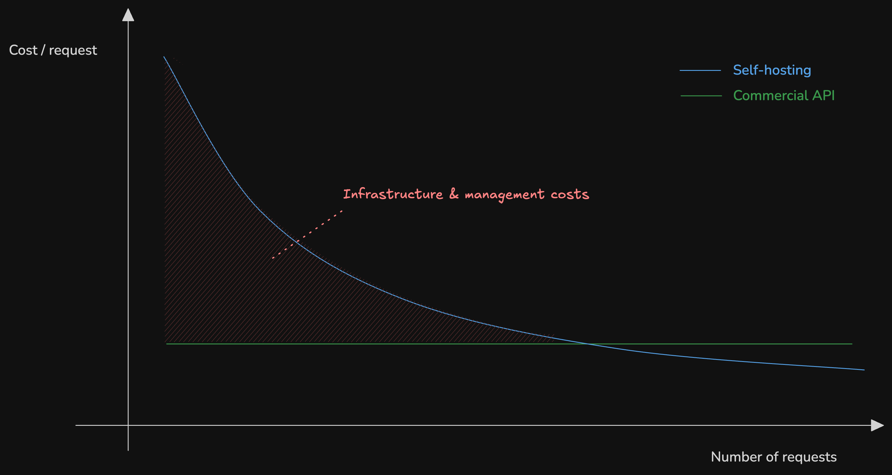

# 🚀 Deploy LLMs on GKE with GPUs

This tutorial will show you how to deploy large language models (LLMs) on Google Kubernetes Engine (GKE) with GPU acceleration. 

We'll use vLLM, an open-source library for fast LLM inference and serving, to efficiently serve LLM requests at scale.

This tutorial is based on one from Google Cloud: [https://cloud.google.com/kubernetes-engine/docs/tutorials/serve-gemma-gpu-vllm](https://cloud.google.com/kubernetes-engine/docs/tutorials/serve-gemma-gpu-vllm)

## 📚 0. Background information

Here we will be using

#### GKE
[Google Cloud Kubernetes Engine](https://cloud.google.com/kubernetes-engine?hl=en) (GKE): A managed solution to use kubernetes on Google Cloud.

#### vLLM
[vLLM](https://github.com/vllm-project/vllm): A highly optimized open source LLM serving framework that can increase serving throughput on GPUs, with features such as:
  - State-of-the-art serving throughput (e.g using [PagedAttention](https://huggingface.co/docs/text-generation-inference/en/conceptual/paged_attention))
  - Efficient management of attention key and value memory with PagedAttention
  - Continuous batching of incoming requests
  - Fast model execution with CUDA/HIP graph
  - Quantizations: GPTQ, AWQ, INT4, INT8, and FP8. 
  - Optimized CUDA kernels, including integration with FlashAttention and FlashInfer.
  - Speculative decoding
  - Chunked prefill 

#### Gemma 2
- [Gemma 2](https://huggingface.co/meta-llama/Gemma-2-9B-Instruct): An LLM with 128K context window with a parameter size range of 2B, 9B or 27B. We are interested in it as the "small" 2BN parameter version will make it much easier for us to manage the deployment. 

💡 You can also use a DeepSeek R1 model or other models with similar capabilities (see this [tutorial](https://cloud.google.com/kubernetes-engine/docs/tutorials/serve-multihost-gpu)). However, due to the cheer size of DeepSeek models we will use Gemma 2 for this tutorial.

## 🎯 1. Objectives

In this tutorial, we will:
- Create a GKE cluster with a GPU node pool
- Install a vLLM server to the cluster
- Deploy a GEMMA 2 model on the vLLM server
- Test the vLLM server with a simple client

## ✅ 2. Prerequisites

#### Basic GCP setup
- A Google Cloud account
- The [Google Cloud CLI](https://cloud.google.com/sdk/docs)
- Enable the GKE API: [https://console.cloud.google.com/flows/enableapi?apiid=container.googleapis.com](https://console.cloud.google.com/flows/enableapi?apiid=container.googleapis.com)

#### Hugging Face setup & GEMMA 2 T&Cs

- 🤗 Create a Hugging Face account and get your token: [https://huggingface.co/settings/tokens](https://huggingface.co/settings/tokens)
  - Click Your Profile > Settings > Access Tokens.
  - Select New Token.
  - Specify a Name of your choice and a Role of at least `Read`.
  - Select Generate a token.
  - Copy the generated token to your clipboard.

You then need to accept the GEMMA 2 T&Cs by visiting: [https://huggingface.co/google/gemma-2-2b-it](https://huggingface.co/google/gemma-2-2b-it) and clicking "Agree" to the terms.
  
#### Local kubectl setup with GKE
To work with `kubectl`, locally, we need to install a required plugin called `gke-gcloud-auth-plugin` ([https://cloud.google.com/kubernetes-engine/docs/how-to/cluster-access-for-kubectl#install_plugin](https://cloud.google.com/kubernetes-engine/docs/how-to/cluster-access-for-kubectl#install_plugin)).

First, check whether it is already installed:

```bash
gke-gcloud-auth-plugin --version
```

If it is not installed, you can install it with:

```bash
gcloud components install gke-gcloud-auth-plugin
```

#### GPU quota

You will need to request a quota increase for GPUs in the region you are using. 

First, you can lookup different GPU types and availability per region here: [https://cloud.google.com/compute/docs/gpus/gpu-regions-zones](https://cloud.google.com/compute/docs/gpus/gpu-regions-zones).   

One thing we notice is that in `europe-west1-b` (in Saint Ghislain, Belgium), there are the following GPUs available:
- l4-vws (NVIDIA L4)
- t4-vws (NVIDIA T4)
- p100-vws (NVIDIA P100)

We will use the `l4-vws` GPU for this tutorial.

Back on quotas: You can check your project's current quota by running the following command and looking for `GPUS_ALL_REGIONS`:

```bash
export PROJECT_ID=example-1project-449313
gcloud compute project-info describe --project=$PROJECT_ID
``` 

If you need more GPUs, you can request a quota increase by:
- Navigating to the quota page in the GCP console: [https://console.cloud.google.com/iam-admin/quotas](https://console.cloud.google.com/iam-admin/quotas)
- Filter by “Metric” and select “GPUs (all regions)” or the specific GPU type you intend to use.

## 🛠️ 3. Prepare your environment

In a new terminal, run the following command to authenticate your Google Cloud CLI:

```bash
gcloud auth application-default login
```    

Set the following environment variables.

🌎 Note that it can be challenging to find GPUs in specific regions. You might need to relaunch this whole deployment with a different region to find GPUs.

```bash
export PROJECT_ID=example-project-449313
export REGION=europe-west1
export CLUSTER_NAME=vllm-cluster-3
export HF_TOKEN=HF_TOKEN
```

## 🔥 4. Create a GKE cluster with a GPU node pool

In a new terminal, run the following command to create a standard GKE cluster:

```bash
gcloud container clusters create $CLUSTER_NAME \
    --project=$PROJECT_ID \
    --region=$REGION \
    --workload-pool=$PROJECT_ID.svc.id.goog \
    --release-channel=rapid \
    --num-nodes=1
```

(⌛️ This might take a while... You can check the status directly in the UI: [https://console.cloud.google.com/kubernetes/list/overview](https://console.cloud.google.com/kubernetes/list/overview)).

We will now create a GPU node pool (note that you can refer to the [tutorial](https://cloud.google.com/kubernetes-engine/docs/tutorials/serve-gemma-gpu-vllm#create-cluster) for different disk sizes adapted to the different models you might want to use).

```bash
gcloud container node-pools create gpupool \
    --accelerator type=nvidia-l4-vws,count=1,gpu-driver-version=latest \
    --project=$PROJECT_ID \
    --location=$REGION \
    --node-locations=$REGION-b \
    --cluster=$CLUSTER_NAME \
    --machine-type=g2-standard-8 \
    --num-nodes=1
``` 

Check if the node pool was created successfully:

```bash
gcloud container node-pools list \
    --cluster=$CLUSTER_NAME \
    --region=$REGION \
    --project=$PROJECT_ID
``` 

We configure `kubectl` to communicate with the new cluster. The following command will:
- Download the cluster's credentials
- Configure your local kubectl context to point to the GKE cluster
- Update your kubeconfig file (typically at `~/.kube/config`)

```bash
gcloud container clusters get-credentials $CLUSTER_NAME --location $REGION
```

You can verify your configuration by running:

```bash
kubectl get namespaces
```

You can also directly verify your connection to the cluster with (check if the IP address returned by the command matches the one in the GKE cluster details in the GCP console under "Control Plane Networking"):
```bash
kubectl cluster-info
```

We then create a kubernetes secret to store the Hugging Face token (make sure to have exported the `HF_TOKEN` environment variable correctly to your token).

```bash
kubectl create secret generic hf-secret \
    --from-literal=hf_api_token=$HF_TOKEN \
    --dry-run=client -o yaml | kubectl apply -f -
```

## 💽 5. Deploy GEMMA 2 model on a vLLM server

Create a k8s deployment file called `vllm-2-2b-it.yaml` with the same content as the one in this repo.

And then apply the deployment:

```bash
kubectl apply -f vllm-2-2b-it.yaml
``` 

A Pod in the cluster downloads the model weights from Hugging Face and starts the serving engine.

Thankfully, we "only" have 2BN parameters to download... 😬

We can set our terminal to wait for the deployment to be available:

```bash
kubectl wait --for=condition=Available --timeout=700s deployment/vllm-gemma-deployment
```

View the logs of your deployment:

```bash
kubectl logs -f -l app=gemma-server
``` 

And check your deployment status:

```bash
kubectl get deployment vllm-gemma-deployment
```

## 🍽️ 6. Serve the model

#### Setup port forwarding 

Setup port forwarding to access the vLLM server:

```bash
kubectl port-forward service/llm-service 8000:8000
```
The output should be something like this: `Forwarding from 127.0.0.1:8000 -> 8000`

#### Interact with the model

From a new terminal, run the following command to interact with the model:

```bash
USER_PROMPT="Is having concepts of MLOps important if I want to start a career in ML Engineering?"

curl -X POST http://localhost:8000/generate \
  -H "Content-Type: application/json" \
  -d @- <<EOF
{
    "prompt": "<start_of_turn>user\n${USER_PROMPT}<end_of_turn>\n",
    "temperature": 0.90,
    "top_p": 1.0,
    "max_tokens": 128
}
EOF
```

## 🧼 7. Clean up

🚨 It is particularly important to clean up your GKE cluster when you are done with the tutorial to avoid incurring charges.

To clean up your GKE cluster, run the following command:

```bash
gcloud container clusters delete $CLUSTER_NAME --region=$REGION
```

## 📖 Miscallaneous extra information

- GKE provides other built in AI frameworks such as Ray, NVIDIA NIM or building a RAG with LangChain and CloudSQL pgvector: [https://console.cloud.google.com/kubernetes/aiml/overview](https://console.cloud.google.com/kubernetes/aiml/overview)

- You can also use a DeepSeek R1 model or other models with similar capabilities (see this [tutorial](https://cloud.google.com/kubernetes-engine/docs/tutorials/serve-multihost-gpu)). However, due to the cheer size of DeepSeek models we will use Gemma 2 for this tutorial.

## 🏠 Considerations when opting for self-hosting

Before you decide to use self-hosting LLMs in production, it's important to understand the trade-offs compared to using commercial APIs like OpenAI's GPT models.

### Pros of Self-Hosting 🟢
- **Data Privacy**: Complete control over data, no external sharing
- **Customization**: Full control over model selection and parameters
- **No Internet Required**: Can run in air-gapped environments
- **No Usage Limits**: No rate limiting or quota restrictions
- **Cost Predictability**: Fixed infrastructure costs vs. per-token pricing

### Cons of Self-Hosting 🔴
- **Infrastructure Costs**: Significant upfront and ongoing hardware expenses
- **Maintenance Overhead**: Regular updates, security patches, monitoring
- **Performance Gap**: Most self-hosted models underperform compared to SOTA commercial API models
- **Technical Expertise**: Requires MLOps knowledge and dedicated personnel
- **Resource Intensive**: High RAM/GPU requirements, even for smaller models

Generally speaking, self-hosting is more expensive than using commercial APIs. It is rather useful if you have really strict security or privacy requirements.

The cost of hosting per request will decrease with the number of requests, as you make better use of the infrastructure and reduce cost of scale such as manual work required to setup and maintain the infrastructure. However, it takes a lot of requests to break even compared to using commercial APIs.

The following graph illustrates this:


