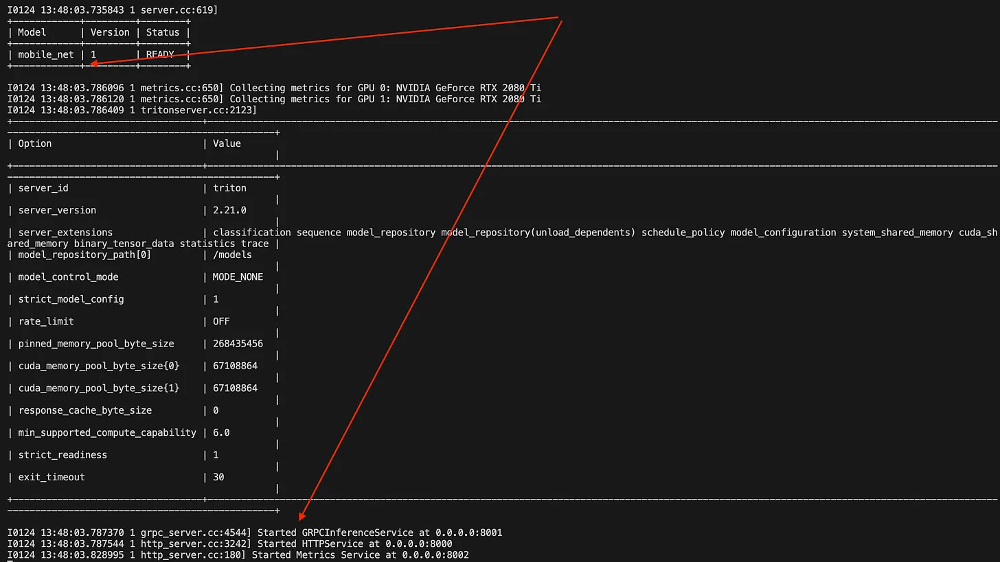
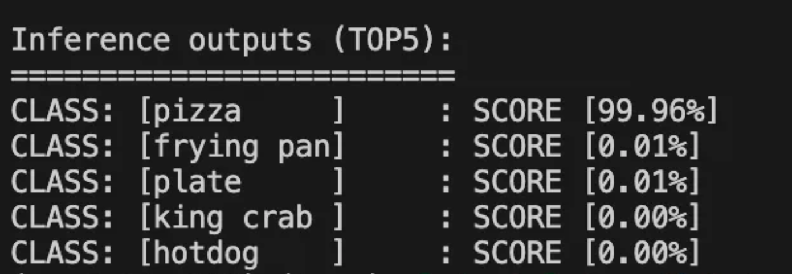

# Lab W07: Triton Inference Server

## Overview
In this lab we will see how you can use [Triton Inference Server](https://developer.nvidia.com/triton-inference-server) to run a MobileNet model efficiently.

As seen in class, Triton servers offer a lot of benefits such as reducing latency by optimising how the model interacts with the hardware used to host it, monitoring, ...

:warning: At step 5 of this lab we will download and run the `tritonserver-22.04-py3` Docker image, which is 11GB !
We don't expect the university internet to allow us to do this within one lab.
So we will provide all the commands and show how it can be done after that if the image is already downloaded.

## Learning Objectives
By completing this lab, you will:
- Understand what Triton Inference Server is and its key benefits for model deployment
- Learn how to configure and deploy a pre-trained deep learning model using Triton
- Gain hands-on experience with Docker containerization for ML model serving
- Practice preprocessing and sending inference requests to a deployed model
- Learn how to interpret and work with model server responses
- Understand basic model serving concepts including input/output tensors and batch processing

## Implementation

### 0. Prerequisites

1. Have a working version of [python](https://www.python.org/downloads/)
2. Have a working version of [Docker Desktop](https://docs.docker.com/desktop/)
3. Docker daemon running.

### 1. Prepare repository & dependencies

Run the following commands to prepare your directory:

```bash
mkdir triton_sample_project/
mkdir triton_sample_project/model_repo
mkdir triton_sample_project/model_repo/mobilenet
mkdir triton_sample_project/model_repo/mobilenet/1
touch triton_sample_project/model_repo/mobilenet/config.pbtxt
```

Make that your terminal is set to a **virtual environment** (see previous labs).

Install the triton python package:

```bash
pip install tritonclient
```

### 2. Prepare model

We will now download a pretrained model for image classification - the popular MobileNet.

Note that the model is already converted to [ONNX](https://onnx.ai/).

```bash
wget -O mobilenetv2-12.onnx https://github.com/onnx/models/raw/main/validated/vision/classification/mobilenet/model/mobilenetv2-12.onnx?download=

mv mobilenetv2-12.onnx  triton_sample_project/model_repo/mobilenet/1/mobilenetv2.onnx
```

### 3. Prepare configurations

#### Understanding Tensors in Machine Learning

A tensor is a fundamental concept in machine learning that represents all data in your ML system. Think of tensors as the "currency" of machine learning - everything gets converted into tensors to be processed:

1. **What are Tensors Used For?**
   - **Input Data**: Images, text, audio, or any other data is converted into tensors
   - **Model Parameters**: The weights and biases learned during training are stored as tensors
   - **Intermediate Values**: The calculations between layers in neural networks are tensors
   - **Output Predictions**: The model's predictions are produced as tensors

2. **Common Tensor Examples in ML:**
   - **Image Data**: A color image tensor might be [height, width, 3]
     - Where 3 represents RGB channels
   - **Text Data**: A sentence tensor might be [sequence_length, embedding_size]
     - Where each word is represented by a vector of numbers
   - **Batch Processing**: Adding a batch dimension: [batch_size, ...]
     - Like [32, height, width, 3] for processing 32 images at once

3. **In Our MobileNet Example:**
   ```
   Input Tensor:  [1, 3, 224, 224]
   ├── 1: Batch size (one image at a time)
   ├── 3: RGB channels
   └── 224, 224: Image dimensions

   Output Tensor: [-1, 1000]
   ├── -1: Flexible batch size
   └── 1000: Probability scores for each ImageNet class
   ```

Think of tensors as the standardized format that allows:
- Data to flow through the model
- Mathematical operations to be performed efficiently
- Hardware (like GPUs) to process information in parallel

Now, let's configure our model:

Open the `triton_sample_project/model_repo/mobilenet/config.pbtxt` file and copy paste the following content:

```protobuf
name: "mobile_net"              # Name of your model in Triton
platform: "onnxruntime_onnx"    # Specifies the backend to use (ONNX Runtime in this case)
max_batch_size: 0              # 0 means dynamic batching is disabled

input [
  {
    name: "input"              # Must match the input tensor name in your ONNX model
    data_type: TYPE_FP32      # 32-bit floating point input
    dims: [ 1, 3, 224, 224 ]  # Input shape: [batch_size, channels, height, width]
  }
]
output [
  {
    name: "output"            # Must match the output tensor name in your ONNX model
    data_type: TYPE_FP32     # 32-bit floating point output
    dims: [-1, 1000]         # Output shape: [batch_size, num_classes]
                            # -1 means dynamic dimension
  }
]

default_model_filename:"mobilenet.onnx"  # Name of your model file in the version directory
```

### 4. Prepare the environment

Create an environment file with the following variables:
```bash
HTTP_P=8000:8000      # Port for HTTP requests (host:container)
GRPC_P=8001:8001      # Port for gRPC requests (host:container)
PROM_P=8002:8002      # Port for Prometheus metrics (host:container), used for monitoring
IMAGE=nvcr.io/nvidia/tritonserver:22.04-py3  # Triton server Docker image
MODEL_REPOSITORY=model_repo                   # Path to model repository
```

### 5. Start you Triton server as a Docker container

Now, we know what this means :rocket:

:warning: This will download the `tritonserver-22.04-py3` image which is 11GB ! It will take a while...

Navigate to the 

```bash
# Go to the right location
cd triton_sample_project

# LOAD .env
source .env

# [OPTIONAL] CLEANUP PREVIOUS CONTAINERS
docker rm sample-tis-22.04

# START THE CONTAINER
docker run --gpus 0 -d -p $HTTP_P -p $GRPC_P -p $PROM_P \
           -v${MODEL_REPOSITORY}:/models \
           --name sample-tis-22.04 $IMAGE tritonserver \
           --model-repository=$MODELS
```

### 6. Check the server status

We can do so by looking at the container logs:
```bash
docker logs sample-tis-22.04 --tail 40
```

You should see something similar to this:


### 7. Download MobileNetV2 labels and a dummy image for testing

You can do so using the following command:
```bash
# LABELS
wget https://raw.githubusercontent.com/pytorch/hub/master/imagenet_classes.txt

# IMAGE
curl https://www.healthyseasonalrecipes.com/wp-content/uploads/2019/12/greek-pizza-21-034.jpg > pizzaa.png
```

### 7. Interact with the server

Create a Jupyter notebook with the following cells to test your deployed model:

##### Cell 1: Image preprocessing
```python
# Import required libraries for preprocessing and inference
import tritonclient.http as httpclient
import numpy as np
from PIL import Image
from scipy.special import softmax

def preprocess(image):
    """
    Preprocess an input image for MobileNetV2 inference.
    
    Args:
        image: Path to input image file
    
    Returns:
        norm_img_data: Normalized and resized image array of shape (1, 3, 224, 224)
    """
    def image_resize(image, min_len):
        """Resize image maintaining aspect ratio"""
        image = Image.open(image)
        ratio = float(min_len) / min(image.size[0], image.size[1])
        if image.size[0] > image.size[1]:
            new_size = (int(round(ratio * image.size[0])), min_len)
        else:
            new_size = (min_len, int(round(ratio * image.size[1])))
        image = image.resize(new_size, Image.BILINEAR)
        return np.array(image)

    def crop_center(image, crop_w, crop_h):
        """Crop the center portion of the image"""
        h, w, c = image.shape
        start_x = w // 2 - crop_w // 2
        start_y = h // 2 - crop_h // 2
        return image[start_y : start_y + crop_h, start_x : start_x + crop_w, :]

    # Resize image to 256px on shortest side
    image = image_resize(image, 256)
    
    # Center crop to 224x224 (MobileNetV2 input size)
    image = crop_center(image, 224, 224)
    
    # Convert to CHW format (channels first)
    image = image.transpose(2, 0, 1)
    img_data = image.astype("float32")

    # Normalize using ImageNet mean and std
    mean_vec = np.array([0.485, 0.456, 0.406])
    stddev_vec = np.array([0.229, 0.224, 0.225])
    norm_img_data = np.zeros(img_data.shape).astype("float32")
    for i in range(img_data.shape[0]):
        norm_img_data[i, :, :] = (img_data[i, :, :] / 255 - mean_vec[i]) / stddev_vec[i]
    
    # Add batch dimension
    norm_img_data = norm_img_data.reshape(1, 3, 224, 224).astype("float32")
    return norm_img_data
```

##### Cell 2: Setup inference parameters
```python
# Load ImageNet class labels
with open("imagenet_classes.txt", "r") as f:
    categories = [s.strip() for s in f.readlines()]

# Configure inference parameters
image_path = "./pizzaa.png"
model_input_name = "input"      # Must match config.pbtxt input name
model_output_name = "output"    # Must match config.pbtxt output name
model_name = "mobile_net"       # Must match config.pbtxt model name
model_vers = "1"               # Model version directory name
server_url = "localhost:8000"  # Triton HTTP endpoint
```

##### Cell 3: Send inference request
```python
# Preprocess the image
processed_image = preprocess(image_path)

# Create Triton client and prepare inference request
client = httpclient.InferenceServerClient(url=server_url)
input_data = httpclient.InferInput(model_input_name, processed_image.shape, "FP32")
input_data.set_data_from_numpy(processed_image)

# Send synchronous inference request
request = client.infer(model_name, model_version=model_vers, inputs=[input_data])

# Get results and apply softmax for probability scores
output = request.as_numpy(model_output_name)
output = np.squeeze(output)
probabilities = softmax(output)  # Convert logits to probabilities
```

##### Cell 4: Parse and print results

```python
# == Format to TOP_K detections ==
top5_class_ids = np.argsort(probabilities)[-5:][::-1]

# == Pretty print results ==
print("\nInference outputs (TOP5):")
padding_str_width = 10
for class_id in top5_class_ids:
    score = probabilities[class_id]
for class_id in top5_class_ids:
    score = probabilities[class_id]
    print(
        f"CLASS: [{categories[class_id]:<{padding_str_width}}]\t: SCORE [{score*100:.2f}%]"
    )
```

##### Cell 5: Sit back and enjoy your pizz

:pizza:

You should see something similar to the following logs:



Well done! You have successfully 

# Credits

This lab is based on the great example from RAZVANT ALEXANDRU of DecodingML: [https://decodingml.substack.com/p/dml-how-to-deploy-deep-learning-models](https://decodingml.substack.com/p/dml-how-to-deploy-deep-learning-models)
