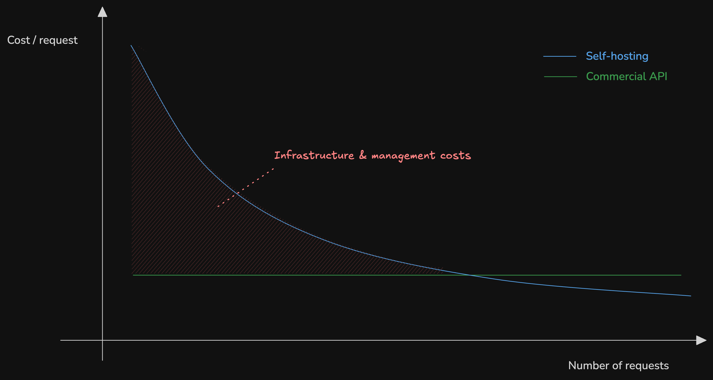

# 🚀 Local LLM Deployment with vLLM

In this tutorial, we'll deploy your very own Language Learning Model (LLM) using vLLM. 

While it's best with a GPU, we'll focus on making it work on CPU for demonstation and learning purposes 🤏

## 🤔 What is vLLM?

vLLM is a fast and easy-to-use library for LLM inference and serving. See github: [https://github.com/vllm-project/vllm](https://github.com/vllm-project/vllm).

It allows for:

#### 🚄 Fast inference performance
vLLM achieves state-of-the-art serving throughput through (among other things):
- **Continuous Batching**: Instead of processing requests one by one, vLLM smartly combines incoming requests into batches, even if they arrive at different times. 
- **PagedAttention** ([link](https://blog.vllm.ai/2023/06/20/vllm.html)): A clever memory management system that handles attention calculations more efficiently than traditional methods, reducing memory usage by up to 60%.

#### 🎯 Smart Resource Management
vLLM comes with advanced optimization features:
- **CUDA/HIP Graph Integration**: Pre-compiles common operations for faster execution on GPUs.
- **FlashAttention & FlashInfer**: Uses optimized attention mechanisms that are both faster and use less memory than traditional methods.

#### 🔧 Flexible Model Support
Supports various ways to run models efficiently:
- **Multiple Quantization Options**: Includes GPTQ, AWQ, INT4, INT8, and FP8, allowing you to compress models without significant quality loss.

#### 🔌 Easy Integration
- **OpenAI-Compatible API**: If you've used ChatGPT's API, you'll feel right at home. vLLM provides the same interface, making it super easy to switch from cloud services to your local deployment.
- **Python & REST APIs**: Choose between direct Python integration or REST API calls, whatever fits your needs better.

Think of vLLM as your personal LLM assistant that helps you:
- Run models efficiently on your own hardware 🖥️
- Save memory while maintaining performance 💾
- Scale from small to larger models 🏋️
- Keep costs down by optimizing resource usage 💰

For this tutorial, we'll focus on the basics, but knowing these features exist will help you scale up when needed! 

## ✅ Prerequisites

Before we dive in, make sure you have:
- Python 3.8 or higher
- At least 8GB RAM

## 🛠️ Step-by-Step Deployment Guide

### 1. 🌱 Environment Setup

First, let's create a clean workspace:

```bash
# Create a cozy new environment for our project
python -m venv vllm-env

# Wake up the environment
source vllm-env/bin/activate  # 🪟 Windows users: use "vllm-env\Scripts\activate"

# Install our tools
pip install vllm transformers
```

### 2. 🎯 Model Selection

Picking the right model is crucial! Let's look at some options based on your hardware:

#### 🐥 Entry Level (4-8GB RAM)
- **[facebook/opt-125m](https://huggingface.co/facebook/opt-125m)**
  - 125 million parameters
  - Perfect for learning and testing
  - Fast responses on CPU
  - Limited capabilities, best for simple tasks

- **[TinyLlama/TinyLlama-1.1B-Chat-v1.0](https://huggingface.co/TinyLlama/TinyLlama-1.1B-Chat-v1.0)**
  - 1.1 billion parameters
  - Good balance of size and capability
  - Runs on most modern laptops
  - Better understanding than opt-125m

#### 🤸‍♂️ Mid Range (16GB+ RAM)
- **[Qwen/Qwen2-1.5B-Instruct](https://huggingface.co/Qwen/Qwen2-1.5B-Instruct)**
  - 1.5 billion parameters
  - Good for general tasks
  - Requires ~8GB RAM for model
  - Decent performance on CPU

- **[microsoft/phi-2](https://huggingface.co/microsoft/phi-2)**
  - 2.7 billion parameters
  - Excellent performance/size ratio
  - Needs ~12GB RAM
  - Great for coding and general tasks

#### 🏋️‍♂️ Heavy Lifting (32GB+ RAM & GPU)
- **[deepseek-ai/deepseek-coder-7b-instruct](https://huggingface.co/deepseek-ai/deepseek-coder-7b-instruct)**
  - 7 billion parameters
  - Specialized for coding
  - Needs 16GB+ RAM, GPU recommended
  - Much better code completion

- **[mistralai/Mixtral-8x7B-Instruct-v0.1](https://huggingface.co/mistralai/Mixtral-8x7B-Instruct-v0.1)**
  - 47B effective parameters
  - State-of-the-art performance
  - Needs 32GB+ RAM
  - Requires good GPU (24GB+ VRAM)

#### Hardware Requirements Quick Guide:

| Model Size | Minimum RAM | Recommended Setup | Expected Performance |
|------------|-------------|-------------------|---------------------|
| <2B params | 8GB | CPU only | 2-5 seconds/response |
| 2B-7B | 16GB | CPU + GPU (8GB+) | 1-3 seconds/response |
| 7B-13B | 32GB | GPU (16GB+) | 0.5-2 seconds/response |
| >13B | 64GB | GPU (24GB+) | Varies by model |

💡 **Tips:**
- Start with smaller models (opt-125m or TinyLlama) to test your setup
- CPU-only setup works fine for learning but for anything serious, consider a GPU
- Consider cloud options for testing larger models: See [tutorial for GKE deployment using GPUs](https://github.com/ThomasVrancken/info9023-mlops/tree/main/demos/04_vllm)!

### 3. 🎮 Deployment Options

#### Option A: 🧪 Quick Testing with Python API

```python
from vllm import LLM, SamplingParams

# Set up our model 
llm = LLM(
    model="facebook/opt-125m", 
    device="cpu",           
    dtype="float16"       
)

# Configure generation parameters
sampling_params = SamplingParams(
    temperature=0.8,    # Controls randomness
    top_p=0.95,        # Controls diversity
    max_tokens=100     # Controls length of the generated text
)

# Let's test it out!
prompts = ["vLLM is an open-source powerful because"]
outputs = llm.generate(prompts, sampling_params)

# See what we got
for output in outputs:
    print(f"Prompt: {output.prompt}")
    print(f"Generated: {output.outputs[0].text}")
```

#### Option B: 🏭 Production Server Deployment

```bash
python -m vllm.entrypoints.openai.api_server \
    --model facebook/opt-125m \
    --device cpu \
    --dtype float16 \
    --tokenizer-mode auto \
    --host 0.0.0.0 \
    --port 8000
```

🎛️ What these settings do:
- `--model`: Pick your model
- `--device cpu`: Use CPU power
- `--dtype bfloat16`: Save memory
- `--tokenizer-mode auto`: Let vLLM be smart
- `--host 0.0.0.0`: Make it accessible
- `--port 8000`: Where to find it

### 4. 🎯 Making API Requests

Two ways to talk to your model:

#### Option A: 🐍 Python

```python
import requests
import json

def query_model(prompt, max_tokens=50):
    url = "http://localhost:8000/v1/completions"
    
    # Package our request nicely 
    headers = {"Content-Type": "application/json"}
    data = {
        "model": "facebook/opt-125m",
        "prompt": prompt,
        "max_tokens": max_tokens,
        "temperature": 0.7
    }

    # Send and get response 
    response = requests.post(url, headers=headers, json=data)
    return json.loads(response.text)

# Try it out! 
result = query_model("Write a haiku about programming:")
print(result)
```

#### Option B: 📺 Terminal Power (curl)

```bash
curl http://localhost:8000/v1/completions \
  -H "Content-Type: application/json" \
  -d '{
    "model": "facebook/opt-125m",
    "prompt": "Write a haiku about vllm:",
    "max_tokens": 50,
    "temperature": 0.7
  }'
```

You'll get back something like this:
```json
{
    "id": "cmpl-...",
    "object": "text_completion",
    "created": 1234567890,
    "model": "facebook/opt-125m",
    "choices": [{
        "text": "...",  # Actual text generated by the model
        "index": 0,
        "logprobs": null,
        "finish_reason": "length"
    }],
    "usage": {
        "prompt_tokens": 6,
        "completion_tokens": 50,
        "total_tokens": 56
    }
}
```

## 🔧 Performance Tips

1. 💾 **Memory Management**
   - Start with small models
   - If possible, enable memory diet mode (`bfloat16`)
   - Keep an eye on RAM usage

2. 📦 **Batch Processing**
   - Start small (large batch sizes can overload your system's memory)
   - Increase gradually
   - Watch your system's health

3. ⚡ **Speed Optimization**
   - Keep max_tokens reasonable
   - Test different prompt lengths

## 🩹 Troubleshooting

1. 💥 **Out of Memory?**
   - Try a smaller model
   - Reduce max_tokens
   - Close other apps

2. 🐌 **Too Slow?**
   - Check CPU usage
   - Close background apps
   - Consider a smaller model

3. 🔌 **Connection Issues?**
   - Check your port settings
   - Look at firewall rules
   - Verify network access


## 📚 Learn More

- 📖 [vLLM Docs](https://vllm.readthedocs.io/)
- 🤗 [Hugging Face Models](https://huggingface.co/models)
- 🔑 [OpenAI API Guide](https://platform.openai.com/docs/api-reference)

Happy modeling! 🎉 Remember, CPU deployment is perfect for learning and testing. When you're ready to go big, consider moving to GPU! 🚀

## 🏠 Considerations when opting for self-hosting

Before you decide to use self-hosting LLMs in production, it's important to understand the trade-offs compared to using commercial APIs like OpenAI's GPT models.

### Pros of Self-Hosting 🟢
- **Data Privacy**: Complete control over data, no external sharing
- **Customization**: Full control over model selection and parameters
- **No Internet Required**: Can run in air-gapped environments
- **No Usage Limits**: No rate limiting or quota restrictions
- **Cost Predictability**: Fixed infrastructure costs vs. per-token pricing

### Cons of Self-Hosting 🔴
- **Infrastructure Costs**: Significant upfront and ongoing hardware expenses
- **Maintenance Overhead**: Regular updates, security patches, monitoring
- **Performance Gap**: Most self-hosted models underperform compared to SOTA commercial API models
- **Technical Expertise**: Requires MLOps knowledge and dedicated personnel
- **Resource Intensive**: High RAM/GPU requirements, even for smaller models

Generally speaking, self-hosting is more expensive than using commercial APIs. It is rather useful if you have really strict security or privacy requirements.

The cost of hosting per request will decrease with the number of requests, as you make better use of the infrastructure and reduce cost of scale such as manual work required to setup and maintain the infrastructure. However, it takes a lot of requests to break even compared to using commercial APIs.

The following graph illustrates this:


