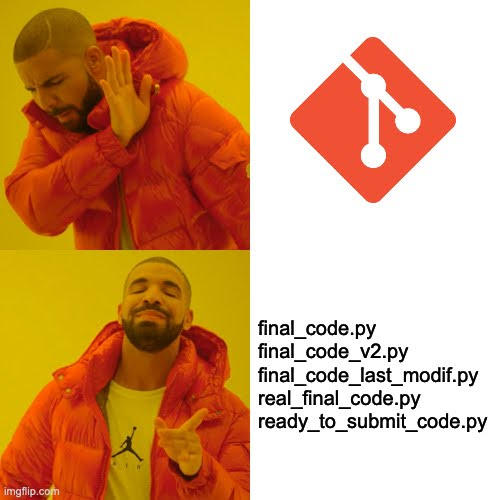

# Demo 1 [Sprint 1, W2] : Git code versioning and code quality




## 0. Introduction

This lab is designed to introduce you to the fundamentals of Git and GitHub. You will learn how to:
- Initialize a repository, commit changes.
- Push changes to GitHub. 
- Create and merge a pull request.
- Understand basic Git commands and workflows.

If you're already familiar with Git and GitHub, you can use this lab to refresh your knowledge and practice your skills.

## 1. Prerequisites

Before you start this lab, you should have:

1. A GitHub account : [Create one here.](https://github.com/)
2. Git installed on your computer : [Download Git.](https://git-scm.com/)
3. A code editor (e.g., [Visual Studio Code](https://code.visualstudio.com/), [Pycharm](https://www.jetbrains.com/fr-fr/pycharm/), etc.)
4. Set up a SSH key: mandatory for secure access to GitHub repositories. Follow this [tutorial](https://docs.github.com/en/authentication/connecting-to-github-with-ssh)


## 2. Git basics overview
The image below illustrates Git's structure and workflow.


- **Working directory**: The directory on your local machine where you make changes to your files.
- **Staging area**: A temporary storage area where you can add files before committing them. You can view it as a buffer between the working directory and the repository to be able to commit only the changes you want.
- **Local repository**: The .git directory where Git stores all the changes you've committed. :warning: This is a local repository, meaning it's stored on your computer, when you commit changes, they are only saved on your machine.
- **Remote repository**: The repository hosted on GitHub, GitLab, Bitbucket, etc. This is where you can push your changes to share them with others.

### Key steps and commands
1. **Create a repository**: you can create the repository on GitHub and clone it on your local machine or create a local repository and push it to GitHub. [Follow this tutorial.]( https://docs.github.com/en/repositories/creating-and-managing-repositories/quickstart-for-repositories)

2. **Clone a repository**: to clone a repository, use the following command:
```bash
git clone <repository_url>
```

3. **Branch management**: create a new branch and switch between branches.
- Create a new branch:
    ```bash
    git checkout -b <branch_name>
    ```
- Switch to a branch:
    ```bash
    git checkout <branch_name>
    ```
- Shortcut to create and switch to a new branch:
    ```bash
    git checkout -b <branch_name>
    ```

4. **Staging and commiting changes**:
- Add files to the staging area:
    ```bash
    git add <file_name>
    ```
- Add all files to the staging area:
    ```bash
    git add .
    ```
- Commit :warning: **staged** :warning: changes:
    ```bash
    git commit -m "Your commit message"
    ```
- Commit **all changes** (staged and unstaged):
    ```bash
    git commit -am "Your commit message"
    ```
5. **Push local changes to the remote repository**:
```bash
git push origin <branch_name>
```

6. **Pull requests**: In a company, in a team or in an open-source project, you will have to create a pull request to merge your changes into the main branch. \
This pull request will be reviewed by other developers, and they can ask you to make changes before merging your code. \
To create a pull request, you can [use the GitHub interface](https://docs.github.com/en/pull-requests/collaborating-with-pull-requests/proposing-changes-to-your-work-with-pull-requests/creating-a-pull-request?tool=codespaces.)

    + Note: A nice practice when creating a pull request is to add a template to help the reviewer understand what you have done and what you expect from the review. 
    + Note: A nice way to make pull requests funier is to use emojis in your pull request titles. Here is a [list of emojis that you can use](https://gitmoji.dev/). For example, if you add a new feature, you can use the emoji :sparkles: in your commit message. If you fix a bug, you can use the emoji :bug:, etc.


7. **Update local repository**: when you work on a project with other developers, you will have to update your local repository with the changes made by others on the remote repository.

- Update your local repository with the changes made on the remote repository, use the following command:
```bash
git pull origin <branch_name>
```
- A safer way to review changes before merging them is to use the following command:
```bash
git fetch origin <branch_name>
```
This allows you to see the changes made on the remote repository without merging them into your local repository.

- Compare the differences between your local repository and the remote repository:
```bash
git diff <branch_name> origin/<branch_name>
```
Finally, you can merge the changes into your local repository using the following command:
```bash
git merge origin/<branch_name>
```

8. **Delete branches**: when you have finished working on a branch i.e., you have merged your changes, the pull request has been accepted and the branch is no longer needed, you can delete it using the following command:
```bash
git branch -d <branch_name>
```

- if you have not merged your changes and you want to delete the branch, you can use the following command:
```bash
git branch -D <branch_name>
```

## 3. Additional ressources 

- Here is a [cheat sheet](https://education.github.com/git-cheat-sheet-education.pdf) made by GitHub that you can use to remember the most common Git commands.

- You can use, as previously mentioned, emojis in your commit messages. Here is a [list of emojis](https://gitmoji.dev/) that you can use to make your commit messages more fun.

- Here is a [Spotify playlist](https://open.spotify.com/playlist/1wNirTC24xxOGVDAKf9sXu?si=3bb49395f1314925) of music to remember the most common Git commands.

In the event of false manipulation of error, visit this [website](https://ohshitgit.com/) to find the solution to your problem.


## 4. Trunk based development vs. Git Flow

There are two main strategies for managing branches in a project: Trunk based development and Git Flow.

- **Trunk based development**: In this strategy, developers work on a single branch, the main branch, and create feature branches when they need to work on a new feature. Once the feature is complete, they merge it into the main branch. This strategy is simple and efficient, but it can be challenging to manage in large projects with many developers.

- **Git Flow**: In this strategy, developers work on one branch: the develop branch. The main branch only contains the stable version of the code i.e., the version that is deployed to production. The main branch is protected, meaning that developers cannot push directly to it. Instead, they create feature branches from the develop branch, work on the feature, and then merge it back into the develop branch. Once the develop branch is stable, it is merged into the main branch. This strategy is more complex but provides more control over the codebase.


credits: https://www.atlassian.com/git/tutorials/comparing-workflows/gitflow-workflow

During your project, you need to choose the strategy that best fits your needs. 
- Gitflow: one release per milestone (MS). This is great because you can do a clean PR per MS and tag us on it for a review.
- Trunk based development: frequent merges to the main branch. Easier for you but you need to be careful to find a clean way to show us the important codes at each MS.


For example on the GitHub of this course, we use the Trunk based development strategy. Why? 
- 1. Only two developers on this project (i.e., small team).
- 2. Small project with very few codes.
- 3. Isolated changes (i.e., my labs will not affect Thomas' lectures because we work on different parts of the "project").
- 4. Fast release cycle (i.e., we release a new lab/lecture every week).

A great application to see your branches and commits is [GitKraken](https://www.gitkraken.com/).


## 5. Code quality checks

When you work on a project, it's important to maintain code quality. You saw during the lesson that there are standards to follow when writing code like PEP8 for Python. To help you maintain code quality, you can use code linters and formatters.
Linters are tools that analyze your code and report any errors or warnings. Formatters are tools that automatically format your code according to a specific style guide. Examples of linters and formatters are: Pylint, Black, Ruff, etc.

Ruff and Black are among the most popular Python tools used for code quality and are often pitted against each other, but they serve different purposes and have unique characteristics. So let's make an objective comparison. Here's a brief overview of the differences between both:

1. Purpose:
   * **Ruff**: primarily a linter with some formatting features.
   * **Black**: code formatter.
2. Configuration:
   * **Ruff**: highly configurable (enable or disable linting rules).
   * **Black**: strongly opinionated with very few configuration options.
3. Ecosystem:
   * **Ruff**: designed to replace multiple other tools (e.g. `flake8`, `isort`, `pylint`) and relatively new.
   * **Black**: widely adopted in the Python community and integrates with most IDE and CI/CD pipelines.

Because Ruff and Black each have their own purposes, strengths and philosophies it is not uncommon to get the best of both worlds by combining them:
- **Use Black** if your primary concern is enforcing consistent, unopinionated code formatting
- **Use Ruff** if you're looking for a fast, versatile linter that also handles minor formatting tasks and integrates multiple types of checks
- **Combine Black and Ruff** for a comprehensive code quality solution, leveraging Black for strict formatting and Ruff for efficient linting and minor fixes


An example of a Ruff configuration file can be found [here](https://docs.astral.sh/ruff/configuration/).

### Linter speed comparison


To use these tools, you can install them using pip:
```bash
pip install black pylint ruff
```

Then you can run Ruff linter on your code using the following command:
```bash
ruff check <file_name>
```

or run Ruff formatter on your code using the following command:
```bash
ruff format <file_name>
```

## 6. Conclusion

In short, Git is a powerful tool that allows you to manage your code versioning and collaborate with other developers. By following the best practices and using code quality tools, you can ensure that your code is clean, maintainable, and easy to work with. You are also ready to work on your first project and collaborate with other developers.


