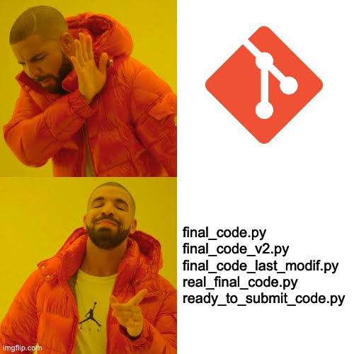
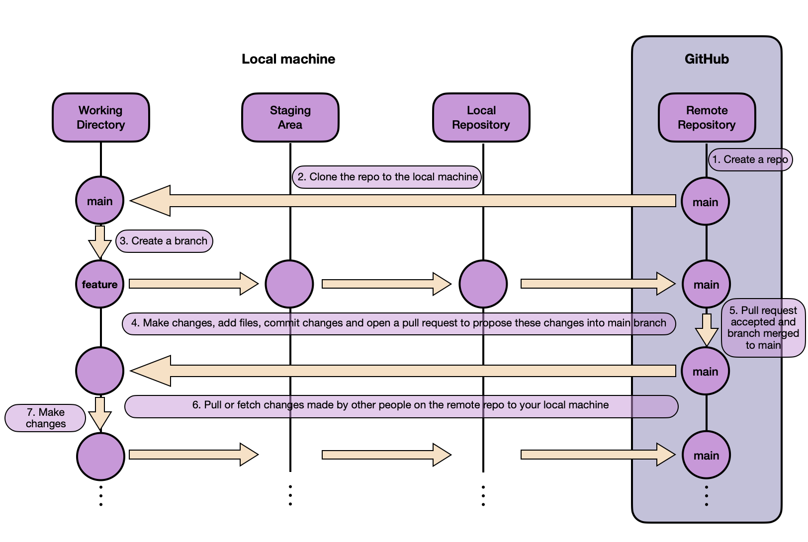

# Lab 1 [Sprint 1, W2]: Git, CI/CD & Code Quality




## 0. Introduction

This lab is designed to introduce you to the fundamentals of Git and GitHub. You will learn how to:
- Initialize a repository, commit changes.
- Push changes to GitHub.
- Create and merge a pull request.
- Understand basic Git commands and workflows.
- Understand the difference between Trunk based development and Git Flow.
- Use code quality tools like Ruff and Black.
- Use pre-commit hooks to ensure code quality.
- Write tests with Pytest.
- Automate your workflow with GitHub Actions.

## 1. Prerequisites

Before you start this lab, you should have:

1. A GitHub account: [Create one here.](https://github.com/)
2. Git installed on your computer: [Download Git.](https://git-scm.com/)
3. A code editor (e.g., [Visual Studio Code](https://code.visualstudio.com/), [PyCharm](https://www.jetbrains.com/fr-fr/pycharm/), etc.)
4. An SSH key set up for secure access to GitHub repositories. Follow this [tutorial](https://docs.github.com/en/authentication/connecting-to-github-with-ssh).


## 2. Git basics overview
The image below illustrates Git's structure and workflow.



- **Working directory**: the directory on your local machine where you make changes to your files.
- **Staging area**: a temporary storage area where you can add files before committing them. You can view it as a buffer between the working directory and the repository to be able to commit only the changes you want.
- **Local repository**: the `.git` directory where Git stores all the changes you've committed. :warning: This is a local repository, meaning it's stored on your computer. When you commit changes, they are only saved on your machine until you push them.
- **Remote repository**: the repository hosted on GitHub, GitLab, Bitbucket, etc. This is where you can push your changes to share them with others.

### Key steps and commands
1. **Create a repository**: you can create the repository on GitHub and clone it to your local machine, or create a local repository and push it to GitHub. [Follow this tutorial.](https://docs.github.com/en/repositories/creating-and-managing-repositories/quickstart-for-repositories)

2. **Clone a repository**: to clone a repository, use the following command:
    ```bash
    git clone <repository_url>
    ```

3. **Branch management**: create a new branch and switch between branches.
- Create a new branch and switch to it:
    ```bash
    git switch -c <branch_name>
    ```
- Switch to a branch:
    ```bash
    git switch <branch_name>
    ```

    + Note: you can choose between `git checkout` and `git switch` to switch and create branches. `git switch` is the **new command introduced in Git 2.23.0**. It is more intuitive and specifically designed for switching branches. \
    Use `git checkout` if you need to perform additional tasks like checking out specific files or commits, i.e., when you need to move to a specific commit in the history of your project (e.g., to inspect old code, to review the code at a specific point in time, etc.). You can do that with `git checkout <commit_hash>`.


- List all local branches:
    ```bash
    git branch
    ```
- List all remote branches:
    ```bash
    git branch -r
    ```
- List all branches (local and remote):
    ```bash
    git branch -a
    ```
- Work on a remote branch that exists on GitHub but not on your machine:
    ```bash
    git fetch origin                        # Download all remote branches
    git switch <branch_name>                # Git will automatically track the remote branch
    ```
    If the branch exists on the remote, Git will create a local branch that tracks it. You can then work on it and push your changes.

4. **Staging and committing changes**:
- Add files to the staging area:
    ```bash
    git add <file_name>
    ```
- Add all files to the staging area:
    ```bash
    git add .
    ```
- Commit :warning: **staged** :warning: changes:
    ```bash
    git commit -m "Your commit message"
    ```
- Commit all **tracked** modified files (skips the staging step for convenience):
    ```bash
    git commit -am "Your commit message"
    ```
    :warning: This only works for files Git already knows about. New (untracked) files must be added with `git add` first.
5. **Push local changes to the remote repository**:
    ```bash
    git push origin <branch_name>
    ```

6. **Pull requests**: in a company, in a team or in an open-source project, you will have to create a pull request to merge your changes into the main branch. \
This pull request will be reviewed by other developers, and they can ask you to make changes before merging your code. \
To create a pull request, you can [use the GitHub interface](https://docs.github.com/en/pull-requests/collaborating-with-pull-requests/proposing-changes-to-your-work-with-pull-requests/creating-a-pull-request?tool=codespaces.)

    + Note: A nice practice when creating a pull request is to add a template to help the reviewer understand what you have done and what you expect from the review.
    + Note: A nice way to make pull requests funnier is to use emojis in your pull request titles. Here is a [list of emojis that you can use](https://gitmoji.dev/). For example, if you add a new feature, you can use the emoji :sparkles: in your commit message. If you fix a bug, you can use the emoji :bug:, but make sure to use them appropriately otherwise they lose their meaning.


7. **Update local repository**: when you work on a project with other developers, you will need to update your local repository with changes made by others on the remote repository.

- The quickest way is to pull directly (this fetches and merges in one step):
    ```bash
    git pull origin <branch_name>
    ```
    Make sure you are on the branch you want to update before running this command.

- A safer approach is to fetch first, review the changes, then merge:
    ```bash
    git fetch origin <branch_name>
    ```
    This downloads the remote changes without applying them to your working directory.

- Compare the differences between your local branch and the fetched remote branch:
    ```bash
    git diff <branch_name> origin/<branch_name>
    ```

- Once you've reviewed the changes, merge them into your current branch:
    ```bash
    git merge origin/<branch_name>
    ```

- **What if you only want some changes?** If you don't want to accept all the changes from the remote branch, you can cherry-pick specific commits:
    ```bash
    git cherry-pick <commit_hash>
    ```
    This applies only that specific commit to your branch, ignoring the others. You can find the commit hash using `git log origin/<branch_name>`.

- **What is a merge conflict?** A conflict occurs when Git cannot automatically merge changes because the same lines of code were modified differently in both branches. For example, if you changed line 10 of a file, and your colleague also changed line 10 differently, Git doesn't know which version to keep.

    When a conflict happens, Git marks the conflicting sections in the file like this:
    ```
    <<<<<<< HEAD
    your version of the code
    =======
    their version of the code
    >>>>>>> branch-name
    ```

    **Resolving conflicts locally**: Edit the file manually to keep the code you want (remove the conflict markers), then stage and commit.

    **Resolving conflicts on GitHub**: If you have a conflict in a Pull Request, GitHub offers a web editor:
    1. Click on "Resolve conflicts" button in the PR
    2. GitHub shows you the conflicting files with the conflict markers
    3. Edit directly in the browser: delete the lines you don't want, keep the lines you want, and remove the `<<<<<<<`, `=======`, and `>>>>>>>` markers
    4. Click "Mark as resolved" for each file
    5. Click "Commit merge" to save your resolution

    This is often easier than resolving conflicts locally, especially for simple conflicts.

8. **Delete branches**: when you have finished working on a branch, i.e., your changes have been merged and the pull request has been accepted, you can delete the branch using the following command:
    ```bash
    git branch -d <branch_name>
    ```
    This is a "safe delete": Git will warn you if the branch contains unmerged changes.

- If you want to force delete a branch (even if it has unmerged changes), use uppercase `-D`:
    ```bash
    git branch -D <branch_name>
    ```
    :warning: Use with caution - you may lose work that hasn't been merged elsewhere.


9. **Keep your branch up to date**: when working on a long-lived feature branch, other branches (e.g., main or develop) may have received updates from colleagues. To incorporate those changes into your branch, you have two primary options: **merge** or **rebase**.

**Option 1**: Merge (Recommended for Simplicity).\
Merging integrates the latest changes from main into your branch, preserving the history of both branches.


Source: https://www.atlassian.com/git/tutorials/merging-vs-rebasing

```bash
git switch <your-branch>
git fetch origin main      # Download latest changes from remote main
git merge origin/main      # Merge remote main into your branch
```

Downsides of merge:
1. If you frequently merge branches, your Git history will have lots of merge commits that may not be meaningful.

2. It's not always clear what changes were made in the feature branch since the commits remain separate.

3. `git bisect` (a tool to find which commit introduced a bug) is harder to use with a complex history.

**Option 2**: Rebase (For a clean history).
Rebasing rewrites your branch's history so it appears as though your changes were made on top of the latest main branch. You don't have merge commits in your history.


Source: https://www.atlassian.com/git/tutorials/merging-vs-rebasing

```bash
git switch <your-branch>
git fetch origin main      # Download latest changes from remote main
git rebase origin/main     # Rebase your branch on top of remote main
```
This results in a linear history but can cause conflicts that must be resolved manually.

**The golden rule of rebasing**: the most important thing to learn is **when not to do it**. The golden rule of git rebase is to never use it on public branches.

If you rebase a branch that others are working on, you will create a mess for them. This is because rebasing rewrites the commit history, which can cause conflicts for other developers.
When you rebase a branch, you are essentially creating a new branch with a new commit history. If someone else has already pulled the branch you rebased, they will have to deal with the conflicts that arise from the new commit history.

If you want to learn more about rebasing, you can read this [article](https://www.atlassian.com/git/tutorials/merging-vs-rebasing).


## 3. Additional resources

- Here is a [cheat sheet](https://education.github.com/git-cheat-sheet-education.pdf) made by GitHub that you can use to remember the most common Git commands.

- You can use, as previously mentioned, emojis in your commit messages. Here is a [list of emojis](https://gitmoji.dev/) that you can use to make your commit messages more fun.

- Here is a [Spotify playlist](https://open.spotify.com/playlist/1wNirTC24xxOGVDAKf9sXu?si=3bb49395f1314925) of music to remember the most common Git commands.

If you make a mistake or mess something up, visit this [website](https://ohshitgit.com/) to find solutions to common Git problems.


## 4. Trunk based development vs. Git Flow

There are two main strategies for managing branches in a project: Trunk based development and Git Flow.

- **Trunk based development**. In this strategy, developers work on a single branch, the main branch, and create feature branches when they need to work on a new feature. Once the feature is complete, they merge it into the main branch. This strategy is simple and efficient, but it can be challenging to manage in large projects with many developers.

- **Git Flow**. In this strategy, there are two long-lived branches: `main` (stable, production-ready code) and `develop` (integration branch for features). Developers create feature branches from `develop`, work on their feature, and then merge it back into `develop` via a pull request. When `develop` is stable and ready for release, it is merged into `main`. Both `main` and `develop` are typically protected branches. This strategy is more complex but provides more control over releases.


Source: https://www.atlassian.com/git/tutorials/comparing-workflows/gitflow-workflow

### For your project: Git Flow is mandatory

:warning: **For your course project, you must use the Git Flow strategy.** Here's how it works:

1. **Your repository must have two main branches**: `main` (stable, production-ready) and `develop` (integration branch).
2. **All your feature branches must be created from `develop`**, not from `main`.
3. **At each milestone (MS)**, when your work is ready:
   - Merge your feature branches into `develop`
   - Create a Pull Request from `develop` to `main`
   - **Assign Thomas (`@ThomasVrancken`) and myself (`@Mapirlet`) as reviewers**
   - Include **clear documentation** in your PR description explaining what you did, what changed, and how to test it
4. **Deadline warning**: :rotating_light: If your Pull Request is not created before the milestone deadline, it will be considered as if you did nothing. No PR = no grade for that milestone.

This workflow ensures:
- Clean separation between work-in-progress and stable code
- Easy review process for the teaching team
- Clear history of what was delivered at each milestone

---

For reference, on the GitHub repo of this course, we (the teaching team) use Trunk-based development. Why? Because our context is different:
1. Small team (only two developers on this project).
2. Small project with minimal code.
3. Isolated changes (my labs don't affect Thomas' lectures because we work on different parts of the project).
4. Fast release cycle (we release a new lab/lecture every week).

This doesn't apply to your project where we need structured milestones and reviews.

A great application to see your branches and commits is [GitKraken](https://www.gitkraken.com/).


## 5. Code quality checks

When you work on a project, it's important to maintain code quality. You saw during the lesson that there are standards to follow when writing code like PEP8 for Python. To help you maintain code quality, you can use code linters and formatters.
Linters are tools that analyze your code and report any errors or warnings. Formatters are tools that automatically format your code according to a specific style guide. Examples of linters and formatters are: Pylint, Black, Ruff, etc.

Ruff and Black are among the most popular Python tools used for code quality and are often pitted against each other, but they serve different purposes and have unique characteristics. So let's make an objective comparison. Here's a brief overview of the differences between both:

1. Purpose:
   * **Ruff**: primarily a linter with some formatting features.
   * **Black**: code formatter.
2. Configuration:
   * **Ruff**: highly configurable (enable or disable linting rules).
   * **Black**: strongly opinionated with very few configuration options.
3. Ecosystem:
   * **Ruff**: designed to replace multiple other tools (e.g. `flake8`, `isort`, `pylint`) and relatively new.
   * **Black**: widely adopted in the Python community and integrates with most IDE and CI/CD pipelines.

Because Ruff and Black each have their own purposes, strengths and philosophies it is not uncommon to get the best of both worlds by combining them:
- **Use Black** if your primary concern is enforcing consistent, unopinionated code formatting
- **Use Ruff** if you're looking for a fast, versatile linter that also handles minor formatting tasks and integrates multiple types of checks
- **Combine Black and Ruff** for a comprehensive code quality solution, leveraging Black for strict formatting and Ruff for efficient linting and minor fixes


An example of a Ruff configuration file can be found [here](https://docs.astral.sh/ruff/configuration/).

### Linter speed comparison


Source: https://docs.astral.sh/ruff/

To use these tools, you can install them using pip:
```bash
pip install black pylint ruff
```

Then you can run Ruff linter on your code using the following command:
```bash
ruff check <file_name>
```

or run Ruff formatter on your code using the following command:
```bash
ruff format <file_name>
```

## 6. Pre-commit hooks

Pre-commit hooks are scripts that run before a commit is made. They can be used to check the code for errors, enforce code style guidelines, or run tests. Pre-commit hooks are a great way to ensure that your code is clean and error-free before you commit it.

To use pre-commit hooks, you need to install the pre-commit package:
```bash
pip install pre-commit
```

Then you need to create a `.pre-commit-config.yaml` file in the root of your project. An example configuration file is shown below:

```yaml
repos:
- repo: https://github.com/astral-sh/ruff-pre-commit
  rev: v0.4.8
  hooks:
    - id: ruff
      types_or: [python, jupyter]
    - id: ruff-format
      args: [--diff]
      types_or: [python, jupyter]
- repo: https://github.com/pre-commit/pre-commit-hooks
  rev: v4.5.0
  hooks:
    - id: check-added-large-files
    - id: check-toml
    - id: check-yaml
    - id: end-of-file-fixer
    - id: mixed-line-ending
      args: [--fix=lf]
    - id: trailing-whitespace
```

This configuration file specifies the pre-commit hooks that should be run before each commit. In this example, we are using the Ruff linter and formatter on python and jupyter files as well as some other pre-commit hooks provided by the pre-commit package such as checking for large files to be sure not to commit them, checking for toml and yaml files to be sure they are well formatted, fixing mixed line endings which means checking if the line endings are consistent and fixing them if they are not, and checking for trailing whitespace.


## 7. Pytest

Pytest is a testing framework for Python that makes it easy to write simple and scalable test cases. It is widely used in the Python community and is known for its simplicity and flexibility.
To use pytest, you first need to install it.
```bash
pip install pytest
```
Once it is installed, you can write test functions using the `assert` statement and save them in a file with the name `test_<your_module>.py`.

You can the run the tests using the command:
```bash
pytest
```

This is really useful and will even be mandatory if you begin a project in your future work.

### Example of a pytest test

For example, if you have a really simple functions that does addition:
```python
def add(a, b):
    return a + b
```
You can write a test for this function like this:
```python
def test_add():
    assert add(1, 2) == 3
    assert add(-1, 1) == 0
    assert add(0, 0) == 0
```
You can save this test in a file called `test_add.py` and run it using pytest:
```bash
pytest test_add.py
```
This will run the test and report any failures.


## 8. GitHub Actions

GitHub Actions is a CI/CD tool that allows you to automate your software development workflows. It enables you to build, test, and deploy your code directly from your GitHub repository. With GitHub Actions, you can create custom workflows that are triggered by specific events, such as pushing code to a repository or creating a pull request.

GitHub Actions is integrated with GitHub, making it easy to set up and manage your workflows without needing to use external CI/CD tools.

### How to use GitHub Actions

To use GitHub Actions, you need to first create a `.github/workflows` directory in your repository. In this directory you need to create one or more YAML files that define your workflows. Each workflow file can contain one or more jobs, which are the individual tasks that will be executed as part of the workflow.

You can configure a GitHub Actions workflow to be triggered by specific events, such as pushes, pull requests, issue comments or scheduled events. You can also define conditions for when a job should run, such as only running on specific branches or when certain files are changed.

### Workflows

A workflow contains one or more jobs that run in parallel or sequentially. Each job runs inside its own virtual environment or container. Each job runs an action or a script.

You can either use predefined actions from the GitHub Marketplace or create your own custom actions. You can also define job's dependencies to run after another job has completed in the same workflow.

### Example of a workflow

Now, we will write a simple workflow that runs pytest on every push and pull requests to the main branch. This workflow will also run pre-commit hooks to check for code quality and formatting issues before running the tests.

```yaml
name: Python CI

on:
  push:
    branches: [ main ]
  pull_request:
    branches: [ main ]

jobs:
    pre-commit:
        runs-on: ubuntu-latest

        steps:
            - uses: actions/checkout@v4
            - name: Run pre-commit hooks
              uses: pre-commit/action@v3.0.1
              with:
                extra_args: --all-files --config pre_commit.yml

    pytest:
        runs-on: ubuntu-latest
        needs: pre-commit

        steps:
            - name: Checkout code
              uses: actions/checkout@v4

            - name: Set up Python
              uses: actions/setup-python@v5
              with:
                python-version: '3.11'

            - name: Install dependencies
              run: |
                python -m pip install --upgrade pip install pytest
                pip install -r requirements.txt

            - name: Run tests
              run: |
                pytest tests/
```


## 9. Your turn

What we ask you to do now is to create a GitHub Actions workflow that runs pytest on every push and pull request to the main branch. This workflow should also run pre-commit hooks to check for code quality and formatting issues before running the tests.

For the assignment, you should have:
1. Created a pytest test for one of your project functions
2. Created a GitHub Actions workflow that runs pytest on every push and pull request to the main branch
3. This workflow should also run pre-commit hooks to check for code quality and formatting issues before running the tests

We will want you to push some code to your GitHub repository and create a pull request to test the workflow.
Also we want you to add something of your choice that should automatically deploy something to the cloud using the CI/CD pipeline.

What we will check is to see if the workflow has run successfully and if the tests have passed. We will also check if the pre-commit hooks have run successfully and if there are any code quality or formatting issues.


## 10. Conclusion

In short, Git is a powerful tool that allows you to manage your code versioning and collaborate with other developers. By following the best practices and using code quality tools, you can ensure that your code is clean, maintainable, and easy to work with. Combined with GitHub Actions, you can automate your testing and deployment workflows, making your development process more efficient. You are now ready to work on your first project and collaborate with other developers.
