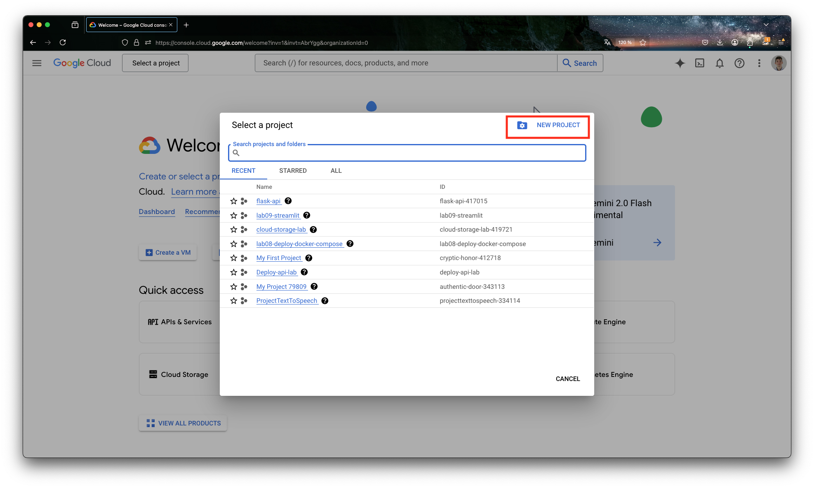
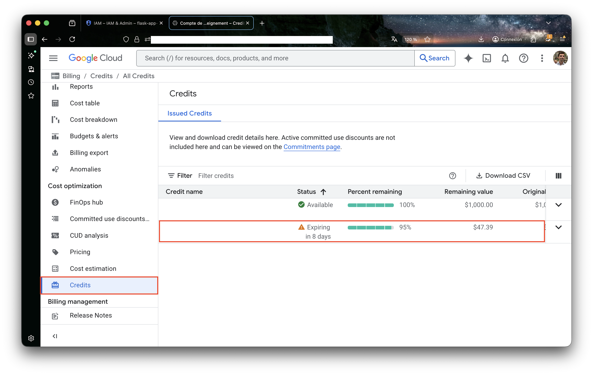
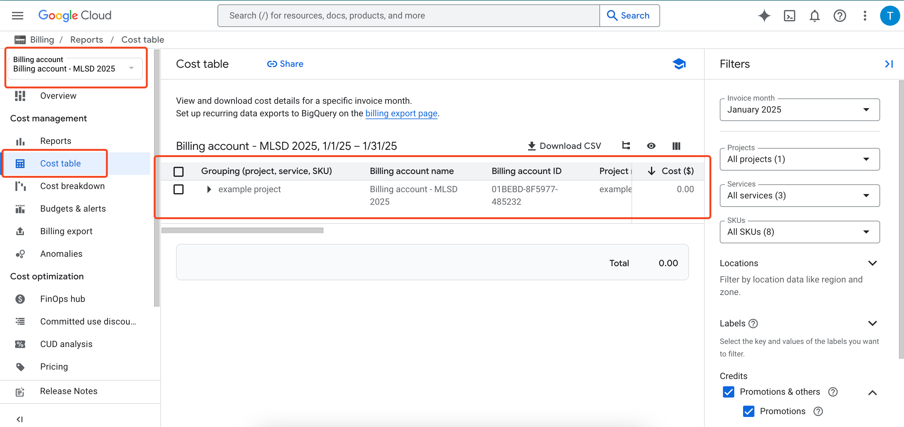

# Lab 2 [Sprint 2, W3]: Introduction to Google Cloud & Data Storage

## 0. Introduction

This lab introduces you to Google Cloud Platform (GCP) and its data storage services. It is divided into two parts:

1. **Part 1: Google Cloud Setup**. Setting up your Google Cloud environment (project, billing, access rights, CLI)
2. **Part 2: Reading & Writing Data**. Using GCP data storage services (GCS, BigQuery, Firestore)

By the end of this lab, you will be able to

- set up and configure a Google Cloud project,
- authenticate using the Google Cloud CLI and Python SDK,
- read and write files to Google Cloud Storage (GCS),
- query data in BigQuery using SQL,
- perform CRUD operations on Firestore (NoSQL database).

These are foundational skills for MLOps. In later labs, you will deploy ML models and APIs to the cloud, but first, you need to understand how to store and access data. In production systems, you should never store data or models locally on your laptop!

:warning: **For your project**, we will check that you are using cloud services (GCS, BigQuery, Firestore, or others) for storing data and models, not local files. Any code that reads/writes local files will be penalized heavily.

## Part 1: Google Cloud Setup

Before you can work with Google Cloud data services, you need to set up your environment. This includes creating a project, configuring billing, managing access rights, and installing the necessary tools.

### 1.1. Project Setup

#### 1.1.1. Create or select a project

1. Visit the [Google Cloud Console](https://console.cloud.google.com/).
2. Click on the project selector dropdown at the top of the page.


3. Click ```New Project```, give it a name, and click ```Create```.



**What is a Google Cloud Project?**
- All resources (databases, compute, storage) are attached to a specific project
- Multiple developers can work in a single project
- One project is attached to a specific billing account
- In production environments, different projects are used for different stages (development, test, production)

#### 1.1.2. Set up billing and credits

You should have received an email with **$50 of educational credits** for this course.

1. Go to the [Billing management page](https://console.cloud.google.com/billing/)
2. Redeem your credits if you haven't already
3. Make sure your project is linked to your billing account



You can verify the link between your project and billing account in the billing tab under `Cost table`:



:warning: :warning: :warning: **Cloud credits can run out very quickly!** Be extremely careful with cloud resources. Here are some tips to avoid burning through your credits:

- **Monitor your spending regularly.** Check the [Billing Dashboard](https://console.cloud.google.com/billing/) frequently to track credit usage.
- **Set up budget alerts.** Configure billing alerts in the Billing console to notify you before credits run out.
- **Delete resources when done.** Don't leave expensive services running (VMs, Cloud Run instances, etc.).
- **Avoid unnecessary operations.** Don't process large datasets in BigQuery or store huge files in GCS without reason.

Your $50 in credits might seem like a lot, but they can disappear in hours if you're not careful.

### 1.2. Access Rights (IAM)

:bulb: **For your group project**: Create a single Google Cloud project using one team member's billing account. The owner can then grant access to other team members through IAM.

To grant access to teammates:
1. Go to the [IAM page](https://console.cloud.google.com/iam-admin/)
2. Click "Grant Access"
3. Enter the team member's email
4. Assign appropriate roles (e.g., `Editor` for full access, or specific roles for limited access)


### 1.3. Google Cloud CLI

There are two ways to interact with Google Cloud:

1. **CLI (Command-Line Interface) `gcloud`**. A terminal tool to manage GCP resources, configure your environment, and authenticate.
2. **SDK (Software Development Kit) Python libraries**. Libraries you import in your Python code (`google-cloud-storage`, `google-cloud-bigquery`, etc.) to interact with GCP services programmatically.

The CLI and SDK work together. You use the CLI to set up authentication and project configuration, and the SDK uses those credentials automatically in your Python code.

#### 1.3.1. Installation

The Google Cloud CLI (`gcloud`) lets you interact with GCP from your terminal.

- macOS: `brew install google-cloud-sdk`
- Windows/Linux: Follow the [official installation guide](https://cloud.google.com/sdk/docs/install)

#### 1.3.2. Configuration

**Initial setup:**
```bash
gcloud init
```

This will:
1. Open a browser for authentication
2. Ask you to select or create a project
3. Optionally set a default region

**Verify your setup**
```bash
gcloud auth list # Check authenticated accounts
gcloud config list # Check current configuration
gcloud projects list # List your projects
```

**Set your project (if not already set)**
```bash
gcloud config set project YOUR_PROJECT_ID
```

:warning: `YOUR_PROJECT_ID` is not your project name. Find it in the Cloud Console dashboard or by running `gcloud projects list`.

#### 1.3.3. Switching between projects

If you're working with multiple GCP projects, you need to ensure you're connected to the correct one before creating resources.

**Check your current project:**
```bash
gcloud config get-value project
```

**List all your projects:**
```bash
gcloud projects list
```

This shows a table with project names and their IDs. The project ID (lowercase with hyphens) is what you need.

**Switch to a different project:**
```bash
gcloud config set project YOUR-PROJECT-ID
```

**Important:** After switching projects, you may see a quota mismatch warning when running Python code. If this happens, see the troubleshooting section in the **Authentication** section below.

#### 1.3.4. Authentication

Before accessing GCP services, you need to authenticate. For local development, run:

```bash
gcloud auth application-default login
```

This opens a browser for authentication and saves credentials locally. The Google Cloud Python libraries (SDK) will automatically use these credentials. No extra configuration needed in your code.

You can verify it worked with:
```bash
gcloud auth application-default print-access-token
```

**How authentication flows from CLI to SDK:**

The activated account will automatically be used by the Python SDK's client (the libraries you use in your Python code). This means:

1. You authenticate with `gcloud auth application-default login`
2. Your credentials are saved locally
3. When you create a client in Python (e.g., `storage.Client()`), it automatically picks up these credentials
4. No need to manually configure credentials in your code

Alternatively, you can configure the client to use another account (see the troubleshooting section below).

**Check which account you're authenticated with:**
```bash
gcloud auth list
```

The active account will have an asterisk (*) next to it.

**Troubleshooting authentication:**

If you encounter authentication errors when running Python code:
1. Make sure you're in the correct project: `gcloud config get-value project`
2. Re-run the authentication: `gcloud auth application-default login`
3. If you switched projects, update the quota project: `gcloud auth application-default set-quota-project YOUR-PROJECT-ID`

## Part 2: Reading & Writing Data to Google Cloud

Now that you have Google Cloud set up, let's learn how to read and write data. Google Cloud offers multiple data storage services, each designed for different use cases.

### 2.1. Overview of data storage options

In this lab, we cover three fundamental data storage services:

| Service | Type | Best for | Example use case |
|---------|------|----------|------------------|
| **GCS** | Object storage | Files, blobs, unstructured data | Store ML models, images, raw data |
| **BigQuery** | Data warehouse | Analytics, large datasets, SQL queries | Analyze training data, generate reports |
| **Firestore** | NoSQL database | Real-time, transactional, CRUD | Store user profiles, prediction results |

In a typical ML application:
1. Raw data is stored in **GCS**
2. Processed/training data is analyzed in **BigQuery**
3. Live predictions and user data are stored in **Firestore**

Let's dive into each service.

### 2.2. Google Cloud Storage (GCS)

Google Cloud Storage is an object storage service for storing any type of data (files, images, models, etc.).

**Key concepts**
- **Bucket**: A container for your files (like a folder). Bucket names must be globally unique.
- **Blob/Object**: A file stored in a bucket. It can be your data file, model file, Docker image, etc.
- **Path**: Objects are organized by path (e.g., `data/raw/file.csv`).

#### 2.2.1. Create a bucket

```python
from google.cloud import storage

def create_bucket(project_id, bucket_name, location="europe-west1"):
    """Creates a new bucket in the specified project."""
    client = storage.Client(project=project_id)
    bucket = client.bucket(bucket_name)
    new_bucket = client.create_bucket(bucket, location=location)
    print(f"Bucket {new_bucket.name} created in {new_bucket.location}")

# Example usage
create_bucket(
    project_id="your-project-id",
    bucket_name="mlops-2026-yourname",
    location="europe-west1"
)
```

:warning: Bucket names must be **globally unique** across all of Google Cloud. If you get an error, try adding random numbers or your username to make it unique.

#### 2.2.2. Upload and download files with Python

**Install the library**
```bash
pip install google-cloud-storage
```

**Upload a file**
```python
from google.cloud import storage

def upload_to_gcs(project_id, bucket_name, source_file_path, destination_blob_name):
    """Uploads a file to Google Cloud Storage."""
    client = storage.Client(project=project_id)
    bucket = client.bucket(bucket_name)
    blob = bucket.blob(destination_blob_name)

    blob.upload_from_filename(source_file_path)
    print(f"File {source_file_path} uploaded to gs://{bucket_name}/{destination_blob_name}")

# Example usage
upload_to_gcs(
    project_id="your-project-id",
    bucket_name="your-bucket-name",
    source_file_path="local_data.csv",
    destination_blob_name="data/uploaded_file.csv"
)
```

**List files in a bucket**
```python
def list_blobs(project_id, bucket_name, prefix=None):
    """Lists all files in a bucket (optionally filtered by prefix)."""
    client = storage.Client(project=project_id)
    blobs = client.list_blobs(bucket_name, prefix=prefix)

    for blob in blobs:
        print(blob.name)

# List all files
list_blobs("your-project-id", "your-bucket-name")

# List files in a specific folder
list_blobs("your-project-id", "your-bucket-name", prefix="data/")
```

**Download a file**
```python
def download_from_gcs(project_id, bucket_name, source_blob_name, destination_file_path):
    """Downloads a file from Google Cloud Storage."""
    client = storage.Client(project=project_id)
    bucket = client.bucket(bucket_name)
    blob = bucket.blob(source_blob_name)

    blob.download_to_filename(destination_file_path)
    print(f"File gs://{bucket_name}/{source_blob_name} downloaded to {destination_file_path}")

# Example usage
download_from_gcs(
    project_id="your-project-id",
    bucket_name="your-bucket-name",
    source_blob_name="data/uploaded_file.csv",
    destination_file_path="downloaded_data.csv"
)
```

**Understanding the Python client and authentication**

In the code above, you may notice that we create a `client` (e.g., `storage.Client(project=project_id)`) without providing any credentials. This is because the client automatically uses the credentials you set up via the `gcloud` CLI (see Part 1).

- **For local development**: The client uses your personal credentials from `gcloud auth application-default login`. This is what you'll use throughout this lab.
- **For deployed services** (e.g., on Cloud Run): You should use a **service account** instead of personal credentials. Service accounts are special accounts meant for applications, not humans. We will cover service accounts in detail in the Cloud Run lab.

#### 2.2.3. When to use GCS

GCS is ideal for:
- Storing ML model files (`.pkl`, `.pth`, `.h5`)
- Raw data files (CSV, JSON, images, audio, video)
- Sharing data between services
- Storing artifacts from training pipelines

### 2.3. BigQuery

BigQuery is Google's serverless data warehouse for analytics (remember the distinction between OLAP and OLTP types from the theoretical course). It's designed for running SQL queries on large datasets.

**Key features**
- serverless i.e., no infrastructure to manage,
- can process terabytes of data in seconds,
- standard SQL syntax,
- pay only for queries and storage.

#### 2.3.1. Enable BigQuery

The BigQuery API will be automatically enabled when you first use it. Alternatively, you can enable it manually:

**Option 1: Using the Cloud Console**
1. Go to [BigQuery API Library](https://console.cloud.google.com/apis/library/bigquery.googleapis.com)
2. Click "Enable"

**Option 2: Using gcloud CLI**
```bash
gcloud services enable bigquery.googleapis.com
```

You can verify it's enabled with:
```bash
gcloud services list --enabled | grep bigquery
```

You should see `bigquery.googleapis.com` in the output.

**Verify billing is enabled:**

Before creating BigQuery resources, ensure your project has billing enabled:
```bash
gcloud beta billing projects describe $(gcloud config get-value project) --format="value(billingEnabled)"
```

If this returns `True`, you're good to go. If it returns `False` or an error, go to the [Billing Console](https://console.cloud.google.com/billing) and link your project to a billing account.

#### 2.3.2. Create a dataset and load data

**Create a dataset**
```python
from google.cloud import bigquery

project_id = "your-project-id"
dataset_id = "mlops_lab"

client = bigquery.Client(project=project_id)

dataset = bigquery.Dataset(f"{project_id}.{dataset_id}")
dataset.location = "europe-west1"

# Use exists_ok=True to make this command safe to run multiple times
dataset = client.create_dataset(dataset, exists_ok=True)
print(f"Created dataset {dataset.project}.{dataset.dataset_id}")
```

**Load data from a DataFrame**
```python
import pandas as pd

df = pd.DataFrame({
    "name": ["Alice", "Bob", "Charlie"],
    "age": [25, 30, 35],
    "score": [95, 87, 92]
})

table_id = f"{project_id}.{dataset_id}.students"
job = client.load_table_from_dataframe(df, table_id)
job.result()

print(f"Loaded {len(df)} rows into {table_id}")
```

#### 2.3.3. Query data with Python

**Install the library**
```bash
pip install google-cloud-bigquery pandas db-dtypes
```

Note: `db-dtypes` is required for converting BigQuery results to pandas DataFrames.

**Run a query**
```python
from google.cloud import bigquery
import pandas as pd

def query_bigquery(query):
    """Runs a BigQuery SQL query and returns a DataFrame."""
    client = bigquery.Client()
    query_job = client.query(query)
    return query_job.to_dataframe()

project_id = "your-project-id"
dataset = "mlops_lab"
table = "your_table"

query = f"""
SELECT DISTINCT(category)
FROM `{project_id}.{dataset}.{table}`
"""

df = query_bigquery(query)
print(df)
```

**Query with filters**
```python
query = f"""
SELECT column1, column2, column3
FROM `{project_id}.{dataset}.{table}`
WHERE column1 > 100
ORDER BY column2 DESC
LIMIT 1000
"""

df = query_bigquery(query)
print(df)
```

**Insert data from a DataFrame**
```python
from google.cloud import bigquery
import pandas as pd

def insert_to_bigquery(df, project_id, dataset, table):
    """Inserts a DataFrame into a BigQuery table."""
    client = bigquery.Client()
    table_id = f"{project_id}.{dataset}.{table}"

    job = client.load_table_from_dataframe(df, table_id)
    job.result()

    print(f"Loaded {len(df)} rows into {table_id}")

# Example
df = pd.DataFrame({
    "name": ["Alice", "Bob"],
    "score": [95, 87]
})
insert_to_bigquery(df, "your-project-id", "mlops_lab", "scores")
```

#### 2.3.4. When to use BigQuery

BigQuery is ideal for:
- Analyzing large datasets (GBs to PBs)
- Running SQL queries for reporting/analytics
- Storing structured, tabular data
- Data that doesn't change frequently (append-only is common)

### 2.4. Firestore

Firestore is a NoSQL document database. Unlike BigQuery (analytical), Firestore is designed for **transactional** operations i.e., reading and writing individual records in real-time.

**Key concepts**
- **Collection**: a group of documents (like a table).
- **Document**: a single record (like a row), stored as key-value pairs.
- **No fixed schema**: documents in the same collection can have different fields.

#### 2.4.1. Enable Firestore

Before using Firestore, you need to enable the API and create a database.

**1. Enable the Firestore API**

The Firestore API will be automatically enabled when you first create a database. Alternatively, enable it manually:

**Option 1: Using the Cloud Console**
- Go to [Firestore API Library](https://console.cloud.google.com/apis/library/firestore.googleapis.com)
- Click "Enable"

**Option 2: Using gcloud CLI**
```bash
gcloud services enable firestore.googleapis.com
```

Verify it's enabled:
```bash
gcloud services list --enabled | grep firestore
```

You should see `firestore.googleapis.com` in the output.

**2. Create a Firestore database**

You must create a Firestore database in your project (this is a one-time setup).

```bash
# Create a named database
gcloud firestore databases create --database=mlops-db --location=europe-west1
```

If the database already exists, you'll see an error message with "ALREADY_EXISTS". This is fine - it means the database was created previously and you can continue using it.

**Verify your database was created:**
```bash
gcloud firestore databases list
```

You should see your `mlops-db` database listed with its location.

**Check database details:**
```bash
gcloud firestore databases describe --database=mlops-db
```

:warning: Once you create a Firestore database, you cannot change its location. If you need to change regions, you must delete the database and recreate it. Choose your region carefully!

**To delete a Firestore database**
```bash
gcloud firestore databases delete --database=mlops-db
```

#### 2.4.2. CRUD operations with Python

**Install the library**
```bash
pip install google-cloud-firestore
```

**Create**
```python
from google.cloud import firestore

def create_document(collection, document_id, data):
    """Creates a document in Firestore."""
    db = firestore.Client(database='mlops-db')
    doc_ref = db.collection(collection).document(document_id)
    doc_ref.set(data)
    print(f"Document {document_id} created in {collection}")

# Example: Add a user
create_document(
    collection="users",
    document_id="user_001",
    data={
        "name": "Alice",
        "email": "alice@example.com",
        "score": 95,
        "created_at": firestore.SERVER_TIMESTAMP
    }
)
```

**Read**
```python
def read_document(collection, document_id):
    """Reads a document from Firestore."""
    db = firestore.Client(database='mlops-db')
    doc_ref = db.collection(collection).document(document_id)
    doc = doc_ref.get()

    if doc.exists:
        return doc.to_dict()
    else:
        print(f"Document {document_id} not found")
        return None

# Example
user = read_document("users", "user_001")
print(user)
```

**Update**
```python
def update_document(collection, document_id, updates):
    """Updates fields in a Firestore document."""
    db = firestore.Client(database='mlops-db')
    doc_ref = db.collection(collection).document(document_id)
    doc_ref.update(updates)
    print(f"Document {document_id} updated")

# Example: Update score
update_document("users", "user_001", {"score": 98})
```

**Delete**
```python
def delete_document(collection, document_id):
    """Deletes a document from Firestore."""
    db = firestore.Client(database='mlops-db')
    doc_ref = db.collection(collection).document(document_id)
    doc_ref.delete()
    print(f"Document {document_id} deleted")

# Example
delete_document("users", "user_001")
```

**Query documents**
```python
def query_documents(collection, field, operator, value):
    """Queries documents in a collection."""
    db = firestore.Client(database='mlops-db')
    docs = db.collection(collection).where(field, operator, value).stream()

    results = []
    for doc in docs:
        results.append({"id": doc.id, **doc.to_dict()})
    return results

# Example: Find users with score > 90
high_scorers = query_documents("users", "score", ">", 90)
print(high_scorers)
```

#### 2.4.3. When to use Firestore

Firestore is ideal for:
- Real-time applications (chat, live dashboards)
- User profiles and settings
- Storing predictions/results from ML models
- Data that changes frequently (CRUD operations)
- Mobile/web app backends

## 3. Your turn

For this assignment, you need to demonstrate that you can read and write data to all three GCP services.

**Requirements**

1. **Google Cloud Storage**
   - Create a bucket
   - Upload a dataset
   - Download the dataset back
   - List files in your bucket

2. **BigQuery**
   - Create a dataset
   - Load data into a table
   - Write some queries and a Python script that queries the data

3. **Firestore**
   - Create a collection
   - Add at least 3 documents
   - Read, update, and delete a document
   - Query documents based on a field

**Deliverables**

Deadline: February 16th 2026 23:59.

- A completed Jupyter notebook should be uploaded on Gradescope.
- All cells must be executable and their outputs should not be erased before submission.
- This case study must be carried out alone. You are not allowed to discuss or collaborate with other students.

## 4. Conclusion

In this lab, you learned how to:

- Set up a Google Cloud project and configure billing
- Authenticate using the `gcloud` CLI and understand how credentials flow to the Python SDK
- Store and retrieve files with Google Cloud Storage
- Query structured data with BigQuery
- Perform CRUD operations with Firestore

These data storage skills are essential for MLOps. In the next labs, you'll learn to deploy APIs and ML models to the cloud - and they'll need to read/write data from these services.

**Key takeaways:**
- Use **GCS** for files (models, images, raw data)
- Use **BigQuery** for analytics on large structured datasets
- Use **Firestore** for real-time, transactional data (predictions, user data)
