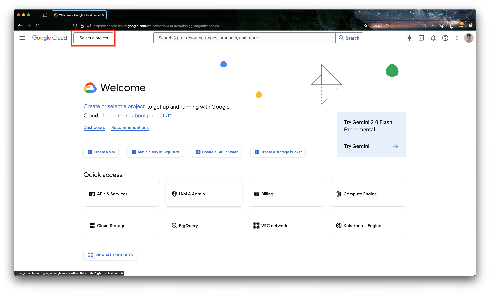
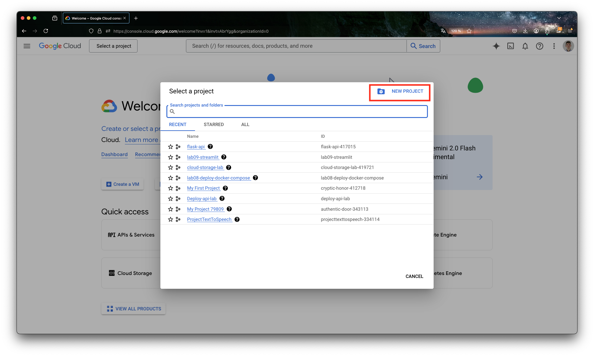
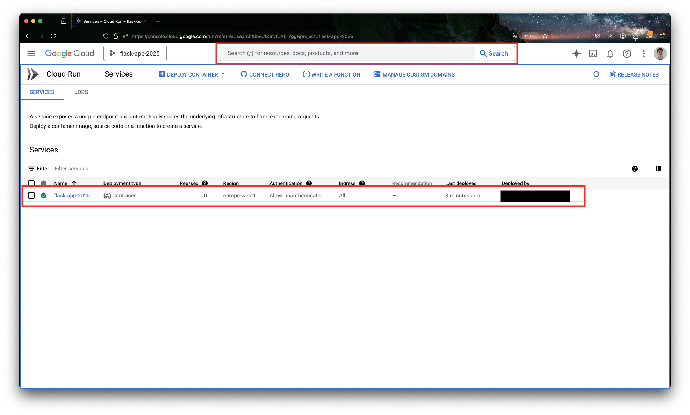
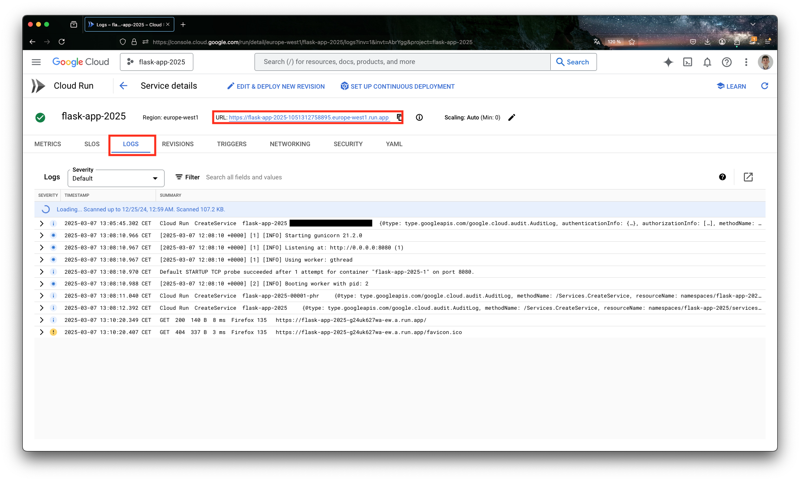
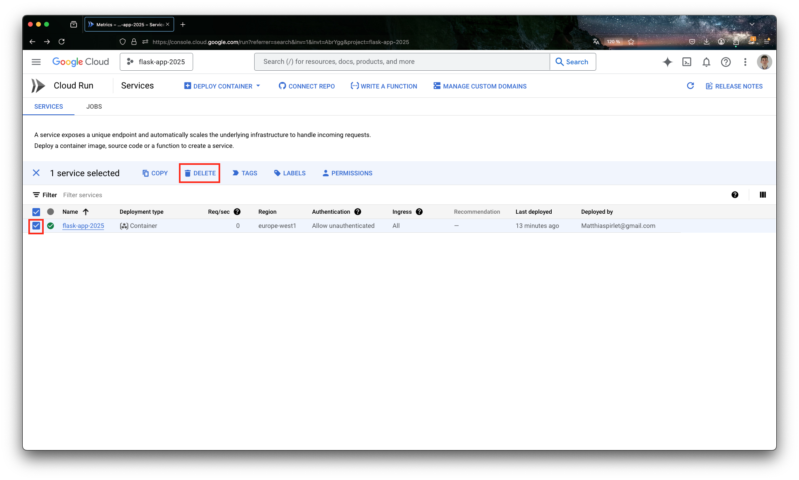
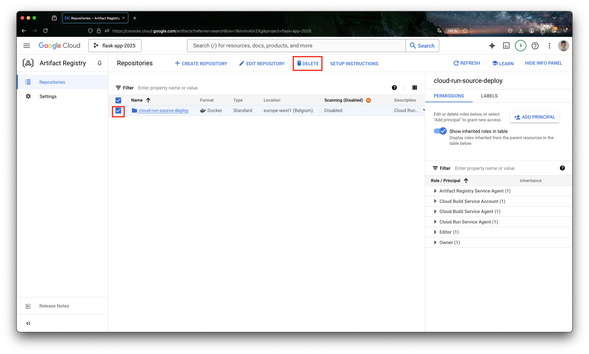

# Directed work 3 [Sprint 3, W06] : Deploy API in Google Cloud Platform (GCP)

## 0. Introduction
The goal of this directed work is to deploy a basic Python Flask API we created in the previous lab to the Google Cloud Platform (GCP).

## 1. Prerequisites

1. Have a working version of [python](https://www.python.org/downloads/)
2. Have a working version of [Docker Desktop](https://docs.docker.com/desktop/)
3. Docker daemon running.

## 1. Flask API
### 1.1. Minimal structure of your folder

Inside the folder of this lab, create the following files and folders:

```bash
> touch Dockerfile
> mkdir src 
> cd src
> touch requirements.txt
> touch hello.py
```
- Note: Be careful with the names of the files, last week some of you had problems because of that. The names of the files and folders should be exactly the same as the ones mentioned above if you want the codes below to work correctly. Mainly the `Dockerfile` file should be named exactly like this otherwise Docker won't be able to build the image correctly.


You can visualize the structure of your folder with the following command:

```bash
> tree
```

### 1.2. Content of the files
Inside the `requirements.txt` file, you should have the following content:

```txt
Flask==3.0.3
gunicorn==21.2.0
```

Inside the `hello.py` file, you should have the following content:

```python
import os
from flask import Flask

app = Flask(__name__)

@app.route("/")
def hello_world():
    return "Hello World"

if __name__ == "__main__":
    app.run(host="0.0.0.0", port=5001)
```

Inside `Dockerfile` add:

```Dockerfile
FROM python:3.9-slim

ENV PYTHONUNBUFFERED True

WORKDIR /src

COPY /src/hello.py .
COPY /src/requirements.txt .

ENV PORT 5001

RUN pip install -r requirements.txt

CMD exec gunicorn --bind :$PORT --workers 1 --threads 8 hello:app
```

This file :
- Uses the `python:3.9-slim` image as the base image. 

- Sets the working directory in the container to `/src`.

- Copies the `hello.py` and `requirements.txt` files to the container.
  - Note: once again some of you had problems with a `File not found` error because you copied only some files and not others. If you want to be sure you can copy all the files in the `src` folder, you can use the following command: `COPY /src/ .`. This command copies all the files in the `src` folder to the container. This is not the best practice because you may copy unnecessary files to the container but it is a good way to avoid the `File not found` error.
- Sets the environment variable `PORT` to `5001` which means that the app will run on port `5001`.

- Installs the requirements defined in the `requirements.txt` file.

- Runs the `hello.py` file when the container launches. The `gunicorn` command is used to run the app. e.g. `gunicorn --bind :$PORT --workers 1 --threads 8 hello:app` means that we are binding the app to the port defined in the environment variable `PORT` and running the app with 1 worker and 8 threads. `hello:app` means that we are running the app named `app` defined in the `hello.py` file. If you named your Flask app differently in the `hello.py`file, you should replace `app` with the name you used.

  - Note : We use `gunicorn` to run the app. `gunicorn` is a Python WSGI HTTP Server for UNIX. It is a pre-fork worker model, ported from Ruby's Unicorn project. The Gunicorn server is broadly compatible with various web frameworks, simply implemented, light on server resources, and fairly fast. In our case as we will work with GCP, we will use `gunicorn` to run the app.


### 1.3. Test the app locally
Now you can test your app by running the following command:

```bash
> docker build -t flask-app .
> docker run -p 5001:5001 flask-app
```

You should get the following output:

```bash
[date-time] [1] [INFO] Starting gunicorn 21.2.0
[date-time] [1] [INFO] Listening at: http://0.0.0.0:5001 (1)
[date-time] [1] [INFO] Using worker: gthread
[date-time] [1] [INFO] Booting worker with pid: 7
```

And visit the following URL in your web browser: `http://localhost:5001/`. You should see the message `Hello World` displayed in your web browser.

## 2. Create a project in GCP

### 2.1. Prerequisites
You should, as asked, have created a gmail address for your group and used your coupon to get your 50$ credit on GCP. If you haven't done so, please do it now. Once it is done you should see in the credits section of the billing page of your GCP console that you have 50$ of credit.


1. Go to the [GCP console](https://console.cloud.google.com/),
2. Create a new project by clicking on the `Select a project` dropdown,



3. Click on `New Project`, name your project and click `Create`,


### 2.2 Install the Google Cloud SDK

1. Go to the [Google Cloud SDK](https://cloud.google.com/sdk/docs/install) page and follow the instructions to install the SDK for your operating system.

#### 2.2.1 for Mac OS
1. Download the `google-cloud-sdk` tar file from the [Google Cloud SDK](https://cloud.google.com/sdk/docs/install) page
2. Extract the tar file in your home directory (just double click on the tar file)
3. Open a terminal, you should be in your home directory
4. Run `./google-cloud-sdk/install.sh` to install the SDK. You will be prompted to answer a few questions. You can just press `Enter` to accept the default answers or `y` to accept the default answers and start the installation.

### 2.3 Initialize the Google Cloud SDK

1. In your GUI (VScode, Pycharm, etc) or in your terminal, run `gcloud init` to initialize the SDK. This should appear in your terminal:

```bash
Welcome! This command will take you through the configuration of gcloud.

Your current configuration has been set to: [default]

You can skip diagnostics next time by using the following flag:
  gcloud init --skip-diagnostics

Network diagnostic detects and fixes local network connection issues.
Checking network connection...done.                                                                                                                                                                                      
Reachability Check passed.
Network diagnostic passed (1/1 checks passed).

You must log in to continue. Would you like to log in (Y/n)?
```

2. You will be prompted to log in to your GCP account. The following message should appear in your terminal:

```bash
You are logged in as: [google email address].

Pick cloud project to use: 
 [1] your-newly-created-project
 [2] Create a new project
Please enter numeric choice or text value (must exactly match list item):
```
3. Select the project you just created.

### 2.4 Change the project
If you want to work in another project, you can see the list of your projects by running the following command in your terminal:

```bash
> gcloud projects list
```

This should give you something like this:

```bash
PROJECT_ID                NAME                  PROJECT_NUMBER
something-staging-2587    something-staging     804012817122
something-production-24   something-production  392181605736
```

Now if you want to change the project you are working on, you can change the project by running the following command in your terminal:

```bash
> gcloud config set project something-staging-2587
```

where `something-staging-2587` is the `PROJECT_ID` of the project you want to work on.

## 3. Deploy the app to GCP

[OLD COMMAND ?]

If you run now the following command in your terminal:

```bash
> gcloud run deploy flask-app --region=europe-west1 --source=$(pwd) --allow-unauthenticated
```

[NEW COMMAND ?]

```bash
gcloud builds submit --tag [IMAGE] /path/to/your/folder
gcloud run deploy flask-app --image [IMAGE]
```

You should get the following output:

```bash
The following APIs are not enabled on project [flask-app-2025]:
        artifactregistry.googleapis.com
        cloudbuild.googleapis.com
        run.googleapis.com

Do you want enable these APIs to continue (this will take a few minutes)? (y/N)?
```

Then

```bash
Deploying from source requires an Artifact Registry Docker repository to store built containers. A repository named [cloud-run-source-deploy] in region [europe-west1] will be created.

Do you want to continue (Y/n)?  
```
Accept by typing `Y` and press `Enter`.

You should get the following output:

```bash
This command is equivalent to running `gcloud builds submit --tag [IMAGE] /Users/matthiaspirlet/info9023-mlops/labs/06_deploy_api` and `gcloud run deploy flask-app --image [IMAGE]`

Building using Dockerfile and deploying container to Cloud Run service [flask-app] in project [project-id] region [europe-west2]
✓ Building and deploying new service... Done.
  ✓ Creating Container Repository...                      
  ✓ Uploading sources...                                
  ✓ Building Container... Logs are available at [https://console.cloud.google.com/cloud-build/builds/...].
  ✓ Creating Revision...                              
  ✓ Routing traffic... 
  ✓ Setting IAM Policy...                               
Done.                                   
Service [flask-app] revision [flask-app-000...] has been deployed and is serving 100 percent of traffic.
Service URL: https://flask-app-...-uc.a.run.app
```


You can now visit the URL `https://flask-app-...-uc.a.run.app` in your web browser. You should see the message `Hello World` displayed in your web browser.


### 3.1. Possible problems

1. **PERMISSION DENIED**
```bash
Building using Dockerfile and deploying container to Cloud Run service [flask-app-2025] in project [flask-app-2025] region [europe-west1]
X Building and deploying new service... Uploading sources.
  ✓ Creating Container Repository...                          
  ✓ Uploading sources...                                     
  . Building Container...                                    
  . Creating Revision...                                    
  . Routing traffic...                                
  . Setting IAM Policy...                              
Deployment failed                                      
ERROR: (gcloud.run.deploy) PERMISSION_DENIED: The caller does not have permission
```

This error may be due to the fact that you don't have the right permissions to deploy the app. Make sure you're logged in with the right account and that you have the right permissions to deploy the app.

```
> gcloud auth login
```

## 4. Monitor the API logs and usage in Google Cloud

1. In the GCP console, search for `Cloud Run` and click on the first result. You should see the following screen:

2. Click on the service you just created. You should see the different metrics of your service and above the URL of your service.
3. Click on `Logs` (or `Journaux` if you are using the French version of the console) to view the logs of your service.
 


## 5. Clean up

1. In `Cloud Run` tab, select the service you just created and click on `Delete` to delete the service

4. In the GCP console, search for the `Artifact Registry` and click on it.
5. Select the `cloud-run-source-deploy` repository and `Delete` to delete the repository



## 6. About pricing

Here we built a small app and deployed it to GCP. We used the `Cloud Run` service which is a serverless platform that allows you to run stateless containers that are invocable via HTTP requests. The pricing of `Cloud Run` is based on the number of requests and the amount of memory used by the app. You can find more information about the pricing of `Cloud Run` [here](https://cloud.google.com/run/pricing). But to give you an idea, in terms of processing power, the first 240k vCPU-seconds per months are free. A vCPU-second is a unit of time that represents the processing power of a single virtual CPU running for one second. After the first 240k vCPU-seconds, you will be charged 0,00001800\$ per vCPU-seconde. So for example if you have an app that uses 1 vCPU for 1 second, you will be charged 0,00001800\$ after the first 240k vCPU-seconde. This [website](https://phoenixnap.com/kb/what-is-a-vcpu) explains what is a vCPU and how you can calculate vCPU requirements for your app..

In terms of memory, the first 450k Gio-seconde per month are free. After that, you will be charged 0,00000200\$ per Gio-seconde. A Gio-seconde is a unit of time that represents the amount of memory used by the app for one second. So for example if you have an app that uses 1 Gio of memory for 1 second, you will be charged 0,00000200\$ after the first 450k Gio-seconde.

## 7. Your turn

You should now deploy the API you created in the previous lab to GCP. All optional features should be implemented. 

You should send me by email:
- object of the mail: `[INFO9023] DW3 - Group <group name>`
- the link of your deployed API by email on **Monday 17 March 2025 at 9 a.m.** at the latest. I will then test your API. If it works as expected, you will get the full mark for this lab. If it doesn't work as expected, you will get a fail mark for this lab.

For a small project as this one you should not be charged for the use of GCP even if you let it run for a few days. But if you want to be sure you are not charged, you can delete the resources you created in GCP as explained in the `Clean up` section. 

**BE SURE THAT YOUR APP IS ACCESSIBLE ON MONDAY 17 MARCH 2025 AT 9 A.M.**

## 8. Conclusion

In this lab, you learned how to deploy a basic `Hello World!` Python Flask API to the Google Cloud Platform (GCP) using the Google Cloud SDK. You also learned how to monitor the API logs and usage in Google Cloud. You also learned how to clean up the resources you created in GCP not to be charged for them :money_with_wings::money_with_wings::money_with_wings:. But you can do way more with more complex Flask APIs and other services of GCP. You can test this tuto and try to deploy more complex APIs that you created in the previous labs. 

## 8. References

- [Google Cloud SDK](https://cloud.google.com/sdk/docs/install)
- [Google Cloud Run](https://cloud.google.com/run/docs/deploying)
- [Google Cloud Run API](https://cloud.google.com/run/docs/reference/rest)
- [Google Cloud Run Pricing](https://cloud.google.com/run/pricing)
- [Google Cloud Run Quickstart](https://cloud.google.com/run/docs/quickstarts/build-and-deploy)
- [Deploy a Python Flask Server using Google Cloud Run](https://medium.com/google-cloud/deploy-a-python-flask-server-using-google-cloud-run-d47f728cc864)
