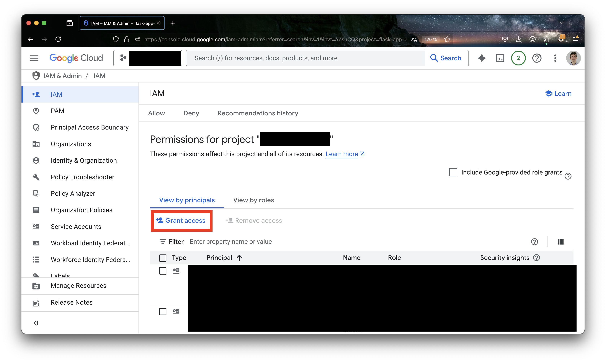
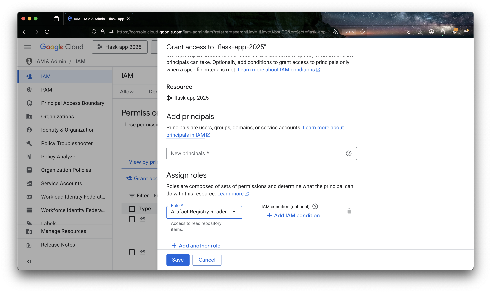
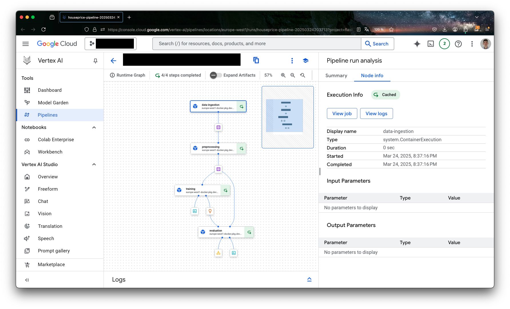

# Directed work 4 [Sprint 4, W08]: Vertex

## 0. Introduction
The goal of this directed work is to make you familiar with the Vertex AI platform.

## 1. Prerequisites

1. Have a working version of [python](https://www.python.org/downloads/)
2. Have a working version of [Docker Desktop](https://docs.docker.com/desktop/)
3. Docker daemon running.
4. Enable Vertex AI API in your Google Cloud project.
5. Have the gcloud CLI installed on your machine.
6. Authenticate with gcloud CLI by running `gcloud auth application-default login`

## 2. Vertex AI

### 2.1. Presentation of Vertex AI
Vertex AI is Google Cloud's unified platform for building, training, and deploying machine learning models. It provides a comprehensive suite of tools and services that allow data scientists and ML engineers to:

- Build and train models using AutoML or custom training
- Deploy models for online prediction or batch prediction
- Manage ML workflows and pipelines
- Monitor model performance and detect model drift
- Collaborate across teams with shared notebooks and datasets

The key advantage of Vertex AI is that it's a fully managed platform, meaning you can focus on the ML aspects rather than infrastructure management. It handles scaling, security, and maintenance automatically in a serverless way.

### 2.2. Required IAM permissions
Before proceeding with the Docker image build and push, you need to ensure you have the correct IAM permissions:

1. Go to the Google Cloud Console
2. Navigate to IAM & Admin > IAM and click on "Grant Access"
    
3. Find your service account by typing the command:
    ```bash
    gcloud projects list
    ```
4. Find the PROJECT_NUMBER of your project
5. Add the following roles:
   - `Artifact Registry Reader` (roles/artifactregistry.reader)
   to your project. In "New principals" add the following:
   ```
   {PROJECT_NUMBER}@gcp-sa-aiplatform-cc.iam.gserviceaccount.com
   ```
   
6. Click on "Save"

Without these permissions, you might encounter errors like:
```
ERROR: Failed to create pipeline job. Error: Vertex AI Service Agent 'XXXXX@gcp-sa-aiplatform-cc.iam.gserviceaccount.com' should be granted access to the image gcr.io/gcp-project-id/application:latest
```


### 2.3. How does Vertex AI Pipelines work?
The typical workflow in Vertex AI consists of several steps:

1. Components Definition: First, we define the individual steps of our ML workflow as components using the Kubeflow Pipelines SDK. These components can be:
   - Custom code components that you write.
   - Pre-built components from Vertex AI's component library.
   - Each component runs in its own Docker container, which we push to Google Cloud's Artifact Registry.

2. Pipeline Creation: We chain these components together to create a pipeline. The pipeline defines:
   - The sequence of component execution.
   - Data flow between components.
   - Required resources and configurations.

3. Pipeline Deployment: The pipeline is deployed to Vertex AI Pipelines, where it:
   - Runs in a fully managed environment.
   - Can be scheduled or triggered on demand.
   - Provides monitoring and logging capabilities.
   - Maintains versioning and reproducibility.

4. Monitoring & Management: Once deployed, Vertex AI provides tools to:
   - Track pipeline executions.
   - Monitor model performance.
   - Manage model versions.
   - Handle model updates and rollbacks.

## 3. Preparing our environment & base image

### 3.1. Dataset and requirements setup

#### Dataset overview
We'll be using the [Housing Prices Dataset](https://www.kaggle.com/datasets/yasserh/housing-prices-dataset?resource=download) from Kaggle. This dataset contains information about house prices and various features including:
- Square footage;
- Number of bedrooms;
- Number of bathrooms;
- Year built;
- And other relevant features.

Before starting with the pipeline, you need to:
1. Download the dataset from Kaggle
2. Create a Google Cloud Storage bucket (if you don't have one already):
```bash
export BUCKET_NAME="{replace_with_your_bucket_name}"
gsutil mb -l europe-west1 gs://$BUCKET_NAME
```
3. Upload the dataset to your bucket.
Download the dataset from Kaggle and put it in a corresponding folder to be picked by the following command.

💡 In this repository specifically, there is a reason to drop it in a folder called `data`. It will be handled differently in an unrelated part of our codebase. Do you know which one?

```bash
gsutil cp data/Housing.csv gs://$BUCKET_NAME/data/
```

You can navigate to the bucket in the console and check that the file is uploaded.

The dataset will be accessed by the pipeline at `gs://$BUCKET_NAME/data/Housing.csv`.

#### Required dependencies
First, let's set up our Python environment with the necessary packages. Create a `requirements.txt` file with the following dependencies:

```txt
kfp==2.7.0
google-cloud-aiplatform==1.42.1
google-cloud-storage==2.14.0
google-auth==2.27.0
google-auth-oauthlib==1.2.0
gcsfs==2024.2.0
numpy>=1.22.4,<2
pandas==2.1.0
scikit-learn==1.3.0
matplotlib==3.8.0
seaborn==0.13.0
```

#### Project structure
Create the following directory structure for your project:
```
house_prediction/
├── Dockerfile
├── requirements.txt
├── src/
│   ├── __init__.py
│   ├── data_ingestion.py
│   ├── preprocessing.py
│   ├── training.py
│   └── evaluation.py
└── run_pipeline.py
```

#### Initial setup code
Before we start building our pipeline components, we need to import the necessary libraries and set up our environment.

Some of these imports will need to be added to the different `src/{component_name}.py` files.

```python
from kfp.v2 import dsl
from kfp.v2.dsl import (
    Artifact,    # For handling ML artifacts
    Dataset,     # For handling datasets
    Input,       # For component inputs
    Model,       # For handling ML models
    Output,      # For component outputs
    Metrics,     # For tracking metrics
    HTML,        # For visualization
    component,   # For creating pipeline components
    pipeline     # For defining the pipeline
)
from kfp.v2 import compiler
from google.cloud.aiplatform import pipeline_jobs

PIPELINE_ROOT = f"{BUCKET_NAME}/{PIPELINE_ROOT_FOLDER}"
```

Key points about the imports:
- `kfp.v2`: The Kubeflow Pipelines SDK v2 for defining ML pipelines
- `dsl`: Domain Specific Language for defining pipeline components and workflows
- `Artifact`, `Dataset`, etc.: Special types for handling ML-specific data and artifacts
- `compiler`: For converting pipeline definitions to Vertex AI-compatible format
- `pipeline_jobs`: For managing pipeline executions in Vertex AI

The `PIPELINE_ROOT` constant defines where all pipeline artifacts (datasets, models, metrics) will be stored in Google Cloud Storage.

### 3.2. Setting up the Docker base Image

Before we can create our pipeline components, we need to set up a Docker image that will be used as a base image to run all our components. This image needs to be stored in Google Cloud's Artifact Registry. Here's how to do it step by step:

1. Create a Dockerfile that will serve as our base image for the components:
```Dockerfile
FROM mirror.gcr.io/library/python:3.9
WORKDIR /app
COPY requirements.txt /app/requirements.txt
COPY src /app/src
RUN pip install -r /app/requirements.txt
ENTRYPOINT ["bash"]
```

Key points about this Dockerfile:
- We use `mirror.gcr.io/library/python:3.9` instead of `python:3.9` because:
  - It's faster to pull as it's a Artifact Registry mirror
  - It reduces external dependencies
  - It's maintained by Google
- `ENTRYPOINT ["bash"]` keeps the container running after component execution
- The image includes our Python dependencies and source code

2. Set up your environment variables:
```bash
PROJECT_ID="your-project-id"
REGION="europe-west1"
REPOSITORY="vertex-ai-pipeline-example"
IMAGE_NAME="training"
IMAGE_TAG="latest"
```

3. Create an Artifact Registry repository:
```bash
gcloud beta artifacts repositories create $REPOSITORY \
    --repository-format=docker \
    --location=$REGION \
    --description="Repository for Vertex AI pipeline components"
```

4. Configure Docker to authenticate with Artifact Registry:
```bash
gcloud auth configure-docker $REGION-docker.pkg.dev
```

5. Build and tag your Docker image:
```bash
# For macOS users, specify the platform explicitly
docker build --platform linux/amd64 -t $IMAGE_NAME:$IMAGE_TAG .
# Tag the image for Artifact Registry
docker tag $IMAGE_NAME:$IMAGE_TAG \
    $REGION-docker.pkg.dev/$PROJECT_ID/$REPOSITORY/$IMAGE_NAME:$IMAGE_TAG
```

6. Push the image to Artifact Registry:
```bash
docker push $REGION-docker.pkg.dev/$PROJECT_ID/$REPOSITORY/$IMAGE_NAME:$IMAGE_TAG
```

7. Now you can use this image in your components:
```python
@component(
    base_image=f"{REGION}-docker.pkg.dev/{PROJECT_ID}/{REPOSITORY}/{IMAGE_NAME}:{IMAGE_TAG}"
)
def your_component():
    # Your component code here
    pass
```

Important notes:
- Make sure you have the necessary permissions in your Google Cloud project
- The Artifact Registry repository must be in the same region as your Vertex AI resources
- Keep your Docker image lightweight and only include necessary dependencies
- Consider using specific version tags instead of 'latest' for better reproducibility
- When building on macOS, use the `--platform linux/amd64` flag to ensure compatibility with Google Cloud
- You can verify your image in the Google Cloud Console under Artifact Registry

## 4. Building each component

We will go through each component in our pipeline.

Each component is implemented in one of the `src/{component_name}.py` file.

You will need to copy the codes provided here in each python file and fill in the missing parts. 
Some variables are missing and need to be defined (e.g. `BASE_IMAGE`).

Before implementing anything, read through the whole flow.

### 4.1: Data ingestion component
This component downloads and prepares the initial dataset:

```python
@component(
    base_image=BASE_IMAGE,
    output_component_file="data_ingestion.yaml"
)
def data_ingestion(
    dataset: Output[Dataset]
):
    """
    Loads and prepares the house price dataset.
    
    Args:
        dataset: Output artifact to store the prepared dataset
    """
    import pandas as pd
    import os
    import sys
    import traceback
    import fsspec
    import logging
    
    try:
        logging.info("Starting data ingestion...")
        
        # TO DO:
        # 1. Load the dataset from the GCS bucket.
        # 2. Save the dataset to the output artifact.
        
        # Save the dataset
        logging.info(f"Saving dataset to {dataset.path}...")
        df.to_csv(dataset.path, index=False)
```

### 4.2: Data preprocessing component
This component cleans and prepares the data for training:

```python
@component(
    base_image=BASE_IMAGE,
    output_component_file="preprocessing.yaml"
)
def preprocessing(
    input_dataset: Input[Dataset],
    preprocessed_dataset: Output[Dataset],
):
    """
    Preprocesses the dataset for training.
    
    Args:
        input_dataset: Input dataset from the data ingestion step
        preprocessed_dataset: Output artifact for the preprocessed dataset
    """
    import pandas as pd
    from sklearn.preprocessing import StandardScaler, OneHotEncoder
    import logging
    
    # Load the dataset
    df = pd.read_csv(input_dataset.path)

    # TO DO:
    # 2. Scale numerical features.
    # 3. Encode categorical features.
    # 4. Save the preprocessed dataset to the output artifact.
    
    # Save preprocessed dataset
    df_processed = pd.DataFrame(StandardScaler().fit_transform(df), columns=df.columns)
    df_processed.to_csv(preprocessed_dataset.path, index=False)
    logging.info(f"Preprocessed dataset saved to: {preprocessed_dataset.path}")
```

### 4.3: Model training component
This component trains the model using the preprocessed data:

```python
@component(
    base_image=BASE_IMAGE,
    output_component_file="training.yaml"
)
def training(
    preprocessed_dataset: Input[Dataset],
    model: Output[Model],
    metrics: Output[Metrics],
    hyperparameters: dict
):
    """
    Trains the model on the preprocessed dataset.
    
    Args:
        preprocessed_dataset: Input preprocessed dataset
        model: Output artifact for the trained model
        metrics: Output artifact for training metrics
        hyperparameters: Dictionary of hyperparameters
    """
    import pandas as pd
    import joblib
    from sklearn.model_selection import train_test_split
    from sklearn.ensemble import RandomForestRegressor
    from sklearn.metrics import mean_squared_error, r2_score
    import logging
    
    # Load preprocessed dataset
    df = pd.read_csv(preprocessed_dataset.path)

    # TO DO:
    # 1. Split features and target.
    # 2. Split into train and validation sets.
    # 3. Initialize and train the model.
    # 4. Make predictions.
    # 5. Calculate metrics.
    # 6. Save the model.

    joblib.dump(rf_model, model.path)
    logging.info(f"Model saved to: {model.path}")
    logging.info(f"Validation MSE: {mse:.2f}")
    logging.info(f"Validation R2: {r2:.2f}") 

```

### 4.4: Model evaluation component
This component evaluates the model's performance:

```python
@component(
    base_image=BASE_IMAGE,
    output_component_file="evaluation.yaml"
)
def evaluation(
    model: Input[Model],
    preprocessed_dataset: Input[Dataset],
    metrics: Output[Metrics],
    html: Output[HTML]
):
    """
    Evaluates the model's performance and generates visualizations.
    
    Args:
        model: Input trained model
        preprocessed_dataset: Input preprocessed dataset
        metrics: Output artifact for evaluation metrics
        html: Output artifact for visualization HTML
    """
    import pandas as pd
    import joblib
    import matplotlib.pyplot as plt
    import seaborn as sns
    from sklearn.metrics import mean_squared_error, r2_score
    import logging

    # TO DO:
    # 1. Load the model and dataset.
    # 2. Make predictions.
    # 3. Calculate metrics.
    # 4. Save the metrics.
    # OPTIONAL: 5. Create visualizations.
    # OPTIONAL:6. Save the HTML report.
    
    # Load the model and dataset
    rf_model = joblib.load(model.path)
   
    # ...
    
    with open(html.path, 'w') as f:
        f.write(html_content)
    
    logging.info(f"Evaluation report saved to: {html.path}")
```

## 5: Building & compiling the pipeline

Now that we have all our components, let's assemble them into a pipeline.

We will provide key parts of the pipeline codes, which you need to organise in the `run_pipeline.py` file.

You need to organise the code accordingly, as well as add the imports and static variables.

The first and key part is the pipeline definition. In it, we define the components and their parameters.

This can be added as a method in our file:

```python
@pipeline(
    name="houseprice_pipeline",
    pipeline_root=PIPELINE_ROOT
)
def houseprice_pipeline():
    # Define the components
    ingestion_task = data_ingestion()
    
    preprocessing_task = preprocessing(
        input_dataset=ingestion_task.outputs["dataset"]
    )
    
    training_task = training(
        preprocessed_dataset=preprocessing_task.outputs["preprocessed_dataset"],
        hyperparameters={
            "n_estimators": 100,
            "max_depth": 10,
            "random_state": 42
        }
    )
    
    evaluation_task = evaluation(
        model=training_task.outputs["model"],
        preprocessed_dataset=preprocessing_task.outputs["preprocessed_dataset"]
    )
```

We then need to add a pipeline compiler.

This is the part of the code that will be run the different methods we previously defined:

1. First, compile the pipeline:
```python
compiler.Compiler().compile(
    pipeline_func=houseprice_pipeline,
    package_path='houseprice_pipeline.json'
)
```

2. Initialize Vertex AI:
```python
aiplatform.init(project=PROJECT_NAME, location=LOCATION)
```

3. Run the pipeline:
```python
pipeline_job = aiplatform.PipelineJob(
    display_name="houseprice_pipeline_job",
    template_path="houseprice_pipeline.json",
    pipeline_root=PIPELINE_ROOT
)
pipeline_job.run()
```

## 6. Monitoring and analyzing results

After running your pipeline, you can:

1. Monitor pipeline execution in the Google Cloud Console:
   - Navigate to Vertex AI > Pipelines
   - Find your pipeline run and click on it
   - View the DAG visualization and execution status
   - Check logs for each component

2. Analyze the results:
   - Review the metrics logged by the training and evaluation components
   - Examine the feature importance plots
   - Check the model's R2 score and MSE
   - Look at the actual vs predicted price comparisons

3. Access artifacts:
   - All artifacts are stored in your GCS bucket under the pipeline root
   - You can find the trained model, evaluation metrics, and visualizations
   - Download and analyze these artifacts locally if needed

## 7. Cleaning up resources

To avoid unnecessary costs, clean up your resources when you're done:

1. Delete pipeline artifacts from GCS:
```bash
gsutil rm -r gs://lab04-bucket/pipeline_root_houseprice/
```

2. Delete the Docker image from Artifact Registry:
```bash
gcloud artifacts docker images delete \
    $REGION-docker.pkg.dev/$PROJECT_ID/$REPOSITORY/$IMAGE_NAME:$IMAGE_TAG \
    --quiet
```

3. Delete the Artifact Registry repository:
```bash
gcloud artifacts repositories delete $REPOSITORY \
    --location=$REGION \
    --quiet
```

4. Optional: Delete the entire GCS bucket if no longer needed:
```bash
gsutil rm -r gs://lab04-bucket
```

Important notes:
- Always clean up resources when you're done to avoid unnecessary costs
- Use `--quiet` flag to skip confirmation prompts
- Some resources might take a few minutes to be fully deleted
- Make sure you have the necessary permissions to delete resources
- Consider implementing a cleanup script to automate this process

## 8. Your turn.

Now that we have our environment set up, you need to:

1. Submit 3 pictures as evidence of your work:
   - Screenshot of pipeline
   
   - Screenshot of output data
   - Screenshot of performance metrics

2. Provide the code for the components.

You have until 06/04/2025 23:59 to submit your work.


