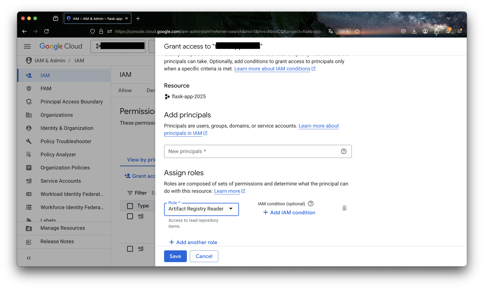

# Directed work 4 [Sprint 4, W08]: Vertex

## 0. Introduction
The goal of this directed work is to make you familiar with the Vertex AI platform.

## 1. Prerequisites

1. Have a working version of [python](https://www.python.org/downloads/)
2. Have a working version of [Docker Desktop](https://docs.docker.com/desktop/)
3. Docker daemon running.
4. Enable Vertex AI API in your Google Cloud project.

## 2. Vertex AI

### 2.1. Presentation of Vertex AI
Vertex AI is Google Cloud's unified platform for building, training, and deploying machine learning models. It provides a comprehensive suite of tools and services that allow data scientists and ML engineers to:

- Build and train models using AutoML or custom training
- Deploy models for online prediction or batch prediction
- Manage ML workflows and pipelines
- Monitor model performance and detect model drift
- Collaborate across teams with shared notebooks and datasets

The key advantage of Vertex AI is that it's a fully managed platform, meaning you can focus on the ML aspects rather than infrastructure management. It handles scaling, security, and maintenance automatically in a serverless way.

How does it work?

The typical workflow in Vertex AI consists of several steps:

1. Components Definition: First, we define the individual steps of our ML workflow as components using the Kubeflow Pipelines SDK. These components can be:
   - Custom code components that you write
   - Pre-built components from Vertex AI's component library
   - Each component runs in its own Docker container, which we push to Google Cloud's Artifact Registry

2. Pipeline Creation: We chain these components together to create a pipeline. The pipeline defines:
   - The sequence of component execution
   - Data flow between components
   - Required resources and configurations

3. Pipeline Deployment: The pipeline is deployed to Vertex AI Pipelines, where it:
   - Runs in a fully managed environment
   - Can be scheduled or triggered on demand
   - Provides monitoring and logging capabilities
   - Maintains versioning and reproducibility

4. Monitoring & Management: Once deployed, Vertex AI provides tools to:
   - Track pipeline executions
   - Monitor model performance
   - Manage model versions
   - Handle model updates and rollbacks

## 3. Example with the House Price Prediction Dataset

### 3.1. Dataset and Requirements Setup

#### Dataset Overview
We'll be using the [Housing Prices Dataset](https://www.kaggle.com/datasets/yasserh/housing-prices-dataset?resource=download) from Kaggle. This dataset contains information about house prices and various features including:
- Square footage
- Number of bedrooms
- Number of bathrooms
- Year built
- And other relevant features

#### Required Dependencies
First, let's set up our Python environment with the necessary packages. Create a `requirements.txt` file with the following dependencies:

```txt
kfp==2.7.0
google-cloud-aiplatform==1.42.1
pandas==2.1.0
scikit-learn==1.3.0
numpy==1.24.0
```

#### Project Structure
Create the following directory structure for your project:
```
house_prediction/
├── Dockerfile
├── requirements.txt
├── src/
│   ├── __init__.py
│   ├── data_ingestion.py
│   ├── preprocessing.py
│   ├── training.py
│   └── evaluation.py
└── house_prediction.ipynb
```

#### Initial Setup Code
Before we start building our pipeline components, we need to import the necessary libraries and set up our environment:

```python
from kfp.v2 import dsl
from kfp.v2.dsl import (
    Artifact,    # For handling ML artifacts
    Dataset,     # For handling datasets
    Input,       # For component inputs
    Model,       # For handling ML models
    Output,      # For component outputs
    Metrics,     # For tracking metrics
    Markdown,    # For documentation
    HTML,        # For visualization
    component,   # For creating pipeline components
    OutputPath,  # For specifying output paths
    InputPath    # For specifying input paths
)
from kfp.v2 import compiler
from google.cloud.aiplatform import pipeline_jobs

PIPELINE_ROOT = f"{BUCKET_NAME}/{PIPELINE_ROOT_FOLDER}"
```

Key points about the imports:
- `kfp.v2`: The Kubeflow Pipelines SDK v2 for defining ML pipelines
- `dsl`: Domain Specific Language for defining pipeline components and workflows
- `Artifact`, `Dataset`, etc.: Special types for handling ML-specific data and artifacts
- `compiler`: For converting pipeline definitions to Vertex AI-compatible format
- `pipeline_jobs`: For managing pipeline executions in Vertex AI

The `PIPELINE_ROOT` constant defines where all pipeline artifacts (datasets, models, metrics) will be stored in Google Cloud Storage.

### 3.2. Setting up the Docker Base Image

Before we can create our pipeline components, we need to set up a Docker base image that will be used to run all our components. This image needs to be stored in Google Cloud's Artifact Registry. Here's how to do it step by step:

1. First, create a Dockerfile that will serve as our base image:
```Dockerfile
FROM mirror.gcr.io/library/python:3.8
WORKDIR /app
COPY requirements.txt /app/requirements.txt
COPY src /app/src
RUN pip install -r /app/requirements.txt
ENTRYPOINT ["bash"]
```

Key points about this Dockerfile:
- We use `mirror.gcr.io/library/python:3.8` instead of `python:3.8` because:
  - It's faster to pull as it's a Google Container Registry (GCR) mirror
  - It reduces external dependencies
  - It's maintained by Google
- `ENTRYPOINT ["bash"]` keeps the container running after component execution
- The image includes our Python dependencies and source code

2. Set up your environment variables:
```bash

PROJECT_ID="your-project-id"
REGION="europe-west1"
REPOSITORY="vertex-ai-pipeline-example"
IMAGE_NAME="training"
IMAGE_TAG="latest"
```

3. Create an Artifact Registry repository:
```bash
gcloud beta artifacts repositories create $REPOSITORY \
    --repository-format=docker \
    --location=$REGION \
    --description="Repository for Vertex AI pipeline components"
```

4. Configure Docker to authenticate with Artifact Registry:
```bash
gcloud auth configure-docker $REGION-docker.pkg.dev
```

5. Build and tag your Docker image:
```bash
docker build -t $IMAGE_NAME:$IMAGE_TAG .
# Tag the image for Artifact Registry
docker tag $IMAGE_NAME:$IMAGE_TAG \
    $REGION-docker.pkg.dev/$PROJECT_ID/$REPOSITORY/$IMAGE_NAME:$IMAGE_TAG
```

6. Push the image to Artifact Registry:
```bash
docker push $REGION-docker.pkg.dev/$PROJECT_ID/$REPOSITORY/$IMAGE_NAME:$IMAGE_TAG
```

7. Now you can use this image in your components:
```python
@component(
    base_image=f"{REGION}-docker.pkg.dev/{PROJECT_ID}/{REPOSITORY}/{IMAGE_NAME}:{IMAGE_TAG}"
)
def your_component():
    # Your component code here
    pass
```

Important notes:
- Make sure you have the necessary permissions in your Google Cloud project
- The Artifact Registry repository must be in the same region as your Vertex AI resources
- Keep your Docker image lightweight and only include necessary dependencies
- Consider using specific version tags instead of 'latest' for better reproducibility
- You can verify your image in the Google Cloud Console under Artifact Registry


## 4. Understanding the Notebook Cells

Let's go through each cell you should have in your notebook:

### 4.1: Import Dependencies
```python
from typing import Optional
import google.auth
from kfp.v2 import dsl
from kfp.v2.dsl import (Artifact, Dataset, Input, Model, Output, Metrics,
                        Markdown, HTML, component, OutputPath, InputPath)
from kfp.v2 import compiler
from kfp.v2.dsl import component, pipeline
from google.cloud import aiplatform
from google.cloud.aiplatform import pipeline_jobs
import kfp.v2 as kfp
import vertexai.preview
```
This cell imports all necessary libraries for working with Vertex AI:
- `kfp.v2`: The Kubeflow Pipelines SDK v2, used for defining ML pipelines
- `google.cloud.aiplatform`: The main Vertex AI SDK
- Various data types from `kfp.v2.dsl` for handling artifacts, datasets, and pipeline components

### 4.2: Project Configuration
```python
PROJECT_NAME = "PROJECT_NAME"
REGION = "REGION"
BUCKET_NAME = "gs://BUCKET_NAME"
PIPELINE_ROOT = f"{BUCKET_NAME}/pipeline_root_houseprice/"
REPOSITORY= "REPOSITORY"
IMAGE_NAME= "IMAGE_NAME"
IMAGE_TAG= "IMAGE_TAG"
BASE_IMAGE = f"{REGION}-docker.pkg.dev/{PROJECT_NAME}/{REPOSITORY}/{IMAGE_NAME}:{IMAGE_TAG}"
```
This cell sets up the basic configuration for your Vertex AI project that you already defined in your terminal to push the image of the base image Docker to Artifact Registry:
- `PROJECT_NAME`: Your Google Cloud project ID. e.g. "Vertex-AI-Pipeline"
- `REGION`: The region where your resources will be deployed. e.g. "europe-west1"
- `BUCKET_NAME`: The Google Cloud Storage bucket for storing pipeline artifacts. e.g. "gs://vertex-ai-pipeline-bucket"
- `PIPELINE_ROOT`: The root directory in the bucket where pipeline artifacts will be stored. e.g. "gs://vertex-ai-pipeline-bucket/pipeline_root_houseprice/"
- `BASE_IMAGE`: The Docker image that will be used to run your pipeline components

### 4.3: Component Definition
```python
@component(base_image=BASE_IMAGE)
def your_component(param1: str, param2: int):
    # Component implementation
    pass
```
This cell shows the basic structure of a pipeline component:
- The `@component` decorator marks a function as a pipeline component
- `base_image` specifies the Docker image to use
- The function parameters define the component's inputs
- The function body contains the component's logic

### 4.4: Pipeline Definition
```python
@pipeline(
    name="houseprice_pipeline",
    pipeline_root=PIPELINE_ROOT
)
def houseprice_pipeline():
    step1 = your_component(param1="value1", param2=123)
    # Add more steps as needed
```
This cell defines the main pipeline:
- The `@pipeline` decorator marks a function as a pipeline
- `name` specifies the pipeline's name
- `pipeline_root` defines where pipeline artifacts will be stored
- The function body defines the pipeline steps and their connections

### 4.5: Pipeline Compilation
```python
compiler.Compiler().compile(
    pipeline_func=houseprice_pipeline,
    package_path='houseprice_pipeline.json'
)
```
This cell compiles the pipeline into a JSON file:
- The compiler converts the Python pipeline definition into a format Vertex AI can understand
- The compiled pipeline is saved as 'houseprice_pipeline.json'

### 4.6: Vertex AI Initialization
```python
aiplatform.init(project=PROJECT_NAME, location=LOCATION)
```
This cell initializes the Vertex AI SDK:
- Sets up the connection to your Google Cloud project
- Configures the region for Vertex AI services

### 4.7: Pipeline Execution
```python
pipeline_job = aiplatform.PipelineJob(
    display_name="houseprice_pipeline_job",
    template_path="houseprice_pipeline.json",
    pipeline_root=PIPELINE_ROOT
)
pipeline_job.run()
```
This cell creates and runs the pipeline job:
- Creates a `PipelineJob` object with the compiled pipeline
- `display_name` sets a human-readable name for the job
- `template_path` points to the compiled pipeline JSON
- `pipeline_root` specifies where to store job artifacts
- `run()` starts the pipeline execution

You will see 2 errors:

1. `Failed to create pipeline job. Error: Vertex AI Service Agent service-{PROJECT_NUMBER}@gcp-sa-aiplatform-cc.iam.gserviceaccount.com does not have permission to access Artifact Registry repository projects/{PROJECT_NAME}/locations/{PROJECT_REGION}/repositories/{REPOSITORY}.`
- This error occurs because the Vertex AI Service Agent does not have permission to access the Artifact Registry repository. You need to grant the Vertex AI Service Agent the necessary permissions. For this, you:
  - Go to the IAM & Admin page in the Google Cloud Console and click on "grant access"
  
  - Under the "New principals" you need to add the Vertex AI Service Agent. i.e. `service-{PROJECT_NUMBER}@gcp-sa-aiplatform-cc.iam.gserviceaccount.com`
  - For the role, you need to add the `Artifact Registry Reader`. This is the role that allows the Vertex AI Service Agent to access the Artifact Registry repository.
  
  - Click on "Save"

Then if you run the pipeline again, you will see the following error:
2. `The DAG failed because some tasks failed. The failed tasks are: ...`
The error you see is because the example component (`your_component`) is just a placeholder. In a real implementation, you would replace it with actual components for data ingestion, preprocessing, training, and evaluation as described in the previous sections.


Still you will be able to see the pipeline in the Vertex AI Pipelines UI.


## 5. Your turn.

Now that we have our environment set up, let's create the components for our ML pipeline. We'll create four main components: data ingestion, preprocessing, training, and evaluation.

You need to submit 3 pictures as evidence of your work:
- Screenshot of pipeline
- Screenshot of output data
- Screenshot of performance metrics

You also need to provide the code for the components.
You have until 06/04/2025 23:59 to submit your work.

### 5.1. Data Ingestion Component

Before doing this, be sure to have the dataset in your Google Cloud Storage bucket.

To send the dataset to the bucket, you can use the following code:
```bash
gsutil -m cp -r data/* gs://vertex-ai-pipeline-bucket/data/
```

This component will download and prepare the initial dataset:

```python
@component(
    base_image=BASE_IMAGE,
    output_component_file="data_ingestion.yaml"
)
def data_ingestion(
    dataset: Output[Dataset]
):
    """
    Downloads and prepares the house price dataset.
    
    Args:
        dataset: Output artifact to store the prepared dataset
    """
    import pandas as pd
    import os
    
    # TODO: Implement the following steps:
    # 1. Download the dataset from Kaggle or your preferred source
    # 2. Load the data into a pandas DataFrame
    # 3. Perform initial data validation
    # 4. Save the dataset to the output path
    # dataset.path will contain the path where to save the data
```

### 5.2. Data Preprocessing Component

This component will clean and prepare the data for training:

```python
@component(
    base_image=BASE_IMAGE,
    output_component_file="preprocessing.yaml"
)
def preprocessing(
    input_dataset: Input[Dataset],
    preprocessed_dataset: Output[Dataset],
):
    """
    Preprocesses the dataset for training.
    
    Args:
        input_dataset: Input dataset from the data ingestion step
        preprocessed_dataset: Output artifact for the preprocessed dataset
    """
    import pandas as pd
    from sklearn.preprocessing import StandardScaler, OneHotEncoder
    
    # TODO: Implement the following steps:
    # 1. Load the input dataset
    # 2. Handle missing values
    # 3. Do whatever you need to do to the data to prepare it for training

    # 4. Save the preprocessed dataset to the output path
    df.to_csv(dataset.path, index=False)
    print(f"Dataset saved to: {dataset.path}")
```

### 5.3. Model Training Component

This component will train the model using the preprocessed data:

```python
@component(
    base_image=BASE_IMAGE,
    output_component_file="training.yaml"
)
def training(
    preprocessed_dataset: Input[Dataset],
    model: Output[Model],
    metrics: Output[Metrics],
    hyperparameters: dict
):
    """
    Trains the model on the preprocessed dataset.
    
    Args:
        preprocessed_dataset: Input preprocessed dataset
        model: Output artifact for the trained model
        metrics: Output artifact for training metrics
        hyperparameters: Dictionary of hyperparameters
    """
    import pandas as pd
    from sklearn.model_selection import train_test_split
    from sklearn.ensemble import RandomForestRegressor
    from sklearn.metrics import mean_squared_error, r2_score
    
    # TODO: Implement the following steps:
    # 1. Load the preprocessed dataset
    # 2. Split into train and validation sets
    # 3. Initialize and train the model
    # 4. Evaluate the model
    # 5. Save the model
    # 6. Log metrics (MSE, R2, etc.)
```

### 5.4. Model Evaluation Component

This component will evaluate the model's performance:

```python
@component(
    base_image=BASE_IMAGE,
    output_component_file="evaluation.yaml"
)
def evaluation(
    model: Input[Model],
    preprocessed_dataset: Input[Dataset],
    metrics: Output[Metrics],
    html: Output[HTML]
):
    """
    Evaluates the model's performance and generates visualizations.
    
    Args:
        model: Input trained model
        preprocessed_dataset: Input preprocessed dataset
        metrics: Output artifact for evaluation metrics
        html: Output artifact for visualization HTML
    """
    import pandas as pd
    import matplotlib.pyplot as plt
    import seaborn as sns
    from sklearn.metrics import mean_squared_error, r2_score
    
    # TODO: Implement the following steps:
    # 1. Load the model and dataset
    # 2. Make predictions
    # 3. Calculate evaluation metrics
    # 4. Create visualizations (residuals, feature importance, etc.)
    # 5. Generate HTML report
    # 6. Save metrics and visualizations
```

### 5.5. Assembling the Pipeline

Now that we have all our components, let's assemble them into a pipeline:

```python
@pipeline(
    name="houseprice_pipeline",
    pipeline_root=PIPELINE_ROOT
)
def houseprice_pipeline():
    # Define the components
    ingestion_task = data_ingestion()
    
    preprocessing_task = preprocessing(
        input_dataset=ingestion_task.outputs["dataset"],
        numerical_features=["sqft_living", "sqft_lot", "sqft_above", "sqft_basement"],
        categorical_features=["condition", "grade"]
    )
    
    training_task = training(
        preprocessed_dataset=preprocessing_task.outputs["preprocessed_dataset"],
        hyperparameters={
            "n_estimators": 100,
            "max_depth": 10,
            "random_state": 42
        }
    )
    
    evaluation_task = evaluation(
        model=training_task.outputs["model"],
        preprocessed_dataset=preprocessing_task.outputs["preprocessed_dataset"]
    )
```

Key points about the pipeline:
- Each component's output is connected to the next component's input
- The pipeline defines the execution order
- Hyperparameters can be passed to components
- The pipeline will automatically handle artifact storage and versioning

To use this pipeline:
1. Implement the TODO sections in each component
2. Compile the pipeline
3. Run it using the Vertex AI Pipeline service

The pipeline will execute each component in sequence, passing data between them and storing all artifacts in your specified Google Cloud Storage bucket.

- Note: Here we used a BASE IMAGE that is used by each component. This is a good practice to avoid repeating the same dependencies in each component. It is also a good idea to have an image for each component when components are more complex and have different dependencies.


