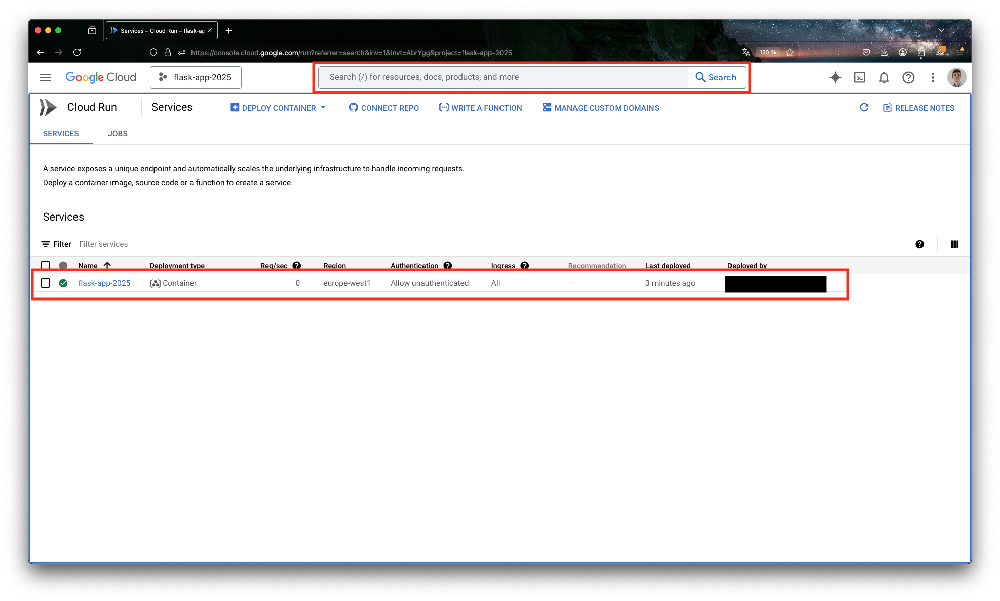

# Lab 5 [Sprint 3, W6]: Deploy on Google Cloud Platform

## 0. Introduction

In this lab, you will deploy a Flask API to Google Cloud Platform (GCP) using Cloud Run.

### Why deploy to the cloud?

So far, your Flask API runs on your laptop. That means it is only available while your machine is on, and nobody else can reach it. Deploying to the cloud makes your API accessible to anyone, anywhere, at any time, which is exactly what you need when you want other services or users to call your ML model.

### Why Cloud Run?

Cloud Run is a serverless platform, meaning you do not need to manage servers, configure load balancers, or worry about scaling. You just deploy a Docker container and get a public HTTPS URL in a single command. Cloud Run automatically scales to zero when there is no traffic (so you are not charged when nobody is using your API) and scales up when requests come in. This makes it ideal for deploying ML APIs that may not receive constant traffic.


### 0.1. Prerequisites

- Complete [Lab 2 (Cloud & Data)](../02_cloud_data/README.md) and have your GCP account set up with credits.
- Complete [Lab 3 (Docker & UV)](../03_docker/README.md) and have Docker installed.
- Complete [Lab 4 (Flask)](../04_flask/README.md).

## 1. A Simple Flask App for Deployment

Before deploying your full ML API, let's walk through the process with a minimal "Hello World" app.

### 1.1. Project structure

Create the following files inside this lab's folder

```
├── Dockerfile
├── requirements.txt
└── hello.py
```

### 1.2. Application code

**`requirements.txt`**

```txt
flask==3.1.0
gunicorn==23.0.0
```

**`hello.py`**

```python
from flask import Flask

app = Flask(__name__)


@app.route("/")
def hello_world():
    return "Hello World"


if __name__ == "__main__":
    app.run(host="0.0.0.0", port=8080)
```

Notice the two dependencies
- **Flask** you already know from Lab 4.
- **Gunicorn** is a production-ready web server for Python applications. When you run `app.run()` in Flask, you use Flask's built-in development server, which can only handle one request at a time and is not meant to be exposed to the internet. Gunicorn replaces it: it can handle multiple requests simultaneously using workers and threads, which is what you need when deploying to the cloud.

### 1.3. Dockerfile

```dockerfile
FROM python:3.13-slim

WORKDIR /app

# Install UV (borrowing the binary from its official image, as seen in Lab 3)
COPY --from=ghcr.io/astral-sh/uv:latest /uv /usr/local/bin/uv

COPY requirements.txt .
RUN uv pip install --system -r requirements.txt

COPY hello.py .

EXPOSE 8080

CMD ["gunicorn", "--bind", ":8080", "--workers", "1", "--threads", "8", "hello:app"]
```

A few points
- **`gunicorn --bind :8080`** tells Gunicorn to listen on port 8080 inside the container. You will never interact with this port directly (Cloud Run gives you a public HTTPS URL), but Cloud Run forwards incoming requests to port 8080 by default, so your container must listen on it.
- **`--workers 1 --threads 8`** runs one worker process with 8 threads. This is a reasonable default for a small API. More workers use more memory, which costs more on Cloud Run.
- **`hello:app`** tells Gunicorn to look for the Flask object named `app` inside the file `hello.py`. If you name your file or your Flask variable differently, adjust this accordingly.
- We use UV to install dependencies, as learned in Lab 3.

### 1.4. Test locally

Build and run the container to make sure everything works before deploying:

```bash
docker build -t flask-app .
docker run -p 9090:8080 flask-app
```

You should see Gunicorn starting:

```
[INFO] Starting gunicorn 23.0.0
[INFO] Listening at: http://0.0.0.0:8080 (1)
[INFO] Using worker: gthread
[INFO] Booting worker with pid: 7
```

Visit `http://localhost:9090` in your browser. You should see "Hello World".

## 2. Set Up GCP

You already set up your GCP environment in [Lab 2](../02_cloud_data/README.md) (project creation, billing, SDK installation, authentication). Make sure you have:

1. The **Google Cloud SDK** (`gcloud`) installed.
2. A **GCP project** with billing enabled and credits available.
3. **Authentication** configured (`gcloud auth login`).

If you need to switch to a different project, use:

```bash
gcloud config set project YOUR_PROJECT_ID
```

## 3. Deploy to Cloud Run

From your lab folder (where the `Dockerfile` is), run:

```bash
gcloud run deploy flask-app --region=europe-west1 --source=$(pwd) --allow-unauthenticated
```

- **`--region=europe-west1`** deploys to a European data center (Belgium).
- **`--source=$(pwd)`** tells Cloud Run to build the Docker image from the current directory using Cloud Build.
- **`--allow-unauthenticated`** makes the service publicly accessible. Without this flag, only authenticated users could call your API.

The first time you run this, GCP will ask to enable the required APIs:

```
The following APIs are not enabled on project [your-project]:
        artifactregistry.googleapis.com
        cloudbuild.googleapis.com
        run.googleapis.com

Do you want to enable these APIs to continue (this will take a few minutes)? (y/N)?
```

Type `y` and press Enter. Then it will ask to create a container repository:

```
Deploying from source requires an Artifact Registry Docker repository to store
built containers. A repository named [cloud-run-source-deploy] in region
[europe-west1] will be created.

Do you want to continue (Y/n)?
```

Type `Y` and press Enter.

> **What is Artifact Registry and why is it needed?** \
> When you run `gcloud run deploy --source`, two things happen behind the scenes. Your Docker image is first built and pushed to Artifact Registry (GCP's private container registry), and then Cloud Run pulls that image and deploys it. In the past, you had to do these two steps manually (`docker push` then `gcloud run deploy --image`). Today, `gcloud run deploy --source` abstracts this into a single command, but the steps still happen in the background. You can verify this by searching for Artifact Registry in the GCP console, you will see your image stored there under the `cloud-run-source-deploy` repository.

After a few minutes, you should see:

```
Service [flask-app] revision [flask-app-000...] has been deployed and is
serving 100 percent of traffic.
Service URL: https://flask-app-...-uc.a.run.app
```

Visit the Service URL in your browser. You should see "Hello World".

> More information on scaling configuration (scaling to zero) can be found here: [Cloud Run autoscaling](https://cloud.google.com/run/docs/about-instance-autoscaling).

### 3.1. Troubleshooting

**PERMISSION_DENIED error:**

```
ERROR: (gcloud.run.deploy) PERMISSION_DENIED: The caller does not have permission
```

This usually means you are logged in with the wrong account. Re-authenticate with:

```bash
gcloud auth login
```

Make sure you select the Google account that has the GCP credits.

## 4. Monitor Your API

1. In the GCP console, search for **Cloud Run** and click the first result. You will see your deployed services.



2. Click on your service to see its metrics and the service URL.
3. Click the **Logs** tab to view request logs and any errors from your application.


## 5. Clean Up

To avoid unnecessary charges, delete your resources after you are done testing.

1. In **Cloud Run**, select your service and click **Delete**.


2. In the GCP console, search for **Artifact Registry** and click on it.
3. Select the `cloud-run-source-deploy` repository and click **Delete**.


## 6. About Pricing

Cloud Run pricing is based on the resources your service uses. Here is a summary of the free tier:

| Resource | Free tier (per month) | After free tier |
|----------|----------------------|-----------------|
| vCPU | 240,000 vCPU-seconds | $0.000018 / vCPU-second |
| Memory | 450,000 GiB-seconds | $0.000002 / GiB-second |

A **vCPU-second** is one virtual CPU running for one second. A **GiB-second** is one gibibyte of memory used for one second.

For a small API like this one, you will stay well within the free tier. Combined with Cloud Run's **scale-to-zero** feature (no instances running when there is no traffic), your costs should be negligible or zero.

> **Warning: the flip side of auto-scaling.** Scale-to-zero saves you money when there is no traffic, but Cloud Run also scales *up* automatically when traffic increases. If your public endpoint gets hit by a bot, a DDoS attack, or simply goes viral, Cloud Run will spin up as many instances as needed to handle the load, and you will be billed for all of them. This can result in an unexpectedly large bill. To protect yourself, set a **maximum number of instances** in your Cloud Run service settings (e.g., 1 or 2 for a lab project). You can do this with the `--max-instances` flag when deploying, or in the Cloud Run console under your service's settings.

You can find the full pricing details here: [Cloud Run Pricing](https://cloud.google.com/run/pricing).

## 7. Assignment

**Deadline:** March 9th 2026, 23:59

**Objective:** Deploy the Flask ML API you built in Lab 4 to Google Cloud Platform using Cloud Run.

**Requirements**

1. Adapt your Lab 4 Flask application to use Gunicorn (add it to `requirements.txt` and update your `Dockerfile`).
2. Deploy your application to Cloud Run.
3. Verify that your `/predict` endpoint works on the deployed URL using `curl`.
4. :warning: All optional features from Lab 4 (PUT endpoint) must be implemented and working in the deployed version to get full marks.

**Deliverables**

Submit the following on **Gradescope**:
1. The URL of your deployed Cloud Run service in a `.txt` file.
2. A `curl` command (or screenshot) showing a successful prediction request to your deployed API.

> Thanks to [scaling to zero](https://cloud.google.com/run/docs/about-instance-autoscaling), your app will not consume resources when there is no traffic, so you can leave it running without significant cost. Still, remember to clean up your resources (Section 5) once grading is complete.

## 8. Resources

- [Google Cloud SDK](https://cloud.google.com/sdk/docs/install)
- [Cloud Run Documentation](https://cloud.google.com/run/docs/deploying)
- [Cloud Run Pricing](https://cloud.google.com/run/pricing)
- [Cloud Run Quickstart](https://cloud.google.com/run/docs/quickstarts/build-and-deploy)
- [Gunicorn Documentation](https://docs.gunicorn.org/en/stable/)
