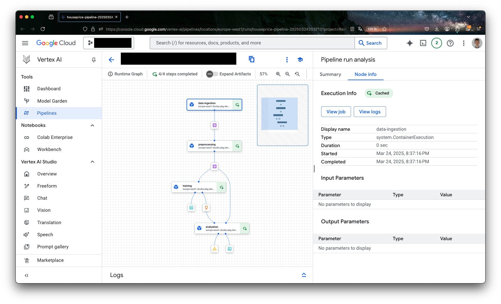

# Lab 6 [Sprint 4, W7]: Vertex AI Pipelines

## 0. Introduction
The goal of this directed work is to make you familiar with the Vertex AI platform.

## 1. Prerequisites

1. Have a working version of [python](https://www.python.org/downloads/)
2. Have a working version of [Docker Desktop](https://docs.docker.com/desktop/)
3. Docker daemon running.
4. Enable the required GCP APIs:
```bash
gcloud services enable aiplatform.googleapis.com artifactregistry.googleapis.com --project=YOUR_PROJECT_ID
```

## 2. Vertex AI

### 2.1. Presentation of Vertex AI
Vertex AI is Google Cloud's unified platform for building, training, and deploying machine learning models. It provides a comprehensive suite of tools and services that allow data scientists and ML engineers to:

- Build and train models using AutoML or custom training
- Deploy models for online prediction or batch prediction
- Manage ML workflows and pipelines
- Monitor model performance and detect model drift
- Collaborate across teams with shared notebooks and datasets

The key advantage of Vertex AI is that it's a fully managed platform, meaning you can focus on the ML aspects rather than infrastructure management. It handles scaling, security, and maintenance automatically in a serverless way.

### 2.2. Required IAM permissions
The Vertex AI service agent needs read access to Artifact Registry to pull your pipeline component images. Run these two commands in order.

First, create the service identity (this also prints its email)
```bash
gcloud beta services identity create \
  --service=aiplatform.googleapis.com \
  --project=YOUR_PROJECT_ID
```

It will print something like
```
Service identity created: service-YOUR_PROJECT_NUMBER@gcp-sa-aiplatform.iam.gserviceaccount.com
```

Then grant it the Artifact Registry Reader role using that email
```bash
gcloud projects add-iam-policy-binding YOUR_PROJECT_ID \
  --member="serviceAccount:service-YOUR_PROJECT_NUMBER@gcp-sa-aiplatform.iam.gserviceaccount.com" \
  --role="roles/artifactregistry.reader"
```

Without this, the pipeline will fail with a permission error when trying to pull your component image from Artifact Registry.


### 2.3. How does Vertex AI Pipelines work?
The typical workflow in Vertex AI consists of several steps:

1. Components Definition. First, we define the individual steps of our ML workflow as components using the Kubeflow Pipelines SDK. These components can be
   - Custom code components that you write.
   - Pre-built components from Vertex AI's component library.
   - Each component runs in its own Docker container, which we push to Google Cloud's Artifact Registry.

2. Pipeline Creation. We chain these components together to create a pipeline. The pipeline defines
   - The sequence of component execution.
   - Data flow between components.
   - Required resources and configurations.

3. Pipeline Deployment. The pipeline is deployed to Vertex AI Pipelines, where it
   - Runs in a fully managed environment.
   - Can be scheduled or triggered on demand.
   - Provides monitoring and logging capabilities.
   - Maintains versioning and reproducibility.

4. Monitoring & Management: Once deployed, Vertex AI provides tools to
   - Track pipeline executions.
   - Monitor model performance.
   - Manage model versions.
   - Handle model updates and rollbacks.

## 3. Example with the house price prediction dataset

### 3.1. Dataset and requirements setup

#### Dataset overview
We'll be using the [Housing Prices Dataset](https://www.kaggle.com/datasets/yasserh/housing-prices-dataset?resource=download) from Kaggle. This dataset contains information about house prices and various features including
- Square footage;
- Number of bedrooms;
- Number of bathrooms;
- Year built;
- And other relevant features.

Before starting with the pipeline, you need to:
1. Download the dataset from Kaggle
2. Use the GCS bucket you created in Lab 2 for pipeline artifacts. If you don't have one, create it:
```bash
gsutil mb -l europe-west1 -p YOUR_PROJECT_ID gs://YOUR_BUCKET_NAME
```
> Even though data now comes from BigQuery, GCS is still required. Vertex AI uses it to store intermediate outputs passed between components (the CSV produced by data ingestion, the preprocessed dataset, the trained model file) and the compiled pipeline JSON. Think of BigQuery as the data source and GCS as the shared workspace between pipeline steps.
3. Load the dataset into BigQuery. This is how data is stored in production ML systems, not as local CSV files. First create a BigQuery dataset, then load the CSV into a table:
```bash
# Create a BigQuery dataset
bq mk --location=europe-west1 --project_id=YOUR_PROJECT_ID housing_dataset

# Load the CSV directly into BigQuery
bq load --project_id=YOUR_PROJECT_ID --autodetect --source_format=CSV housing_dataset.housing data/Housing.csv
```

> Download the CSV from Kaggle first and place it at `data/Housing.csv` before running this command.

The pipeline will query this BigQuery table directly instead of reading a CSV file. This mirrors real-world MLOps where data lives in a data warehouse, not in flat files.

#### Required dependencies
As seen in previous labs, use UV to manage dependencies. From inside your project directory:

```bash
uv init --no-package .
uv add kfp==2.7.0 google-cloud-aiplatform==1.42.1 google-cloud-bigquery==3.17.2 google-cloud-bigquery-storage==2.24.0 google-cloud-storage==2.14.0 google-auth==2.27.0 pandas==2.1.0 scikit-learn==1.3.0 matplotlib==3.8.0 seaborn==0.13.0
```

This generates a `pyproject.toml` and a `uv.lock` file. Both are used by the Dockerfile to install dependencies reproducibly inside the pipeline component containers.

#### Project structure
Your project directory should look like this:
```
06_vertex/
├── Dockerfile
├── pyproject.toml
├── uv.lock
├── run_pipeline.py
├── data/
│   └── Housing.csv
└── src/
    ├── __init__.py
    ├── data_ingestion.py
    ├── preprocessing.py
    ├── training.py
    └── evaluation.py
```

Running the pipeline will also generate files at the root level that you do not need to create or commit:
- `data_ingestion.yaml`, `preprocessing.yaml`, etc.: component spec files exported by the `output_component_file` parameter in each `@component` decorator. They are not required for the pipeline to run. The pipeline executes from the Python functions directly. They are just a way to export a reusable component spec without the Python source.
- `houseprice_pipeline.json`: the compiled pipeline definition produced by `compiler.Compiler().compile()`. It is read immediately by `PipelineJob` in the same script and is stale after every run, so there is no point committing it.

Both are gitignored.

#### Initial setup code (`run_pipeline.py`)
At the top of `run_pipeline.py`, import the necessary libraries and define your configuration constants:

```python
from kfp import dsl, compiler
from kfp.dsl import Dataset, Input, Model, Output, Metrics, HTML, component
from google.cloud import aiplatform

PIPELINE_ROOT = f"{BUCKET_NAME}/pipeline_root_houseprice/"
```

Key points about the imports:
- `kfp`: The Kubeflow Pipelines SDK v2. Note: the correct import is `from kfp import ...`, not `from kfp.v2 import ...` (which was the old deprecated style).
- `dsl`: Domain Specific Language for defining pipeline components and workflows.
- `Dataset`, `Model`, etc.: Special types for handling ML-specific data and artifacts.
- `compiler`: For compiling the pipeline definition to a JSON file that Vertex AI can execute.

The `PIPELINE_ROOT` constant defines where all pipeline artifacts (intermediate datasets, models, metrics) will be stored in GCS.

### 3.2. Setting up the Docker base Image

Before creating pipeline components, you need a Docker base image stored in Artifact Registry. This is the image Vertex AI will use to run each component.

1. First, create a Dockerfile that will serve as our base image for the components:
```Dockerfile
FROM mirror.gcr.io/library/python:3.11-slim

WORKDIR /app

# Install UV
COPY --from=ghcr.io/astral-sh/uv:latest /uv /usr/local/bin/uv

# Copy dependency files
COPY pyproject.toml uv.lock .

# Install dependencies system-wide (no venv this is a base image for pipeline components)
RUN uv export --frozen --no-hashes | uv pip install --system --no-cache -r -

# Copy source code
COPY src /app/src

ENTRYPOINT ["bash"]
```

Key points about this Dockerfile:
- We use `mirror.gcr.io/library/python:3.11-slim` (a GCR mirror) because it's faster to pull inside GCP and maintained by Google.
- UV is copied from its official image, as seen in Lab 3.
- `uv export --frozen --no-hashes` generates a pinned list of all packages from `uv.lock`, which is then piped to `uv pip install --system`. This installs exact versions reproducibly, system-wide (no virtual environment).
- `ENTRYPOINT ["bash"]` is required by Vertex AI: it keeps the container available so the platform can inject and run each component's code.

> **Why `uv pip install --system` here instead of `uv sync` like in Labs 3, 4, and 5?** \
> In previous labs, the Dockerfile built a self-contained **application container**: your code, your dependencies, your entrypoint everything runs inside one container that you fully control. There, `uv sync` creates a `.venv` inside the container and you expose it via `ENV PATH="/app/.venv/bin:$PATH"`. The container starts, Flask runs, done.
>
> Here, the situation is fundamentally different. This Docker image is not an application it is a **base image** that Vertex AI uses as a runtime environment for each pipeline component. When Vertex AI runs a component, it takes this image, injects the component's code into it at runtime, and executes it. Vertex AI does this automatically, without activating any virtual environment first. If packages are inside a `.venv`, Vertex AI won't find them.
>
> This is why we use `--system`: packages must be installed directly into the system Python, not into a virtual environment. Same tool (UV), same lock file, different installation target.

2. Set up your environment variables:
```bash
PROJECT_ID="your-project-id"
REGION="europe-west1"
REPOSITORY="vertex-ai-pipeline-example"
IMAGE_NAME="training"
IMAGE_TAG="latest"
```

3. Create an Artifact Registry repository:
```bash
gcloud beta artifacts repositories create $REPOSITORY \
    --repository-format=docker \
    --location=$REGION \
    --description="Repository for Vertex AI pipeline components"
```

4. Configure Docker to authenticate with Artifact Registry:
```bash
gcloud auth configure-docker $REGION-docker.pkg.dev
```

5. Build and tag your Docker image:
```bash
# For macOS users, specify the platform explicitly
docker build --platform linux/amd64 -t $IMAGE_NAME:$IMAGE_TAG .
# Tag the image for Artifact Registry
docker tag $IMAGE_NAME:$IMAGE_TAG \
    $REGION-docker.pkg.dev/$PROJECT_ID/$REPOSITORY/$IMAGE_NAME:$IMAGE_TAG
```

6. Push the image to Artifact Registry:
```bash
docker push $REGION-docker.pkg.dev/$PROJECT_ID/$REPOSITORY/$IMAGE_NAME:$IMAGE_TAG
```

7. Now you can use this image in your components:
```python
@component(
    base_image=f"{REGION}-docker.pkg.dev/{PROJECT_ID}/{REPOSITORY}/{IMAGE_NAME}:{IMAGE_TAG}"
)
def your_component():
    # Your component code here
    pass
```

The `--platform linux/amd64` flag in the build command is important for macOS users: GCP runs on Linux x86-64, so building without it on Apple Silicon would produce an incompatible ARM image. You can verify your image was pushed correctly in the GCP console under Artifact Registry.

## 4. Understanding the components

Let's go through each component in our pipeline:

### 4.1: Data ingestion component
This component queries BigQuery and saves the result as a CSV artifact for the next step:

```python
@component(
    base_image=BASE_IMAGE,
    output_component_file="data_ingestion.yaml"
)
def data_ingestion(
    bq_project: str,
    bq_dataset: str,
    bq_table: str,
    dataset: Output[Dataset]
):
    """
    Loads the house price dataset from BigQuery.

    Args:
        bq_project: GCP project ID
        bq_dataset: BigQuery dataset name
        bq_table: BigQuery table name
        dataset: Output artifact to store the dataset
    """
    from google.cloud import bigquery
    import pandas as pd

    print(f"Querying BigQuery: {bq_project}.{bq_dataset}.{bq_table}")

    client = bigquery.Client(project=bq_project)
    query = f"SELECT * FROM `{bq_project}.{bq_dataset}.{bq_table}`"
    df = client.query(query).to_dataframe()

    print(f"Dataset shape: {df.shape}")
    df.to_csv(dataset.path, index=False)
    print(f"Dataset saved to: {dataset.path}")
```

Notice that the component now takes `bq_project`, `bq_dataset`, and `bq_table` as parameters instead of hardcoding a GCS path. This makes the pipeline reusable across different projects and datasets. These parameters are passed in when assembling the pipeline.

### 4.2: Data preprocessing component
This component cleans and prepares the data for training:

```python
@component(
    base_image=BASE_IMAGE,
    output_component_file="preprocessing.yaml"
)
def preprocessing(
    input_dataset: Input[Dataset],
    preprocessed_dataset: Output[Dataset],
):
    """
    Preprocesses the dataset for training.
    
    Args:
        input_dataset: Input dataset from the data ingestion step
        preprocessed_dataset: Output artifact for the preprocessed dataset
    """
    import pandas as pd
    from sklearn.preprocessing import StandardScaler, OneHotEncoder
    
    # Load the dataset
    df = pd.read_csv(input_dataset.path)

    # TO DO:
    # 2. Scale numerical features.
    # 3. Encode categorical features.
    # 4. Save the preprocessed dataset to the output artifact.
    
    # Save preprocessed dataset
    df_processed.to_csv(preprocessed_dataset.path, index=False)
    print(f"Preprocessed dataset saved to: {preprocessed_dataset.path}")
```

### 4.3: Model training component
This component trains the model using the preprocessed data:

```python
@component(
    base_image=BASE_IMAGE,
    output_component_file="training.yaml"
)
def training(
    preprocessed_dataset: Input[Dataset],
    model: Output[Model],
    metrics: Output[Metrics],
    hyperparameters: dict
):
    """
    Trains the model on the preprocessed dataset.
    
    Args:
        preprocessed_dataset: Input preprocessed dataset
        model: Output artifact for the trained model
        metrics: Output artifact for training metrics
        hyperparameters: Dictionary of hyperparameters
    """
    import pandas as pd
    import joblib
    from sklearn.model_selection import train_test_split
    from sklearn.ensemble import RandomForestRegressor
    from sklearn.metrics import mean_squared_error, r2_score
    
    # Load preprocessed dataset
    df = pd.read_csv(preprocessed_dataset.path)

    # TO DO:
    # 1. Split features and target.
    # 2. Split into train and validation sets.
    # 3. Initialize and train the model.
    # 4. Make predictions.
    # 5. Calculate metrics.
    # 6. Save the model.

    joblib.dump(rf_model, model.path)
    print(f"Model saved to: {model.path}")
    print(f"Validation MSE: {mse:.2f}")
    print(f"Validation R2: {r2:.2f}") 

```

### 4.4: Model evaluation component
This component evaluates the model's performance:

```python
@component(
    base_image=BASE_IMAGE,
    output_component_file="evaluation.yaml"
)
def evaluation(
    model: Input[Model],
    preprocessed_dataset: Input[Dataset],
    metrics: Output[Metrics],
    html: Output[HTML]
):
    """
    Evaluates the model's performance and generates visualizations.
    
    Args:
        model: Input trained model
        preprocessed_dataset: Input preprocessed dataset
        metrics: Output artifact for evaluation metrics
        html: Output artifact for visualization HTML
    """
    import pandas as pd
    import joblib
    import matplotlib.pyplot as plt
    import seaborn as sns
    from sklearn.metrics import mean_squared_error, r2_score

    # TO DO:
    # 1. Load the model and dataset.
    # 2. Make predictions.
    # 3. Calculate metrics.
    # 4. Save the metrics.
    # OPTIONAL: 5. Create visualizations.
    # OPTIONAL:6. Save the HTML report.
    
    # Load the model and dataset
    rf_model = joblib.load(model.path)
   
    # ...
    
    with open(html.path, 'w') as f:
        f.write(html_content)
    
    print(f"Evaluation report saved to: {html.path}")
```

### 4.5: Assembling the Pipeline
Now that we have all our components, let's assemble them into a pipeline:

```python
@dsl.pipeline(
    name="houseprice_pipeline",
    pipeline_root=PIPELINE_ROOT
)
def houseprice_pipeline(
    bq_project: str = PROJECT_ID,
    bq_dataset: str = BQ_DATASET,
    bq_table: str = BQ_TABLE,
):
    ingestion_task = data_ingestion(
        bq_project=bq_project,
        bq_dataset=bq_dataset,
        bq_table=bq_table,
    )
    
    preprocessing_task = preprocessing(
        input_dataset=ingestion_task.outputs["dataset"]
    )
    
    training_task = training(
        preprocessed_dataset=preprocessing_task.outputs["preprocessed_dataset"],
        hyperparameters={
            "n_estimators": 100,
            "max_depth": 10,
            "random_state": 42
        }
    )
    
    evaluation_task = evaluation(
        model=training_task.outputs["model"],
        preprocessed_dataset=preprocessing_task.outputs["preprocessed_dataset"]
    )
```

## 5. Running the Pipeline

Make sure you have updated the configuration variables at the top of `run_pipeline.py` (`PROJECT_ID`, `BUCKET_NAME`, `BQ_DATASET`, `BQ_TABLE`), then run:

```bash
uv run python run_pipeline.py
```

This compiles the pipeline to `houseprice_pipeline.json` and submits it to Vertex AI. You can then monitor execution in the GCP console under Vertex AI > Pipelines.

> **Note on IAM permissions**: the first run may fail with a permission error. If so, follow the steps in section 2.2 to grant the Artifact Registry Reader role to the Vertex AI service agent, then run again.

## 6. Monitoring and analyzing results

After running your pipeline, you can:

1. Monitor pipeline execution in the Google Cloud Console:
   - Navigate to Vertex AI > Pipelines
   - Find your pipeline run and click on it
   - View the DAG visualization and execution status
   - Check logs for each component

2. Analyze the results:
   - Review the metrics logged by the training and evaluation components
   - Examine the feature importance plots
   - Check the model's R2 score and MSE
   - Look at the actual vs predicted price comparisons

3. Access artifacts:
   - All artifacts are stored in your GCS bucket under the pipeline root
   - You can find the trained model, evaluation metrics, and visualizations
   - Download and analyze these artifacts locally if needed

## 7. Cleaning up resources

To avoid unnecessary costs, clean up your resources when you're done:

1. Delete pipeline artifacts from GCS:
```bash
gsutil rm -r gs://YOUR_BUCKET_NAME/pipeline_root_houseprice/
```

2. Delete the BigQuery dataset:
```bash
bq rm -r -f YOUR_PROJECT_ID:housing_dataset
```

3. Delete the Docker image from Artifact Registry:
```bash
gcloud artifacts docker images delete \
    $REGION-docker.pkg.dev/$PROJECT_ID/$REPOSITORY/$IMAGE_NAME:$IMAGE_TAG \
    --quiet
```

4. Delete the Artifact Registry repository:
```bash
gcloud artifacts repositories delete $REPOSITORY \
    --location=$REGION \
    --quiet
```

5. Optional: Delete the entire GCS bucket if no longer needed:
```bash
gsutil rm -r gs://YOUR_BUCKET_NAME
```

Use `--quiet` to skip confirmation prompts. Some deletions take a few minutes to propagate.

## 8. Your turn.

Now that we have our environment set up, you need to:

1. Submit the following on **Gradescope**:
   - Screenshot of your pipeline DAG running successfully in the Vertex AI console
   
   - Screenshot of output data
   - Screenshot of performance metrics
   - Your component code (`src/` directory)

You have until 06/04/2026 23:59 to submit your work on **Gradescope**.


