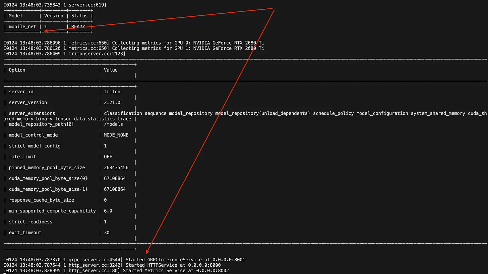
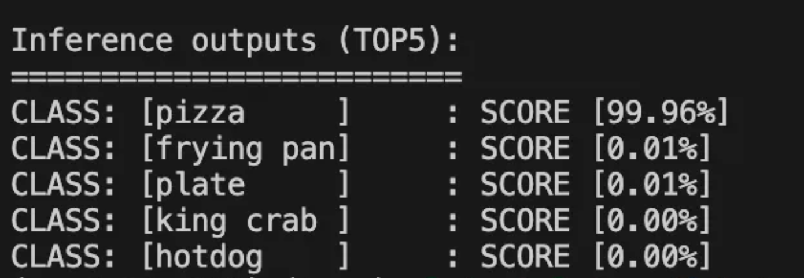

# Lab W07: Triton Inference Server

In this lab we will see how you can use [Triton Inference Server](https://developer.nvidia.com/triton-inference-server) to run a MobileNet model efficiently.

As seen in class, Triton servers offer a lot of benefits such as reducing latency by optimising how the model interacts with the hardware used to host it, monitoring, ...

:warning: At step 5 of this lab we will download and run the `tritonserver-22.04-py3` Docker image, which is 11GB !
We don't expect the university internet to allow us to do this within one lab.
So we will provide all the commands and show how it can be done after that if the image is already downloaded.

### 0. Prerequisites

1. Have a working version of [python](https://www.python.org/downloads/)
2. Have a working version of [Docker Desktop](https://docs.docker.com/desktop/)
3. Docker daemon running.

### 1. Prepare repository & dependencies

Run the following commands to prepare your directory:

```bash
mkdir triton_sample_project/
mkdir triton_sample_project/model_repo
mkdir triton_sample_project/model_repo/mobilenet
mkdir triton_sample_project/model_repo/mobilenet/1
touch triton_sample_project/model_repo/mobilenet/config.pbtxt
```

Make that your terminal is set to a **virtual environment** (see previous labs).

Install the triton python package:

```bash
pip install tritonclient
```

### 2. Prepare model

We will now download a pretrained model for image classification - the popular MobileNet.

Note that the model is already converted to [ONNX](https://onnx.ai/).

```bash
wget -O mobilenetv2-12.onnx https://github.com/onnx/models/raw/main/validated/vision/classification/mobilenet/model/mobilenetv2-12.onnx?download=

mv mobilenetv2-12.onnx  triton_sample_project/model_repo/mobilenet/1/mobilenetv2.onnx
```

### 3. Prepare configurations

Open the `triton_sample_project/model_repo/mobilenet/config.pbtxt` file and copy paste the following content:

```
## config.pbtxt

name: "mobile_net"
platform: "onnxruntime_onnx"
max_batch_size: 0

input [
  {
    name: "input"
    data_type: TYPE_FP32
    dims: [ 1, 3, 224, 224 ]
  }
]
output [
  {
    name: "output"
    data_type: TYPE_FP32
    dims: [-1, 1000]
  }
]

default_model_filename:"mobilenet.onnx"
```

### 4. Prepare the environment

Create an environment file by running the following command:

```bash
touch triton_sample_project/.env
```

Open the `triton_sample_project/.env` file and copy paste the following content:

```
HTTP_P=8000:8000
GRPC_P=8001:8001
PROM_P=8002:8002
IMAGE=nvcr.io/nvidia/tritonserver:22.04-py3
MODEL_REPOSITORY=./model_repo
```

### 5. Start you Triton server as a Docker container

Now, we know what this means :rocket:

:warning: This will download the `tritonserver-22.04-py3` image which is 11GB ! It will take a while...

Navigate to the 

```bash
# Go to the right location
cd triton_sample_project

# LOAD .env
source .env

# [OPTIONAL] CLEANUP PREVIOUS CONTAINERS
docker rm sample-tis-22.04

# START THE CONTAINER
docker run --gpus 0 -d -p $HTTP_P -p $GRPC_P -p $PROM_P \
           -v${MODEL_REPOSITORY}:/models \
           --name sample-tis-22.04 $IMAGE tritonserver \
           --model-repository=$MODELS
```

### 6. Check the server status

We can do so by looking at the container logs:
```bash
docker logs sample-tis-22.04 --tail 40
```

You should see something similar to this:


### 7. Download MobileNetV2 labels and a dummy image for testing

You can do so using the following command:
```bash
# LABELS
wget https://raw.githubusercontent.com/pytorch/hub/master/imagenet_classes.txt

# IMAGE
curl https://www.healthyseasonalrecipes.com/wp-content/uploads/2019/12/greek-pizza-21-034.jpg > pizzaa.png
```

### 7. Interact with the server

Create a Jupyte notebook to interact with the model in the Triton server:
```bash
touch triton_sample_project/test_server.ipynb
```

In it, we will copy the following cells:

##### Cell 1: Image preprocessing

Copy the following part in your first cell to prepare the image preprocessing step:

```python
import tritonclient.http as httpclient
import numpy as np
from PIL import Image
from scipy.special import softmax

def preprocess(image):
    def image_resize(image, min_len):
        image = Image.open(image)
        ratio = float(min_len) / min(image.size[0], image.size[1])
        if image.size[0] > image.size[1]:
            new_size = (int(round(ratio * image.size[0])), min_len)
        else:
            new_size = (min_len, int(round(ratio * image.size[1])))
        image = image.resize(new_size, Image.BILINEAR)
        return np.array(image)

    image = image_resize(image, 256)

    # Crop centered window 224x224
    def crop_center(image, crop_w, crop_h):
        h, w, c = image.shape
        start_x = w // 2 - crop_w // 2
        start_y = h // 2 - crop_h // 2
        return image[start_y : start_y + crop_h, start_x : start_x + crop_w, :]

    image = crop_center(image, 224, 224)

    image = image.transpose(2, 0, 1)
    img_data = image.astype("float32")

    # normalize
    mean_vec = np.array([0.485, 0.456, 0.406])
    stddev_vec = np.array([0.229, 0.224, 0.225])
    norm_img_data = np.zeros(img_data.shape).astype("float32")
    for i in range(img_data.shape[0]):
        norm_img_data[i, :, :] = (img_data[i, :, :] / 255 - mean_vec[i]) / stddev_vec[i]
    norm_img_data = norm_img_data.reshape(1, 3, 224, 224).astype("float32")
    return norm_img_data
```

##### Cell 2: Load labels and prepare the connection

```python
with open("imagenet_classes.txt", "r") as f:
    categories = [s.strip() for s in f.readlines()]

image_path = "./pizzaa.png"
model_input_name = "input"
model_output_name = "output"
model_name = "mobile_net"
model_vers = "1"
server_url = "localhost:8000"
```

##### Cell 3: Send inference request

```python
processed_image = preprocess(image_path)

# Populate a Triton HTTP request 
client = httpclient.InferenceServerClient(url=server_url)
input_data = httpclient.InferInput(model_input_name, processed_image.shape, "FP32")
input_data.set_data_from_numpy(processed_image)

request = client.infer(model_name, model_version=model_vers, inputs=[input_data])

# Unpack output in numpy
output = request.as_numpy(model_output_name)
output = np.squeeze(output)
probabilities = softmax(output)
```

##### Cell 4: Parse and print results

```python
# == Format to TOP_K detections ==
top5_class_ids = np.argsort(probabilities)[-5:][::-1]

# == Pretty print results ==
print("\nInference outputs (TOP5):")
padding_str_width = 10
for class_id in top5_class_ids:
    score = probabilities[class_id]
for class_id in top5_class_ids:
    score = probabilities[class_id]
    print(
        f"CLASS: [{categories[class_id]:<{padding_str_width}}]\t: SCORE [{score*100:.2f}%]"
    )
```

##### Cell 5: Sit back and enjoy your pizz

:pizza:

You should see something similar to the following logs:



Well done! You have successfully 

# Credits

This lab is based on the great example from RAZVANT ALEXANDRU of DecodingML: [https://decodingml.substack.com/p/dml-how-to-deploy-deep-learning-models](https://decodingml.substack.com/p/dml-how-to-deploy-deep-learning-models)
