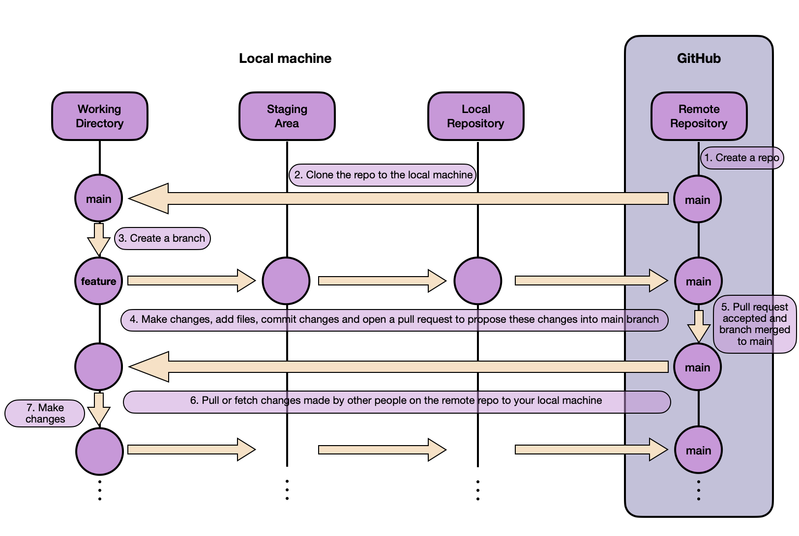

# Lab week 2 : Git versioning and code quality

## 0. Introduction

This lab is designed to help you get started with Git and GitHub. You will learn how to create a repository, commit changes, and push changes to GitHub. You will also learn how to create a pull request and merge it into the main branch. If you're already familiar with Git and GitHub, you can use this lab to refresh your knowledge and practice your skills.

## 1. Prerequisites

Before you start this lab, you should have the following:

- A GitHub account : https://github.com/
- Git installed on your computer : https://git-scm.com/
- A code editor (e.g., Visual Studio Code, Pycharm, etc.)
- Set up a SSH key (mandatory to access and write data to a GitHub repository) : 
    - following this tutorial: https://docs.github.com/en/authentication/connecting-to-github-with-ssh

## 2. Overview of Git basic commands

You have in the image above : 

- Remote repository: the repository on GitHub, GitLab, Bitbucket, etc.
- Local repository: the repository on your computer.
- Staging area: the area where you prepare your changes before committing them.
- Working directory: the directory on your computer where you are working on your project.

In the image above, you have several steps that we will describe now:

1. You create the repository on GitHub. Here, is a tutorial for that: https://docs.github.com/en/repositories/creating-and-managing-repositories/quickstart-for-repositories

2. `git clone <repository-url>`: Clone a repository from a remote repository to your computer.

    + Note: `git branch`: List all the branches in your local repository. At the beginning, you will have only one branch called `main`.

3. `git branch <branch-name>`: Create a new branch. To go to this branch, you can use the command `git checkout <branch-name>`. Another way to create a branch and go to it directly in one command is to use the command `git checkout -b <branch-name>`.

4. Now, you can start creating files. The following instruction `git add <file-name>` adds a file to the staging area. You can also use the command `git add .` to add all the files in the working directory to the staging area. You can also make changes to existing files. \
When new files are added or when you finished modifying files, you can commit your changes. Commit means that you save the changes in the local repository. The following instruction `git commit -m "your message"` commits the changes in the staging area to the local repository. 

    + Note: You can also use the command `git commit -am "your message"` to add all the files in the working directory to the staging area and commit them in one command.

    + Note: A nice practice is to write a commit message with emojis. Here is a list of emojis that you can use in your commit messages: https://gitmoji.dev/. For example, if you add a new feature, you can use the emoji :sparkles: in your commit message. If you fix a bug, you can use the emoji :bug: in your commit message, etc.

   Finally you can push your changes to the remote repository. The following instruction `git push origin <branch-name>` pushes the changes from the local repository to the remote repository.\
   When you work on your branch and you want to update the main branch with all the changes you made, you can create a pull request. A pull request is a request to merge the changes from your branch to the main branch. You can create a pull request on GitHub. Here is a tutorial for that: https://docs.github.com/en/pull-requests/collaborating-with-pull-requests/proposing-changes-to-your-work-with-pull-requests/creating-a-pull-request?tool=codespaces. 
   
5. In a company or in a team of developers, you will have to create a pull request to merge your changes to the main branch. This pull request will be reviewed by other developers. If the pull request is accepted, the changes will be merged into the main branch.

6. Once again, in a company or in a team of developers, you will have to update your local repository with the changes made by other developers. To do that, you can use the command `git pull origin main`. This command will update your local repository with the changes made by other developers in the main branch. `fetch` is another command that you can use to update your local repository with the changes made by other developers. The difference between `pull` and `fetch` is that `pull` will update your local repository and merge the changes into your branch, while `fetch` will only update your local repository. In fact you can view a `git pull` as a `git fetch` followed by a `git merge`.\
\
For example if a colleague has created a new branch and made changes in some of the functions and you want to get these changes, you can use the command `git fetch origin <branch-name>`. This command will update your local repository with the changes made by your colleague in the branch `<branch-name>`. If you want to see the changes made by your colleague, you can use the command `git diff origin/<branch-name>` and if you agree with the changes, you can merge them into your branch using the command `git merge origin/<branch-name>`.\
\
If you did a `git pull` instead of a `git fetch`, the changes would be merged into your branch automatically which is not always what you want because you may want to review the changes before merging them into your branch.

7. Now, you loop over steps 3, 4, 5 and 6 until you finish your work.
    + Note: Each time that you want to create a new feature or fix a bug, you should create a new branch. This is a good practice because it allows you to work on different features or bugs at the same time without affecting the main branch.

8. Finally, when you finish your work, you can delete your branch using the command `git branch -d <branch-name>`. If you want to delete a branch that is not merged into the main branch, you can use the command `git branch -D <branch-name>`.

## 3. Summary of Git basic commands

- `git init` : initializes a brand-new Git repository (locally) and begins tracking an existing directory. It adds a hidden subfolder within the existing directory that houses the internal data structure required for version control (i.e., tracking every change in the different files).

- `git clone` : this command creates a local copy of a project that already exists remotely. The clone includes all the project's files, history, and branches.

- `git add` : stages a change. Git tracks changes to a developer's codebase, but it's necessary to stage and take a snapshot of the changes to include them in the project's history. This command performs staging, the first part of that two-step process. Any changes that are staged will become a part of the next snapshot and a part of the project's history. Staging and committing separately gives developers complete control over the history of their project without changing how they code and work.

- `git commit` : saves the snapshot to the project history and completes the change-tracking process. This is the second part of the two-step process. In short, a commit functions like taking a photo. Anything that's been staged with git add will become a part of the snapshot with git commit.

- `git status` : shows the status of changes as untracked, modified, or staged.

- `git branch` : shows the branches being worked on locally.

- `git checkout` : switch to another branch and check it out into your working directory.

- `git merge` : merges lines of development together. This command is typically used to combine changes made on two distinct branches. For example, a developer would merge when they want to combine changes from a feature branch into the main branch for deployment.

- `git pull` : updates the local line of development with updates from its remote counterpart. Developers use this command if a teammate has made commits to a branch on a remote, and they would like to reflect those changes in their local environment.

- `git push` : updates the remote repository with any commits made locally to a branch.

- `git rebase [base_branch]` : modifies the commit history to create a linear project history. It integrates changes from one branch into another while maintaining a clean and chronological sequence of commits. git rebase [base_branch] transfers changes from the current branch onto another branch (base_branch).
Useful for keeping the commit history clean and avoiding unnecessary merge commits to prepare a clean branch for a pull request.

    :warning: **WARNING** :warning: : Rewriting history can cause conflicts and should be used with care, especially in shared branches.

- `git fetch` : retrieves changes from a remote repository without merging them into the local branch. When downloading content from a remote repo, git pull and git fetch commands are available to accomplish the task. You can consider git fetch the 'safe' version of the two commands.

- `pull request` : A pull request (PR) is a mechanism for proposing changes to a codebase hosted on platforms like GitHub, GitLab, or Bitbucket. This facilitates collaboration and code review in a distributed development environment.

Cheat sheet: https://education.github.com/git-cheat-sheet-education.pdf

# Sources 

+ https://docs.github.com/en/get-started/using-git/about-git
+ https://www.atlassian.com/git/tutorials/atlassian-git-cheatsheet
+ 

    

