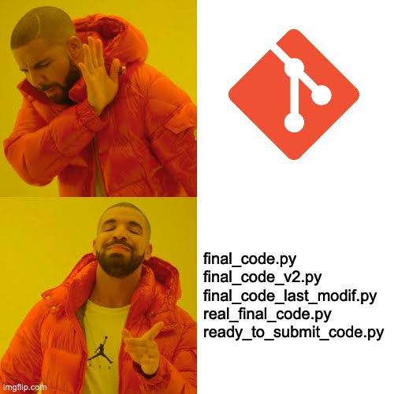
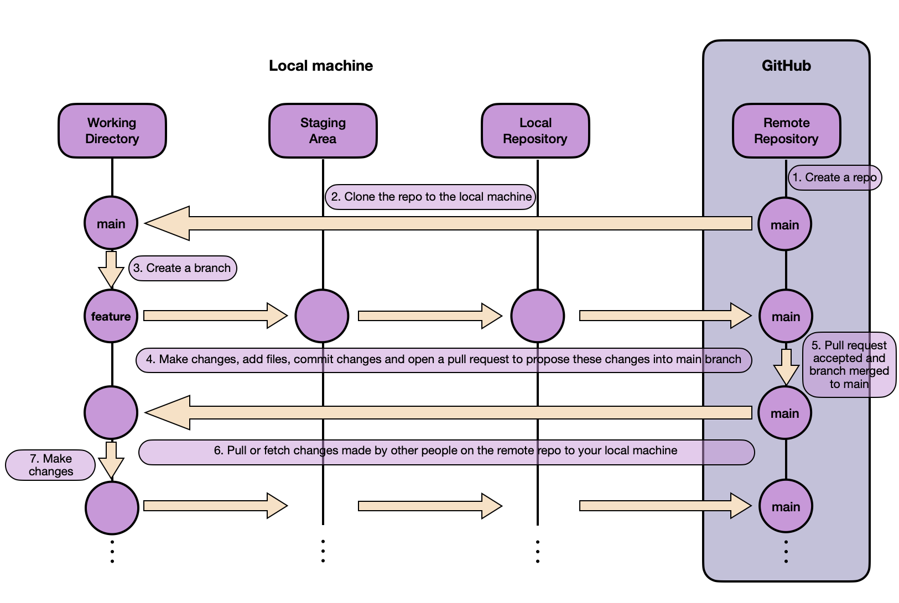

# Lab 1 [Sprint 1, W2] : Git code versioning and code quality

## 0. Introduction

This lab is designed to introduce you to the fundamentals of Git and GitHub. You will learn how to:
- Initialize a repository, commit changes.
- Push changes to GitHub. 
- Create and merge a pull request.
- Understand basic Git commands and workflows.

If you're already familiar with Git and GitHub, you can use this lab to refresh your knowledge and practice your skills.



## 1. Prerequisites

Before you start this lab, you should have:

1. A GitHub account : [Create one here.](https://github.com/)
2. Git installed on your computer : [Download Git.](https://git-scm.com/)
3. A code editor (e.g., [Visual Studio Code](https://code.visualstudio.com/), [Pycharm](https://www.jetbrains.com/fr-fr/pycharm/), etc.)
4. Set up a SSH key: mandatory for secure access to GitHub repositories. Follow this [tutorial](https://docs.github.com/en/authentication/connecting-to-github-with-ssh)


## 2. Git basics overview
The image below illustrates Git's structure and workflow.



- **Working directory**: The directory on your local machine where you make changes to your files.
- **Staging area**: A temporary storage area where you can add files before committing them. You can view it as a buffer between the working directory and the repository to be able to commit only the changes you want.
- **Local repository**: The .git directory where Git stores all the changes you've committed. :warning: This is a local repository, meaning it's stored on your computer, when you commit changes, they are only saved on your machine.
- **Remote repository**: The repository hosted on GitHub, GitLab, Bitbucket, etc. This is where you can push your changes to share them with others.

### Key steps and commands
1. **Create a repository**: you can create the repository on GitHub and clone it on your local machine or create a local repository and push it to GitHub. [Follow this tutorial.]( https://docs.github.com/en/repositories/creating-and-managing-repositories/quickstart-for-repositories)

2. **Clone a repository**: to clone a repository, use the following command:
```bash
git clone <repository_url>
```

3. **Branch management**: create a new branch, switch between branches, and delete branches.
- Create a new branch:
    ```bash
    git checkout -b <branch_name>
    ```
- Switch to a branch:
    ```bash
    git checkout <branch_name>
    ```
- Shortcut to create and switch to a new branch:
    ```bash
    git checkout -b <branch_name>
    ```
- Delete a branch:
    ```bash
    git branch -d <branch_name>
    ```

4. **Staging and commiting changes**:
- Add files to the staging area:
    ```bash
    git add <file_name>
    ```
- Add all files to the staging area:
    ```bash
    git add .
    ```
- Commit :warning: **staged** :warning: changes:
    ```bash
    git commit -m "Your commit message"
    ```
- Commit all changes (staged and unstaged):
    ```bash
    git commit -am "Your commit message"
    ```
5. **Push local changes to the remote repository**:
```bash
git push origin <branch_name>
```

6. **Pull requests**: In a company, in a team or in an open-source project, you will have to create a pull request to merge your changes into the main branch. \
This pull request will be reviewed by other developers, and they can ask you to make changes before merging your code. \
To create a pull request, you can [use the GitHub interface](https://docs.github.com/en/pull-requests/collaborating-with-pull-requests/proposing-changes-to-your-work-with-pull-requests/creating-a-pull-request?tool=codespaces.)

    + Note: A nice practice when creating a pull request is to add a template to help the reviewer understand what you have done and what you expect from the review. 
    + Note: A nice way to make pull requests funier is to use emojis in your pull request titles. Here is a [list of emojis that you can use](https://gitmoji.dev/). For example, if you add a new feature, you can use the emoji :sparkles: in your commit message. If you fix a bug, you can use the emoji :bug:, etc.


